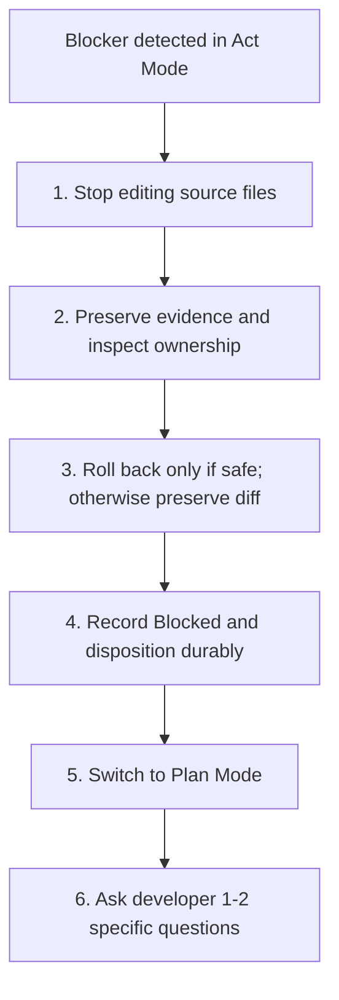

# Shared AI Memory Bank and Codebase Analysis Specification

> A standardized protocol for persistent project context, rigorous codebase audits, and safe implementation workflows across **Google Antigravity**, **Claude Code**, **Cline**, **Cursor**, and other AI coding agents.

**Specification version:** 3.2 (2026-10-07)

**Compatibility:** protocol artifacts use ISO 8601-2 dates (`DD-MM-YYYY`). Version 3.2 adds dependency-publication guards, completion recovery, final verification binding, structured acceptance, and baseline-aware history checks. Upgrade installed protocol files, nonterminal artifacts and `AGENTS.md` together; do not mix protocol versions. Preserve committed terminal records using a comparison baseline.

---

## Table of Contents

1. [Overview and Core Concepts](#1-overview-and-core-concepts)
   - [1.1 Why a Shared Memory Bank](#11-why-a-shared-memory-bank)
   - [1.2 File Responsibilities](#12-file-responsibilities)
   - [1.3 Scope vs User Context](#13-scope-vs-user-context)
   - [1.4 Operating Modes](#14-operating-modes)
   - [1.5 Context Loading Tiers](#15-context-loading-tiers)
   - [1.6 Status Vocabularies](#16-status-vocabularies)
2. [Repository Layout](#2-repository-layout)
   - [2.1 Directory Structure](#21-directory-structure)
   - [2.2 Scaffolding Commands](#22-scaffolding-commands)
   - [2.3 Memory File Header and Staleness Detection](#23-memory-file-header-and-staleness-detection)
   - [2.4 Git Strategy](#24-git-strategy)
3. [Agent Configuration](#3-agent-configuration)
   - [3.1 Canonical Protocol File AGENTS.md](#31-canonical-protocol-file-agentsmd)
   - [3.2 Thin Tool Adapters](#32-thin-tool-adapters)
4. [Phase 1: Codebase Discovery](#4-phase-1-codebase-discovery)
   - [4.1 Pass 1: Inventory and Architecture Overview](#41-pass-1-inventory-and-architecture-overview)
   - [4.2 Pass 2: Deep Quality and Security Audit](#42-pass-2-deep-quality-and-security-audit)
   - [4.3 Pass 3: Component Map and Boundary Synthesis](#43-pass-3-component-map-and-boundary-synthesis)
5. [Phase 2: Initializing the Memory Bank](#5-phase-2-initializing-the-memory-bank)
   - [5.1 Initialization Prompt](#51-initialization-prompt)
   - [5.2 Starter Templates](#52-starter-templates)
6. [Phase 3: From Review to Implementation](#6-phase-3-from-review-to-implementation)
   - [6.1 Prioritized Planning](#61-prioritized-planning)
   - [6.2 Pre-Act Checklist](#62-pre-act-checklist)
   - [6.3 Scoped Execution](#63-scoped-execution)
   - [6.4 Definition of Done](#64-definition-of-done)
   - [6.5 Blocker and Rollback Protocol](#65-blocker-and-rollback-protocol)
   - [6.6 End-to-End Sequence](#66-end-to-end-sequence)
7. [Session Lifecycle](#7-session-lifecycle)
   - [7.1 Session Startup](#71-session-startup)
   - [7.2 Session Closeout](#72-session-closeout)
   - [7.3 Update Threshold Rules](#73-update-threshold-rules)
8. [Validation and Adoption](#8-validation-and-adoption)

---

## 1. Overview and Core Concepts

### 1.1 Why a Shared Memory Bank

AI coding assistants work inside finite context windows and keep no state across sessions, tool restarts, or model changes. Without an external, structured memory layer:
- Agents re-analyze the codebase repeatedly, wasting tokens and time.
- Understanding drifts between sessions, producing inconsistent architectural decisions.
- Switching tools (Antigravity, Claude Code, Cline, Cursor) resets project understanding.

The **Shared Memory Bank** is a repository-native, Markdown-based context store. All agents enter through **one canonical protocol file (`AGENTS.md`)**, which explicitly delegates to this versioned specification. Tool-specific files are thin pointers, not independent copies of protocol rules. Code describes observed behavior; approved requirements describe intended behavior (section 3.1, Source of Truth).

#### Target Audience and Recommended Usage

`MemBankRules.md` is primarily intended for **individual developers and small to medium projects** with **short-term to medium-term horizons**. It provides a lightweight yet disciplined structure that minimizes documentation overhead while delivering immediate continuity benefits.

Key benefits include:
- **Preserves project context between AI sessions:** Eliminates model amnesia by maintaining architectural decisions, stack conventions, and active work items in repository-tracked files rather than volatile prompt histories.
- **Reduces the need to repeatedly explain project details to different AI models:** New sessions immediately pick up core goals, operational constraints, and coding standards without repetitive prompt re-briefings.
- **Makes it easier to switch between AI providers and tools without losing context:** Switch freely between Google Antigravity, Claude Code, Cline, Cursor, and other tools, as all agents read the same standardized memory files through thin adapters.
- **Minimizes productivity loss caused by model usage limits, rate limits, context window limitations, or temporary service restrictions:** Shields developers from interruptions like hourly token exhaustion, rate limits, context saturation, or AI subscription quotas (such as 5-hour provider cooling intervals) by allowing an instant, seamless switch to another agent, model, or session without losing progress.
- **Saves both time and cost by enabling efficient continuation of work across sessions:** Eliminates redundant token expenditures on repetitive codebase re-discovery, maximizing productive output per AI interaction.

For larger teams, multi-agent workflows, or projects with medium-to-long-term lifecycles where rigorous requirements traceability, formal acceptance criteria mapping, and change governance are essential, adopt the [CDIP extension](MemBankRulesWithCDIP.md).

### 1.2 File Responsibilities

| File / Directory | Audience | Volatility | Role |
| :--- | :--- | :--- | :--- |
| `AGENTS.md` | All agents | **Stable** | **Canonical entry point.** Declares required versioned specifications and precedence. |
| `MemBankRules.md` and optional `MemBankRulesWithCDIP.md` | All agents | **Stable** | Delegated normative rules; read before following the workflow. |
| `GEMINI.md`, `CLAUDE.md`, `.clinerules/`, `.cursor/rules/` | One tool each | **Stable** | Thin adapters: point to `AGENTS.md` plus tool-specific quirks only. |
| `memory-bank/projectBrief.md` | Shared | **Stable** | WHAT and WHY: mission, goals, scope, non-goals, constraints. |
| `memory-bank/productContext.md` | Shared | **Stable** | WHO and HOW: personas, user journeys, domain glossary, UX expectations. |
| `memory-bank/systemPatterns.md` | Shared | **Semi-stable** | Architecture, component boundaries, design patterns, code conventions. |
| `memory-bank/techContext.md` | Shared | **Semi-stable** | Stack, setup, build/test/lint commands, configuration, deployment. |
| `memory-bank/activeContext.template.md` | Shared | **Stable** | Template used to create `activeContext.md` on a fresh clone. |
| `memory-bank/activeContext.md` | Shared or local | **Dynamic** | Session focus and pointers to tracked plans/TASKs; optional cached execution context. |
| `memory-bank/plans/` | Shared | **Dynamic** | Authoritative base work-item plans, approval revisions, status, and durable handoff. |
| `memory-bank/progress.md` | Shared | **Dynamic** | Completed work, audit findings backlog (`FIND-xxx`), test status. |
| `memory-bank/decisions/` | Shared | **History-preserving** | One ADR per decision; status changes append dated history rather than rewriting accepted rationale. |
| `memory-bank/decisions/ADR-xxx-<title>.md` | Shared | **History-preserving** | Accepted rationale is immutable; status transitions append dated evidence. |

### 1.3 Scope vs User Context

To prevent duplication between `projectBrief.md` and `productContext.md`:
* **`projectBrief.md` answers WHAT and WHY (business level):** mission, business goals, functional requirements, deliverables, explicit non-goals, constraints.
* **`productContext.md` answers WHO and HOW (experience level):** personas, user journeys including failure paths, domain terminology, UX and output expectations, external business systems.

### 1.4 Operating Modes

Different tools name their modes differently. This specification defines modes **by capability**, so the rules apply to every tool:

| Mode | Allowed | Forbidden |
| :--- | :--- | :--- |
| **Plan Mode** | Reading, analysis, read-only Git inspection; validation only if it has no writes or external side effects. | File writes, commits, checkout, installing dependencies, fixing lint, snapshot updates, or other state changes. |
| **Documentation Preparation** | With host write permission and an authorized documentation scope: scaffold protocol files, save plans, draft requirements/tasks, record explicit human approvals, update metadata. | Application implementation, inferred approvals, or unrelated edits. |
| **Act Mode** | Implement one `Ready` work item, or resume its owned `In Progress` execution; approved verification and narrowly scoped bookkeeping. | Unapproved implementation, unrelated edits, or destructive operations without explicit permission. |

These are workflow phases, not permission grants. The host tool's actual mode, higher-priority instructions, and user authorization always bound actions. If Plan Mode prohibits writes, present proposed documentation and wait for a write-enabled mode; do not silently switch modes. Blocker and closeout writes follow the same rule.

Preparation is not gated by an implementation task: its scope must be explicitly authorized (for example, initializing the protocol or drafting a plan). Save and review the approved plan, then commit **only authorized preparation files** before starting implementation. If committing is not authorized, ask for that boundary instead of implementing over a dirty preparation tree. In a repository without `HEAD`, an authorized initial commit is required before a checkpoint can exist.

Inspect each validation command before running it. Use non-fixing/non-snapshot-updating options and isolated test data; never assume tests are read-only. In write-enabled phases, permitted generated output stays outside tracked source and shared services; record any necessary side effects in the plan.

### 1.5 Context Loading Tiers

Every agent loads the same files, in the same order:

| Tier | When | Files |
| :--- | :--- | :--- |
| **Tier 0** | Always, at session startup | `activeContext.md` (or template), `techContext.md`, linked tracked PLAN/TASK if any |
| **Tier 1** | Before any code change | `systemPatterns.md` |
| **Tier 2** | On demand only | `projectBrief.md`, `productContext.md`, `progress.md`, `decisions/` |

### 1.6 Status Vocabularies

Status names are not a mandatory linear sequence:

| Artifact | Lifecycle |
| :--- | :--- |
| **Work item** (plan item) | `Backlog`, `Ready`, `In Progress`, `Blocked`, `Done`, `Cancelled` |
| **Audit finding** (`FIND-xxx`) | `Open` → `Planned` → `Resolved` or `Won't Fix` |
| **ADR** | `Proposed` → `Accepted` or `Rejected`; later `Superseded by ADR-xxx` or `Deprecated` |

| Transition | Preconditions and actor | Required record |
| :--- | :--- | :--- |
| Backlog → Ready | Agent checks explicit developer approval of the current plan revision, satisfied dependencies, no unresolved blockers, and a complete verification plan | Approver, date, approval evidence, approved revision |
| Ready → In Progress | Owner claims item; pre-act checks pass | Owner, branch/worktree, checkpoint, baseline |
| In Progress → In Progress (resume) | Same owner or explicit handoff; verify current diff, approval, dependencies, and checkpoint | Durable handoff and any new baseline evidence; never replace the original checkpoint silently |
| In Progress → Done | Owner satisfies section 6.4, including acceptance evidence | Completion date, verification result, completion commit subject |
| In Progress → Blocked | Owner encounters a blocker or invalidated approval | Evidence, reason, rollback disposition |
| Blocked → Ready | All blockers resolved, approvals revalidated, dependencies satisfied, residual diff reconciled | Resolution evidence; fresh pre-act checks on restart |
| Ready or Blocked → Backlog | Plan/requirements change or approval is withdrawn | Review note, incremented plan revision where applicable, cleared approval |
| Backlog, Ready, or Blocked → Cancelled | Developer authorizes cancellation | Dedicated Cancellation reason and Cancellation decision; reconcile any residual changes first |

To cancel running work, first stop and mark it `Blocked`. `Done` and `Cancelled` are terminal: create follow-up items rather than rewriting history. Reject a proposed plan by returning feedback in `Backlog` or authorizing `Cancelled`; rejection is not approval. Dependencies must exist, must not reference the item itself, and must form an acyclic graph. A cancelled dependency does not satisfy a dependency; revise and reapprove the dependent plan.

**Dependency satisfaction is not historical status.** At readiness, start, resume, and completion, each dependency must be published `Done` in the accepted execution baseline, its required implementation must be available in the executing branch/worktree, and no known revert or superseding change may invalidate the needed behavior. Record its full publication commit, the full integrated baseline SHA (`Available at`), and behavior/compatibility evidence in `Dependency Evidence`. An ancestor commit alone does not prove behavior survives; inspect relevant later changes and run appropriate checks. Cherry-picks require equivalent implementation evidence and an accepted integration commit containing the dependency record. Do not reopen historical `Done` when behavior is later removed; block affected dependents and create follow-up work.

**Blockers survive replanning.** Keep stable blocker IDs in a `Blockers` table with `Open` or `Resolved` state. Resolution requires evidence. `Blocked reason` summarizes current open blockers, or is exactly `none` when none remain. No readiness/start/resume/completion route may bypass an open blocker, including `Blocked → Backlog → Ready`. Keep resolved rows as history. Cancellation and implementation approval are separate decisions: `Cancellation decision` identifies the author, dated durable decision, item and revision; it never grants plan approval.

Recorded blocker IDs and reasons are append-only history: never delete or rename rows, erase them by deleting the task, or replace their original reason. Transition `Open → Resolved` only with resolution evidence. Resolved rows, including their evidence, are immutable; if the problem recurs, create a new blocker ID and reference the earlier record. Append corrections in the execution record rather than silently rewriting history. These rules apply even when the work item returns to Backlog or is cancelled.

**Verification is separate from execution status:** `Not Run`, `Passed`, `Failed`, or `Manual Accepted`. `Done` requires `Passed` with acceptance evidence, or actual manual checks plus explicit developer acceptance (`Manual Accepted`). Merely listing manual steps is `Not Run`/Unverified and cannot become `Done`. Failed or unavailable mandatory checks block completion. Existing unrelated baseline failures may remain only when identified and shown not to invalidate the item's acceptance evidence.

Findings become `Planned` when linked to tracked remediation items. Mark `Resolved` only after **all** required items are `Done` and finding-level regression evidence is recorded. `Won't Fix` requires developer rationale; reopen a finding if new evidence disproves resolution. ADR acceptance also requires an explicit human decision.

---

## 2. Repository Layout

### 2.1 Directory Structure

```text
project-root/
├── AGENTS.md                                # Canonical entry point with versioned delegation
├── MemBankRules.md                          # Installed normative specification
├── GEMINI.md                                # Thin adapter: Gemini CLI (optional for Antigravity)
├── CLAUDE.md                                # Thin adapter: Claude Code
├── .clinerules/
│   └── memory-bank.md                       # Thin adapter: Cline
├── .cursor/
│   └── rules/
│       └── memory-bank.mdc                  # Thin adapter: Cursor
└── memory-bank/
    ├── projectBrief.md                      # WHAT and WHY
    ├── productContext.md                    # WHO and HOW
    ├── systemPatterns.md                    # Architecture and conventions
    ├── techContext.md                       # Stack and commands
    ├── activeContext.template.md            # Template for activeContext.md
    ├── activeContext.md                     # Focus, plan, checkpoint, baseline, blockers
    ├── plans/                              # Tracked PLAN-xxx records: authority for work and handoff
    ├── progress.md                          # Completed work and FIND-xxx backlog
    ├── decisions.md                         # ADR index
    └── decisions/
        └── ADR-001-initial-architecture.md  # One file per decision
```

### 2.2 Scaffolding Commands

Run in the project root during authorized Documentation Preparation. Never overwrite existing protocol or context files without review:

```bash
# 1. Directories
mkdir -p memory-bank/decisions memory-bank/plans .clinerules .cursor/rules

# 2. Memory Bank files (populated in Phase 2)
touch memory-bank/projectBrief.md \
      memory-bank/productContext.md \
      memory-bank/systemPatterns.md \
      memory-bank/techContext.md \
      memory-bank/activeContext.template.md \
      memory-bank/progress.md \
      memory-bank/decisions.md

# 3. Protocol and adapters (content in section 3)
touch AGENTS.md GEMINI.md CLAUDE.md \
      .clinerules/memory-bank.md \
      .cursor/rules/memory-bank.mdc
```

`activeContext.md` is not created here. It is created from the template by the startup protocol (section 7.1), after the template has been populated in Phase 2.

### 2.3 Memory File Header and Staleness Detection

Every descriptive file in `memory-bank/`, including `decisions.md` and the active-context template, starts with this header. Historical ADR records and authoritative `plans/` records use their own dated lifecycle metadata instead:

```markdown
> Last verified: DD-MM-YYYY @ <commit SHA or UNKNOWN>
> Covers: src/, package.json
```

`Covers` is a comma-separated list of repository-root-relative literal paths, with no globs, absolute paths, `..`, or commas within names. `REPOSITORY` means the entire repository **except `memory-bank/`** (avoids self-invalidating bookkeeping). `SESSION` means branch/worktree/task identity, ownership, and handoff state; it is checked against Git and the tracked work item, not a pathspec. Special values must appear alone. List additional inputs if a memory file summarizes other memory files.

**Freshness states:**
- `Unknown`: missing/invalid/unavailable SHA, unborn `HEAD`, non-ancestor baseline, malformed coverage, or evidence insufficient to reverify. Do not treat an empty/erroring Git command as fresh.
- `Stale`: any covered commit since the baseline, covered staged/unstaged/untracked change, or mismatched `SESSION` identity.
- `Fresh`: baseline is a valid ancestor, no covered changes, and the file's claims were actually verified. `SESSION` additionally requires a matching branch/worktree/task and inspected current state.

For literal paths, check committed, staged, unstaged, and untracked state, handling errors explicitly:

```bash
git merge-base --is-ancestor <sha> HEAD
git log --oneline <sha>..HEAD -- <covered paths>
git diff --name-only -- <covered paths>
git diff --cached --name-only -- <covered paths>
git ls-files --others --exclude-standard -- <covered paths>
```

Report `Stale` and `Unknown` at startup. Reverify task-critical commands, constraints, and architecture **before using them**; defer only irrelevant context. Never copy a newer SHA without inspecting the claims. During uncommitted changes, record evidence against the checkpoint plus the inspected diff; the header may conservatively remain stale. After a completion commit, any header refresh referencing that existing commit is a separate authorized metadata commit; no file is required to contain its own eventual commit SHA.

### 2.4 Git Strategy

#### Shared vs developer-specific context

1. **Shared team context (default):** commit all Memory Bank files, including `activeContext.md`. Best for solo developers or sequential work on one branch.
2. **Worktree-local context (multiple developers or agents in parallel):** use one dedicated Git worktree and branch per owner/task; commit `activeContext.template.md`, and ignore the local `activeContext.md`:
   ```gitignore
   memory-bank/activeContext.md
   ```
   Ignoring a file alone does not isolate it. Do not switch tasks/branches in a shared working directory and assume its ignored context follows. Verify branch/worktree/task identity at startup. If context is missing, read the template and tracked plan/TASK in Plan Mode; create local context only with host write permission. Recover approvals, checkpoint, owner, baseline, and handoff from tracked work items, never from ignored context alone.

#### Avoiding merge conflicts

* Reserve PLAN, FIND, ADR, BR, SR, and TASK IDs with the developer/coordinator before creating files. Check uniqueness against the shared integration branch. Separate files reduce conflicts but do not prevent ID collisions.
* Keep `progress.md` edits on a feature branch limited to the items that branch touches.
* Claim a work item through a serialized coordinator/developer decision before implementation. A branch-local owner field is not an atomic lock. Record owner and worktree in the tracked item; explicit handoff releases/reassigns ownership. Reconcile IDs, links, approvals, and derived summaries at integration.

#### Checkpoints

Before starting implementation, the index and working tree must be clean, preparation must be committed, and `HEAD` must exist. Use a dedicated worktree or explicit exclusive ownership; a clean checkpoint alone does **not** prove ownership of later changes. Record the checkpoint and baseline in the tracked plan/TASK before application edits. Resuming owned work uses the recorded checkpoint and reconciles the existing diff instead of discarding it to force cleanliness.

#### Branch and commit conventions

* **Branch:** `<type>/<ID>-<short-name>`, for example `fix/FIND-007-null-session-check`.
* **Commit:** `<type>: <summary> (FIND-007)`. Every commit made in Act Mode references the finding or work item it implements.

---

## 3. Agent Configuration

### 3.1 Canonical Protocol File AGENTS.md

`AGENTS.md` is the canonical entry point, **not a second implementation of this specification**. Install this file as `MemBankRules.md` in the project root and save the following as `AGENTS.md`. Adapters must ensure it is read; do not assume automatic loading by a particular tool/version. Missing or mismatched delegated specifications block protocol-governed writes until repaired in authorized Documentation Preparation.

````markdown
# AGENTS.md: Shared Memory Bank Protocol

This file is the canonical entry point for repository workflow rules.
Tool-specific files only point here. Before any task, read the installed
`MemBankRules.md` specification version 3.2 in full. It is normative, including
its lifecycle tables, templates' required fields, and safety procedures.
This entry point is a navigation index, not an abbreviated replacement.
Host/system/developer instructions and actual tool permissions take precedence.
Explicit overrides in a declared compatible extension take precedence over the base;
otherwise follow the base. If normative rules conflict ambiguously, stop and ask.

## 1. Memory Bank
Files in `memory-bank/`:
- `projectBrief.md`: WHAT and WHY (goals, scope, non-goals, constraints)
- `productContext.md`: WHO and HOW (personas, journeys, glossary)
- `systemPatterns.md`: architecture, boundaries, conventions
- `techContext.md`: stack and build/test/lint commands
- `activeContext.md`: session-local focus and pointers (never sole authority for approvals)
- `plans/PLAN-xxx-<title>.md`: tracked plan, status, approval, execution record, handoff
- `progress.md`: completed work, FIND-xxx backlog, test status
- `decisions.md` + `decisions/ADR-xxx-<title>.md`: architectural decisions

## 2. Operating Modes
Follow MemBankRules.md sections 1.4 and 1.6. Plan Mode is read-only. Documentation
Preparation needs host write permission and an authorized documentation scope.
Implementation starts at Ready or resumes owned In Progress work; approval and
dependency guards always apply. This protocol cannot switch or expand host modes.

## 3. Session Startup
Follow MemBankRules.md section 7.1: inspect Git before writes, load tiers and the
tracked work item, verify ownership/identity and freshness, then briefly acknowledge.

## 4. Source of Truth
Source code and tests establish observed behavior; approved requirements and approved
plans establish intended behavior. Descriptive memory follows verified observations.
An observed/intended discrepancy is a defect candidate or a proposed requirement
change, never permission to rewrite approved intent or alter code without approval.
Report evidence, distinguish fact from intent, and use the approval/change workflow.

## 5. Safety Rules
- Never run destructive commands without explicit developer permission. This includes:
  `git reset --hard`, `git clean`, `git push --force`, `git stash drop`, deleting branches,
  `rm -rf`, dropping or truncating database tables, and running migrations against shared environments.
- Never commit, stash, or discard the developer's own uncommitted work.
- Never write credentials, tokens, API keys, private keys, connection strings, personal data,
  or production data into any file, including Memory Bank files.
- Do not modify generated files, build output, lock files, or dependencies unless the work item requires it.
- In code you write: validate external input and avoid unsafe command execution.

## 6. Act Mode Procedure
Follow MemBankRules.md sections 6.1-6.4 in order: committed preparation, claim,
clean checkpoint (or reconciled resume), baseline, bounded implementation,
acceptance verification, metadata closeout, then an authorized completion commit.
Execution and verification statuses are separate (section 1.6). Never claim a
command ran or a human approved something without evidence.

## 7. Blocker Protocol
Follow MemBankRules.md section 6.5. Preserve evidence before rollback, inspect
ownership and index state, and never restore entire files whose ownership is uncertain.
Record Blocked and rollback disposition durably; request clarification in Plan Mode.

## 8. Staleness Detection
Follow MemBankRules.md section 2.3, including Fresh/Stale/Unknown, working-tree
changes, special Covers values, and mandatory task-critical reverification.

## 9. Memory Updates (Closeout)
Follow MemBankRules.md sections 7.2-7.3; closeout is part of completion, before the
completion commit. Never resolve a finding merely because one related item is Done.
Approvals and handoff remain in tracked artifacts even when activeContext is ignored.

## 10. Analysis Rules
- Inspect real implementation and tests; never infer behavior from file names alone.
- Cite file paths and line numbers for every finding.
- Separate verified facts from hypotheses.
- Never modify source files during read-only analysis.
- For architectural changes, present alternatives and trade-offs before implementing.
````

### 3.2 Thin Tool Adapters

Adapters contain **no rules of their own**. They point to `AGENTS.md` and add only tool-specific notes.

#### GEMINI.md (Gemini CLI)

For tools configured to read `GEMINI.md`, use this adapter. Verify instruction discovery in the installed tool; omit redundant adapters only after confirming the entry point is loaded:

```markdown
# Project Instructions (Gemini)
Follow `AGENTS.md` in the repository root. It is the canonical protocol for this project.
Do not duplicate its rules here; add only Gemini-specific notes below.
```

#### CLAUDE.md (Claude Code)

For a Claude Code installation supporting `@path` imports, use the following; otherwise configure an explicit instruction to read `AGENTS.md`:

```markdown
# Project Instructions (Claude Code)
@AGENTS.md

Claude Code notes:
- Use Claude Code plan mode for Plan Mode as defined in AGENTS.md section 2.
```

#### .clinerules/memory-bank.md (Cline)

```markdown
# Project Rules (Cline)
Read and follow `AGENTS.md` in the repository root before every task. It is the canonical protocol.
Cline's actual mode bounds permissions. Documentation Preparation and implementation both require write-enabled mode; Plan Mode remains read-only.
```

#### .cursor/rules/memory-bank.mdc (Cursor)

```markdown
---
description: Shared Memory Bank protocol
alwaysApply: true
---
Read and follow `AGENTS.md` in the repository root. It is the canonical protocol for this project.
```

> [!NOTE]
> `.cursorrules` is Cursor's legacy rules format. Use it only if your Cursor version does not support `.cursor/rules/`. If your version reads `AGENTS.md` natively, this adapter can be omitted.

---

## 4. Phase 1: Codebase Discovery

Discovery runs in **three bounded passes in Plan Mode**, so that no single response exhausts the output budget. Pass outputs are saved to the Memory Bank in Phase 2.

### 4.1 Pass 1: Inventory and Architecture Overview

```text
Perform Pass 1 (Inventory and Architecture Overview) on this codebase. Plan Mode: do not modify files.

1. Identify entry points, major packages, configuration files, and build/test manifests.
2. Identify core runtime dependencies and frameworks.
3. Identify how to run the tests and linters, run them, and report the current result (baseline).
4. Produce a report containing:
   - Purpose: what the application does.
   - Module topology: top-level directories and packages.
   - Primary execution flow: from process start to the main request or event loop.
   - External integrations: databases, APIs, queues, cloud services.
5. Skip node_modules, dist, build, vendor, coverage, .git, and generated artifacts.
6. Keep the report under about 150 lines. Do not audit bugs or list improvements yet.
```

### 4.2 Pass 2: Deep Quality and Security Audit

```text
Perform Pass 2 (Deep Quality, Security, and Edge-Case Audit) on the core modules from Pass 1.
Plan Mode: do not modify files.

Investigate:
1. Error handling: swallowed exceptions, missing timeouts, unbounded retries.
2. Security: unsafe input handling, injection, unsafe deserialization, secret leakage, auth boundaries.
3. Concurrency and state: race conditions, shared mutable state, resource leaks.
4. Coupling: circular dependencies, duplicated business logic, leaky abstractions.
5. Tests: missing coverage of critical workflows.

Output each finding as one row:
FIND-ID | Severity (Critical/High/Medium/Low) | Confidence | Evidence (path:line) | Impact | Remediation outline | Regression risk

Number findings FIND-001, FIND-002, ... Separate verified defects from hypotheses.
List separately anything that needs runtime evidence, credentials, or domain knowledge to confirm.
```

### 4.3 Pass 3: Component Map and Boundary Synthesis

```text
Using Passes 1 and 2, produce a concise component map. Plan Mode: do not modify files.

1. Component table: Component | Path | Responsibility.
2. Dependency graph, including any circular dependencies.
3. Where persistent state is read, written, and cached.
4. Open architectural questions that need developer input.
```

---

## 5. Phase 2: Initializing the Memory Bank

### 5.1 Initialization Prompt

```text
In authorized, write-enabled Documentation Preparation, initialize the Memory Bank from the Phase 1 results.

Populate:
1. memory-bank/projectBrief.md
2. memory-bank/productContext.md
3. memory-bank/systemPatterns.md   (from Pass 1 and Pass 3)
4. memory-bank/techContext.md      (include the commands and the test baseline from Pass 1)
5. memory-bank/activeContext.template.md
6. memory-bank/progress.md         (record EVERY Pass 2 finding in the findings table, status Open)
7. memory-bank/decisions.md and memory-bank/decisions/ADR-001-initial-architecture.md

Then create memory-bank/activeContext.md from the template.

Rules:
- Use section 2.3 headers for descriptive memory files; ADR and plan records use lifecycle metadata instead.
- Keep projectBrief (what/why/scope/non-goals) and productContext (who/how/journeys/glossary) separate.
- Write only facts verified from the repository. Mark assumptions explicitly under "Open Questions".
- Do not invent business requirements.
- Do not record secrets or environment values.
- Do not modify application source files.

Report: files inspected, files created, open questions.
```

### 5.2 Starter Templates

#### Template: projectBrief.md

```markdown
> Last verified: DD-MM-YYYY @ <sha>
> Covers: README.md, docs/

# Project Brief

## Purpose
<!-- 1-2 sentences: what the project does and why it exists -->

## Business Goals and Success Metrics
- Goal 1: metric or outcome

## Primary Requirements
- [REQ-01] Core functional requirement

## Scope
### In Scope
- Capabilities delivered by this repository.

### Out of Scope (Non-Goals)
- Explicit non-goals, external responsibilities, deferred features.

## Constraints and Assumptions
- Constraints: platform, licensing, architectural, organizational.
- Assumptions: marked as such until verified.

## Authoritative References
- Specifications, architecture documents, schemas.
```

#### Template: productContext.md

```markdown
> Last verified: DD-MM-YYYY @ <sha>
> Covers: src/ui/, src/api/

# Product Context

## Problems Solved
- Problem 1

## Personas
- **Primary:** needs, skill level, interaction channel.
- **Secondary:** administrator, operator, or consuming service.

## User Journeys
1. **Primary journey:** trigger to outcome.
2. **Failure journey:** what the user experiences when things go wrong.

## Domain Glossary
| Term | Meaning in this system |
| :--- | :--- |
| Term | Definition |

## UX and Output Expectations
- Output formats, latency expectations, error messages.
```

#### Template: systemPatterns.md

```markdown
> Last verified: DD-MM-YYYY @ <sha>
> Covers: src/

# System Patterns

## Architecture
<!-- Monolith, modular service, CLI, event-driven worker, etc. -->

## Components
| Component | Path | Responsibility |
| :--- | :--- | :--- |
| ExampleService | `src/services/example.ts` | Domain logic for X |

## Design Patterns and Conventions
- Structural patterns (repository, factory, dependency injection).
- Error handling convention (result types, domain exceptions, error codes).
- Naming, typing, and formatting rules.

## Data Flow
1. Request -> validation -> domain handler -> persistence -> response.

## Security Boundaries
- Authentication and authorization enforcement points.
- Input sanitization and encryption points.
```

#### Template: techContext.md

This template contains a code block, so it is wrapped in a four-backtick fence:

````markdown
> Last verified: DD-MM-YYYY @ <sha>
> Covers: package.json, Dockerfile, .github/workflows/

# Technical Context

## Stack
- **Languages:** language and version
- **Frameworks and core libraries:** names and versions
- **Persistence:** databases, caches, file formats

## Setup
```bash
npm install   # or: pip install -r requirements.txt
```

## Commands
- **Build:** `npm run build`
- **Unit tests:** `npm test`
- **Integration tests:** `npm run test:e2e`
- **Lint:** `npm run lint`

## Test Baseline
- Recorded on DD-MM-YYYY @ <sha>: <N> passing, <M> failing (list known failures).
- If no automated tests exist, state so explicitly.

## Configuration
- Environment template: `.env.example`
- Precedence: defaults -> config files -> environment variables

## Deployment
- Target runtime: container, Cloud Run, serverless, VM.
````

#### Template: activeContext.template.md

```markdown
> Last verified: DD-MM-YYYY @ <sha>
> Covers: SESSION

# Active Context

**Last updated:** DD-MM-YYYY
**Current branch:** main

## Current Focus
- Current objective.

## Active Work Item
- [PLAN-001](plans/PLAN-001-session-invalidation.md) (authoritative plan, status, and execution record)
- Owner/worktree: copied from the tracked item only after identity verification.

## Checkpoint and Baseline
- Checkpoint: <short SHA>
- Test baseline: <N> passing, <M> failing (<list>)
- Files modified or created in this work item: (list)

## Recent Changes
- Verified changes from recent sessions.

## Next Steps
1. Step 1.

## Open Questions
- Items awaiting developer clarification.

## Blockers and Risk Discoveries
- None.
```

#### Template: progress.md

```markdown
> Last verified: DD-MM-YYYY @ <sha>
> Covers: memory-bank/plans/, src/, tests/

# Project Progress

**Status as of:** DD-MM-YYYY

## Completed
- [x] Feature or fix, verified by tests (FIND-001).

## In Progress
- [ ] PLAN-001 (FIND-003; derived from the tracked plan)

## Findings Backlog
| ID | Severity | Confidence | Evidence | Impact | Remediation | Regression risk | Status | Required items | Resolution evidence |
| :--- | :--- | :--- | :--- | :--- | :--- | :--- | :--- | :--- | :--- |
| FIND-003 | Critical | Verified | `src/auth/session.ts:88` | Logged-out session remains usable | Invalidate session | Existing clients | Planned | PLAN-001 | none |

## Test and Verification Status
- Unit, integration, and static analysis status.
```

#### Template: decisions.md and ADR records

`memory-bank/decisions.md` is a short index:

```markdown
> Last verified: DD-MM-YYYY @ <sha>
> Covers: memory-bank/decisions/

# Architectural Decision Records

| ADR | Date | Title | Status | Scope | File |
| :--- | :--- | :--- | :--- | :--- | :--- |
| ADR-001 | DD-MM-YYYY | Initial Architecture and Memory Bank | Proposed | System | [ADR-001](decisions/ADR-001-initial-architecture.md) |
```

Each record is a file `memory-bank/decisions/ADR-xxx-<title>.md`:

```markdown
# ADR-001: Initial Architecture and Memory Bank

**Status:** Proposed
**Date:** DD-MM-YYYY
**Deciders:** Team or developer

## Status History
- DD-MM-YYYY: Proposed; author and evidence.
<!-- Append actor, date, reason, and approval evidence for every transition.
     Accepted rationale is immutable; substantive replacement gets a new ADR.
     Update the Status field and derived index together. -->

## Context
The verified problem that requires a decision.

## Decision
The chosen approach and why.

## Alternatives Considered
- **Alternative A:** why it was rejected.

## Consequences
- **Positive:** benefits.
- **Trade-offs:** costs, limitations, follow-up work.

## Affected Files
- `path/to/component`
```

---

## 6. Phase 3: From Review to Implementation

### 6.1 Prioritized Planning

Analyze in Plan Mode; save in authorized Documentation Preparation. Plans are **tracked**, even when active context is ignored:

```text
From the Findings Backlog in memory-bank/progress.md, select the 3-5 highest-value Open findings
with strong code evidence.

For each, create memory-bank/plans/PLAN-xxx-<title>.md using the template below:
- Reserved item ID (PLAN-001, PLAN-002, ...) and the FIND-ID it implements
- Exact files in scope
- Expected behavior change and compatibility concerns
- Test plan
- Rollback approach
- Dependencies on other plan items
Set each item's status to Backlog and the finding's status to Planned.

Do not modify source code. Ask me to approve the plan.
```

Record explicit developer approval of the plan revision; set `Ready` only when dependencies are satisfied under section 1.6 and no open blockers remain. Revised behavior, scope, dependencies, or verification increments the plan revision and clears approval. Commit reviewed preparation before implementation (section 1.4).

#### Template: PLAN-xxx work item

```markdown
# PLAN-001: Session invalidation

**Status:** Backlog
**Revision:** 1
**Approved revision:** none
**Approval evidence:** none
**Approved by:** none
**Approved on:** none
**Depends on:** none
**Resolves:** FIND-003
**Verification result:** Not Run
**Verification evidence:** none
**Manual acceptance:** none
**Owner:** none
**Branch:** fix/PLAN-001-session-invalidation
**Worktree:** none
**Checkpoint:** none
**Blocked reason:** none
**Review note:** none

**Cancellation reason:** none
**Cancellation decision:** none
**Verified implementation:** none
**Verification environment:** none
**Approval reference:** none
**Final checks:** none

## Blockers
| ID | State | Reason | Resolution evidence |
| :--- | :--- | :--- | :--- |

## Dependency Evidence
| Dependency | Published commit | Available at | Compatibility evidence |
| :--- | :--- | :--- | :--- |

## Behavior and Compatibility
Invalidate the server-side session on logout; preserve the existing response contract.

## Scope (files)
- `src/auth/session.ts`
- `tests/auth/session.test.ts`

## Acceptance and Test Plan
- Logout prevents reuse of the session; verify with the session regression test.
- Record actual project commands, expected results, and integration checks before approval.

## Verification
- **Command:** <actual isolated project regression command>
- **Success:** Session reuse after logout is rejected and required baseline checks pass.

## Rollback Plan
Inspect ownership and preserve evidence; restore only proven-owned uncommitted changes
under section 6.5. Existing committed changes require a separately authorized revert.

## Execution Record
- Claim/handoff approval: none
- Baseline commands, exit codes, passing/failing tests: not run
- Changed/created files and diff ownership: none
- Acceptance evidence and verification commands/results: none
- Next steps and residual changes: none
- Rollback disposition: not needed

## Completion
**Completed on:** none
**Completion commit subject:** none
```

Examples are drafts, not approved work. Replace illustrative paths/commands with verified project facts before approval. `Verification evidence` summarizes actual commands, exit codes, and acceptance results or links to their durable execution record; it must not be `none` for `Done`. Completion commit subjects must include the work-item ID and be unique for that item's completion; do not store a self-referential commit SHA. Record IDs use a numeric suffix (for example PLAN-001); optional uppercase suffixes are allowed for TASK IDs. Clear current approval fields to `none` together when invalidating an approval, preserving the old decision in dated execution/review history.

### 6.2 Pre-Act Checklist

Before starting implementation:
1. Confirm host write permission, valid current approval, satisfied published dependencies, no open blockers, and serialized claim.
2. Check `git status`, existing `HEAD`, committed preparation, and a clean index/tree. Never commit or stash another person's work; ask for resolution if necessary.
3. Establish dedicated worktree or exclusive ownership and the approved branch `<type>/<ID>-<short-name>`.
4. Record the full checkpoint SHA, owner, branch/worktree, and claim evidence in the tracked plan (TASK under CDIP); optional active-context copies are caches.
5. Run inspected, authorized test/lint commands and record commands, exit codes, and known failing cases. Unavailable checks need a verification decision, not a fabricated baseline.
6. Set `In Progress` and begin application edits. The protocol metadata written in steps 4-6 is allowed after the clean-tree check.

For resume, do not demand a clean tree or create a new checkpoint over existing work. Reconcile the tracked execution record against the index, worktree, and any intermediate commits; verify ownership, approvals, dependencies, and handoff. Stop if attribution is uncertain. Re-run relevant baseline checks when environment/upstream state changed, preserving the original baseline and documenting the comparison limits.

### 6.3 Scoped Execution

Act Mode, one item at a time:

```text
Implement the tracked PLAN-001 record (Ready to start, or owned In Progress to resume).

- Complete the pre-act checklist first (AGENTS.md section 6).
- Change only implementation scope files plus the bounded protocol metadata below; track each changed/created file.
- Follow memory-bank/systemPatterns.md conventions.
- Add or update tests for the behavior change.
- Run the test and lint commands; compare results with the baseline.
- Report the changed files, the commands you ran, and their results against the Definition of Done.
- If an assumption is falsified, follow the Blocker Protocol immediately.
```

**Two scopes:** implementation scope lists exact application/test/configuration files. Protocol metadata scope permits only the active tracked work item, active context, affected progress/finding rows, truthful descriptive-memory corrections, and necessary ADR records/index entries. Under CDIP it also permits affected derived indexes. These are bookkeeping changes, not authority to change approved requirements, task scope, dependencies, acceptance criteria, or protocol rules. Those need separate Documentation Preparation and reapproval. Include both scopes in final diff review.

### 6.4 Definition of Done

A work item is `Done` only when all of the following are true:

- [ ] Only approved implementation files and bounded protocol metadata changed
- [ ] Final approval reference, ownership, dependency satisfaction and absence of open blockers rechecked immediately before completion
- [ ] Verification evidence is bound to the final scoped implementation and recorded environment; staged files match that implementation
- [ ] Tests: no new failures compared with the baseline; new and changed tests pass
- [ ] Lint and static analysis: no new errors
- [ ] Every acceptance criterion has actual verification evidence, including required integration checks
- [ ] Verification is `Passed` or explicitly `Manual Accepted`; missing mandatory checks are not waived implicitly
- [ ] Tracked execution/handoff record, active context, and progress updated; findings resolved only under section 1.6
- [ ] ADR added if an architectural decision was made
- [ ] No secrets written anywhere
- [ ] Completion date and unique completion commit subject reference the work-item ID

**Completion transaction:** run verification; record results; mark `Done` and fill completion metadata; perform closeout and refresh summaries; review the entire diff; then create the authorized completion commit containing code **and** metadata. Until that commit succeeds, `Done` is a pending local transition, not a published completion. On commit failure retain the evidence/diff, report the pending transaction, and retry only when authorized. If committing is not authorized, do not publish `Done`: retain `In Progress` with validation complete and hand off the proposed completion transaction.

Use the unique completion commit subject as the durable lookup key in Git history (show subject and resulting SHA in the final report). Intermediate commits must use different subjects. Never require a commit to embed its own SHA. Optional later metadata-only commits must be separately authorized and clearly identified. `Unverified` is a report label for insufficient evidence, not an alternative execution status or a way to satisfy `Done`.

### 6.5 Blocker and Rollback Protocol

#### Final guard and interrupted-completion recovery

The section 6.4 completion transaction has a **proposed state** in the working tree and a **published state** in an authorized, reviewed completion commit. Before preparing `Done`, and again immediately before committing, recheck the current approval chain against the agreed coordinator/integration reference, task revision, dependency satisfaction, absence of open blockers, ownership, and the entire staged/unstaged scope. Record the reference (full SHA plus decision evidence) in `Approval reference` and the dated guard results in `Final checks`. If the coordinator cannot be consulted or ownership/approval changed, stop and preserve the proposal; do not publish it. An isolated worktree does not isolate external approval decisions.

Verification must describe the **final implementation**, not an earlier working copy. Record actual commands/results, runtime/dependency/tool versions and relevant configuration in `Verification environment`. After checks pass, compute `Verified implementation` using the section 8 fingerprint command. Any subsequent scoped content, file-mode, creation or deletion change invalidates this binding and requires appropriate revalidation and a new fingerprint. Scope lists exact repository-root-relative files, not directories/globs, and excludes its own record. Record deliberate deletions; a missing file is fingerprinted, not proof the deletion is correct. Symlink scope requires a separately reviewed alternative; the reference fingerprint does not support it. Environment/dependency changes also require impact review and selective or full reruns even if the file fingerprint is unchanged. Pure administrative status/summary updates do not invalidate tests unless they affect behavior; never recompute a fingerprint to conceal untested changes. Compare the final index with the verified files before publishing; this read-only validator fingerprints the working tree, not a prospective commit.

At every startup, check for a local `Done` proposal whose exact completion subject/implementation/metadata is absent from the accepted branch. A dirty tree, failed hook, or crash can leave such a proposal. Preserve it and inspect Git/history and ownership; never infer publication from the status text or a matching subject alone. If the authorized completion commit exists and contains the reviewed state, reconcile caches and report its SHA. Otherwise either resume final verification and the authorized commit, or reconcile the uncommitted proposal back to `In Progress`/`Blocked` with a durable recovery note. This is rollback of a local proposal, not reopening a published terminal record. If committing is not authorized, leave a truthful handoff; do not advertise completed work.

Dependents and delivery reports consume only published state from an explicitly accepted baseline. A local proposed `Done` cannot unlock another task, even within the same proposed completion batch: publish and integrate the prerequisite first. Derived working-tree summaries are proposals too. Publication in a task branch does not imply integration, deployment, or acceptance on another branch. Do not rewrite committed terminal records, including their evidence, paths and mappings; append separate correction/follow-up records instead. Existing approved historical evidence is checked against its historical requirement version, not today's criteria.



1. **Stop implementation.** Preserve sanitized error output, relevant diff evidence, and reproduction steps before changing anything.
2. **Inspect ownership:** compare index, worktree, untracked files, and commits since the checkpoint against the execution record. A clean initial tree is not proof of ownership. If external edits or attribution uncertainty exist, do not restore/delete; retain the diff and ask.
3. **Rollback cases:**
   - Only unstaged owned edits to tracked implementation files, no intervening commits: targeted `git restore --source=<checkpoint> --worktree -- <owned paths>` after review.
   - Owned staged and unstaged edits under the same conditions: targeted `git restore --source=<checkpoint> --staged --worktree -- <owned paths>` only after confirming the index contains no other work.
   - Newly created files: remove only individually reviewed, exclusively owned files; unstage owned additions first. Never use a blanket clean.
   - Intermediate commits: do not reset history or restore over them blindly. Propose a commit-specific revert, obtain authorization, and assess shared descendants/conflicts first.
   - Mixed ownership: no whole-file rollback. Preserve changes and request an agreed hunk-level recovery or owner intervention.
4. **Record durably:** set the tracked item `Blocked`, with evidence, reason, ownership assessment, remaining changes, and rollback disposition. Preserve this metadata, rather than restoring it away; update active context as a cache. Commit only authorized blocker/handoff records. If host mode prohibits writes, report the exact pending metadata update instead.
5. **Return to planning** within host permissions and ask focused questions. Restart only through `Blocked → Ready` after reconciliation and approval checks. Never use `git reset --hard`, `git clean`, or broad deletion as an automatic recovery step.

### 6.6 End-to-End Sequence

```text
1. Open the repository root; inspect Git state without changing it.
2. Confirm .gitignore excludes build output (and activeContext.md if using dedicated worktree-local context).
3. Phase 1, Pass 1 (Plan Mode): inventory, architecture, test baseline.
4. Phase 1, Pass 2 (Plan Mode): audit -> FIND-xxx findings.
5. Phase 1, Pass 3 (Plan Mode): component map.
6. Developer reviews findings against the code.
7. Documentation Preparation (write-enabled): populate memory-bank/ and durable findings.
8. Draft tracked plans, obtain revision-specific approval, resolve dependencies, commit authorized preparation.
9. Phase 3, execution (Act Mode): one Ready item at a time, pre-act checklist, Definition of Done.
   If blocked: Blocker and Rollback Protocol.
10. Verify acceptance, perform closeout, review the full diff, then commit code and metadata together.
```

---

## 7. Session Lifecycle

### 7.1 Session Startup

```text
Follow AGENTS.md section 3:
1. Inspect git status, HEAD, branch, and worktree before any write. Load the declared specifications.
   Reconcile any interrupted completion transaction using section 6.5 before releasing dependencies.
2. Read Tier 0: activeContext.md (or its template if absent), techContext.md, and the linked tracked plan/TASK.
3. Validate branch/worktree/task identity and ownership. Recover durable context from the tracked item;
   create missing activeContext only during authorized write-enabled preparation. Never overwrite mismatched context blindly.
4. Read Tier 1 (systemPatterns.md) before any code change and Tier 2 only as needed.
5. Check freshness; reverify task-critical Stale/Unknown information before use.

Reply in 1-2 sentences: current focus and any stale files. Then proceed with the task.
Do NOT produce an unsolicited project summary.
```

### 7.2 Session Closeout

```text
Update the Memory Bank based on this session (only files whose information changed):

1. Tracked plan/TASK: authoritative status, approval, execution evidence, owner, checkpoint, and handoff.
   activeContext.md: focus, pointer, next steps, blockers; never the only durable copy.
2. progress.md: completed items; FIND-xxx statuses.
3. decisions/: add an ADR for each architectural decision; index it in decisions.md.
4. systemPatterns.md / techContext.md: only if architecture, dependencies, or commands changed.
5. Update the "Last verified" header of every file you re-verified.
6. Confirm no secrets were written.
7. Review the full diff and, if authorized, commit the completion transaction under section 6.4.
8. Report summary, changed files, actual validation and acceptance results, and commit SHA or pending commit boundary.
```

### 7.3 Update Threshold Rules

#### Update the Memory Bank when:
* A work item reaches `Done` or `Blocked`.
* Functionality is added, changed, or removed.
* A significant defect or security issue is fixed.
* Dependencies, runtime versions, build/test commands, or configuration change.
* An architectural decision is proposed or made.
* A structured analysis is completed.
* A session ends with unfinished work to hand off.

#### Do NOT update the Memory Bank when:
* Answering conceptual or explanatory questions.
* Performing read-only exploration that produced no new verified findings.
* Making cosmetic edits, typo fixes, or formatting changes.
* Mid-debugging, before conclusions are verified.

These exclusions do not suppress required status, blocker, approval, or handoff records (even for a cosmetic task). Record observations as observations, not verified conclusions. Apply all updates only with host write permission; otherwise report pending updates.

> [!TIP]
> These rules keep `memory-bank/` small, accurate, and immediately useful to every agent and team member.

## 8. Validation and Adoption

Install both the entry point and its declared specification version, not an isolated excerpt. The optional reference validator requires Python 3.10 or newer and uses only its standard library. Git is required for baseline checks and the regression suite. Run these commands from the installed validator's repository root (replace the example project path and BASE_REF with actual values):

```bash
python3 tools/validate_protocol.py --specs .
python3 tools/validate_protocol.py --artifacts /absolute/path/to/project
python3 tools/validate_protocol.py --artifacts /absolute/path/to/project --baseline HEAD
python3 tools/validate_protocol.py --artifacts /absolute/path/to/project --baseline BASE_REF --execution-baseline HEAD
python3 tools/validate_protocol.py --artifacts /absolute/path/to/project --fingerprint requirements/tasks/TASK-001A-title.md
python3 -m unittest discover -s tests -v
```

Specification checks cover version agreement, delegation markers, local document links/anchors outside examples, and balanced fences. Artifact checks cover PLAN/BR/SR/TASK records: strict record format, unique IDs, inline local links, current-state guards, dependency cycles, revision-bound approval chains, presence of completion evidence, finding/work-item links and resolution guards, and derived CDIP matrices. Nonzero exit means errors; an empty artifact set is an error, not a successful audit. The validator is read-only and does not execute commands embedded in documents.

`--baseline REF` is the **history-comparison baseline**, an ancestor commit of HEAD compared with working-tree artifacts. Use the accepted pre-transition baseline (often HEAD for uncommitted work); for a committed PR use its agreed pre-change base, not the PR's own terminal state. Only byte-identical terminal records already present in that baseline receive historical exemptions. Deletion, renaming or modification of those records fails validation; newly completed records must pass current approvals, criteria, final guards and verification binding. The baseline is a trusted historical boundary, not proof that older work was originally approved.

`--execution-baseline REF` is the separate **accepted publication baseline** for dependency checks. It defaults to HEAD when `--baseline` is supplied; callers must confirm that this commit is an accepted execution baseline, not merely the latest local commit. It must be an ancestor of HEAD and a descendant of (or equal to) the comparison baseline when both are supplied. Dependency publication and `Available at` commits must be ancestors of this execution baseline, which must contain the unchanged published Done record. Thus A may be completed and committed after the comparison base, then legitimately unlock B in a later transaction on the same branch. An uncommitted Done proposal still cannot unlock B. Neither ancestry nor matching metadata proves that the implementation remains compatible; inspect changes and retain behavior evidence. Cherry-picked dependencies need a publication/integration commit on the accepted ancestry containing their unchanged record.

Baseline checks fail closed for invalid, missing or non-ancestor references. Without a comparison baseline, the CLI warns that terminal, approval-content and blocker history were not checked and treats every Done record as a new proposal; older valid records may therefore require a baseline. Without an execution baseline (explicit or defaulted), it separately warns that publication/availability ancestry was not checked. An explicit execution baseline alone does not enable historical exemptions.

**Approval-content comparison:** against the comparison baseline, a previously approved PLAN/TASK contract change requires a strictly higher `Revision`; a BR/SR contract change requires a higher `Version`. This includes title, parent bindings, objectives, scope, dependencies, criteria, verification commands/success conditions, rollback plans, and unknown contract sections, including fenced examples. Reapproval of a changed or renumbered contract requires new durable `Approval evidence` scoped to that revision; otherwise clear current approval fields and return to preparation. A different evidence string is not proof of a real decision. Version/revision numbers cannot decrease.

The conservative comparison excludes top-level operational metadata (status, ownership, verification results, final checks, completion and retirement/cancellation metadata), `Changelog`, derived requirement/task lists, and TASK/PLAN `Blockers`, `Dependency Evidence`, `Execution Record`, and `Completion` sections. Checklist checkmarks, blank lines, trailing whitespace, and HTML comments do not change the contract. Do not place normative obligations in these administrative areas. In SR coverage, required task allocation IDs are administrative; criterion mappings and verification/integration obligations remain approval-sensitive. Allocation changes still need impact review and affected task-plan approval; endpoint validation cannot prove that a removed task was unnecessary. Recorded blockers are separately checked for preservation, evidenced resolution, and immutable resolved history. Approved requirements must be retired rather than deleted.

`--fingerprint RECORD` is a separate read-only operation: it prints only a scoped implementation hash, not a validation result. The hash is SHA-256 of UTF-8 compact JSON (no ASCII escaping) containing sorted `[path, kind, executable, content-sha256]` rows; missing files use `[path, "missing", false, ""]`. Keep actual test evidence separately. Cancellation/retirement evidence, blocker and dependency tables, nonempty scope and verification sections, structured criterion definitions and reciprocal coverage, and both summary blocks are checked. Tables use exact template headers with plain comma-separated IDs (or `none`/`unassigned` where permitted); escaped pipes and alternate Markdown dialects are unsupported. Empty dependency/blocker tables contain their two header lines and no dummy `none` row.

The validator does not authenticate human decisions, verify semantic compatibility, run tests, confirm the latest remote approvals, establish ownership, prove arbitrary transitions or race-free claims, or audit ADR schemas/tool discovery/Git freshness. Comparison is between endpoints, not every intervening commit: validate each preparation/completion boundary as well as the final PR, and review newly introduced records and any intermediate history. It cannot detect a blocker introduced and erased entirely between checked endpoints. A metadata or hash match cannot prove tests ran or that a revert did not break behavior. Scope completeness and index-vs-worktree equality require explicit review. Integrate validation into existing CI only after verifying the project's tooling and scope. Templates intentionally contain illustrative placeholders; populate them before artifact validation. Upgrade nonterminal artifacts and derived summaries to this schema in authorized preparation; keep older committed terminal records immutable and use a baseline to preserve their historical bindings.
