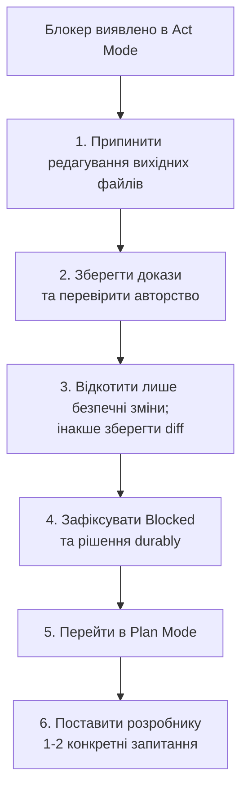

# Специфікація Shared AI Memory Bank та аналізу кодової бази

> Стандартизований протокол для збереження персистентного контексту проєкту, ретельного аудиту кодової бази та безпечних робочих процесів реалізації в **Google Antigravity**, **Claude Code**, **Cline**, **Cursor** та інших AI-агентах для розробки.

**Версія специфікації:** 3.2 (07-10-2026)

**Сумісність:** артефакти протоколу використовують дати стандарту ISO 8601-2 (`DD-MM-YYYY`). Версія 3.2 додає захисні перевірки публікації залежностей (dependency-publication guards), відновлення після перерваного завершення (completion recovery), прив'язку фінальної верифікації (final verification binding), структуроване приймання (structured acceptance) та перевірки історії з урахуванням baseline (baseline-aware history checks). Оновлюйте встановлені файли протоколу, нетермінальні артефакти та `AGENTS.md` разом; не змішуйте версії протоколу. Зберігайте зафіксовані термінальні записи за допомогою baseline порівняння (comparison baseline).

---

## Зміст

1. [Огляд та основні концепції](#1-огляд-та-основні-концепції)
   - [1.1 Навіщо потрібен Shared Memory Bank](#11-навіщо-потрібен-shared-memory-bank)
   - [1.2 Відповідальність файлів](#12-відповідальність-файлів)
   - [1.3 Межі проєкту та контекст користувача](#13-межі-проєкту-та-контекст-користувача)
   - [1.4 Режими роботи](#14-режими-роботи)
   - [1.5 Рівні завантаження контексту](#15-рівні-завантаження-контексту)
   - [1.6 Словники статусів](#16-словники-статусів)
2. [Структура репозиторію](#2-структура-репозиторію)
   - [2.1 Структура каталогів](#21-структура-каталогів)
   - [2.2 Команди створення каркаса](#22-команди-створення-каркаса)
   - [2.3 Заголовок файлів Memory Bank і виявлення застарілості (Staleness)](#23-заголовок-файлів-memory-bank-і-виявлення-застарілості-staleness)
   - [2.4 Стратегія роботи з Git](#24-стратегія-роботи-з-git)
3. [Конфігурація агентів](#3-конфігурація-агентів)
   - [3.1 Канонічний файл протоколу AGENTS.md](#31-канонічний-файл-протоколу-agentsmd)
   - [3.2 Тонкі адаптери інструментів](#32-тонкі-адаптери-інструментів)
4. [Фаза 1: Дослідження кодової бази](#4-фаза-1-дослідження-кодової-бази)
   - [4.1 Прохід 1: Інвентаризація та огляд архітектури](#41-прохід-1-інвентаризація-та-огляд-архітектури)
   - [4.2 Прохід 2: Поглиблений аудит якості та безпеки](#42-прохід-2-поглиблений-аудит-якості-та-безпеки)
   - [4.3 Прохід 3: Карта компонентів і синтез меж](#43-прохід-3-карта-компонентів-і-синтез-меж)
5. [Фаза 2: Ініціалізація Memory Bank](#5-фаза-2-ініціалізація-memory-bank)
   - [5.1 Промпт ініціалізації](#51-промпт-ініціалізації)
   - [5.2 Стартові шаблони](#52-стартові-шаблони)
6. [Фаза 3: Від аналізу до реалізації](#6-фаза-3-від-аналізу-до-реалізації)
   - [6.1 Пріоритезоване планування](#61-пріоритезоване-планування)
   - [6.2 Чекліст перед Act Mode](#62-чекліст-перед-act-mode)
   - [6.3 Виконання в межах Scope](#63-виконання-в-межах-scope)
   - [6.4 Definition of Done](#64-definition-of-done)
   - [6.5 Протокол блокерів і відкату змін](#65-протокол-блокерів-і-відкату-змін)
   - [6.6 Наскрізна послідовність](#66-наскрізна-послідовність)
7. [Життєвий цикл сесії](#7-життєвий-цикл-сесії)
   - [7.1 Початок сесії](#71-початок-сесії)
   - [7.2 Завершення сесії](#72-завершення-сесії)
   - [7.3 Правила порогів оновлення](#73-правила-порогів-оновлення)
8. [Валідація та впровадження](#8-валідація-та-впровадження)

---

## 1. Огляд та основні концепції

### 1.1 Навіщо потрібен Shared Memory Bank

AI-асистенти для програмування працюють у межах обмежених контекстних вікон і не зберігають стан між сесіями, перезапусками інструментів чи змінами моделей. Без зовнішнього структурованого шару пам'яті:
- Агенти раз у раз повторно аналізують кодову базу, марнуючи токени та час.
- Розуміння проєкту втрачається або змінюється між сесіями, що призводить до суперечливих архітектурних рішень.
- Перемикання між інструментами (Antigravity, Claude Code, Cline, Cursor) скидає накопичене розуміння проєкту.

**Shared Memory Bank** — це вбудоване безпосередньо в репозиторій сховище контексту на основі файлів Markdown. Усі агенти заходять через **один канонічний файл протоколу (`AGENTS.md`)**, який явно делегує повноваження цій версіонованій специфікації. Файли для окремих інструментів є тонкими покажчиками, а не незалежними копіями правил протоколу. Код описує спостережувану поведінку; затверджені вимоги описують очікувану поведінку (розділ 3.1, Джерело істини).

#### Цільова аудиторія та рекомендоване використання

`MemBankRulesUkr.md` насамперед призначений для **індивідуальних розробників та малих/середніх проєктів** із **короткостроковим та середньостроковим горизонтом планування**. Він пропонує легку, але дисципліновану структуру, що мінімізує витрати на документування, одночасно забезпечуючи відчутні переваги безперервності роботи.

Основні переваги:
- **Зберігає контекст проєкту між сесіями AI:** Усуває проблему "амнезії" моделей, зберігаючи архітектурні рішення, конвенції технологічного стека та активні робочі завдання безпосередньо у файлах репозиторію, а не в тимчасовій історії діалогів.
- **Зменшує потребу багаторазово пояснювати деталі проєкту різним моделям AI:** Нові сесії миттєво підхоплюють цілі проєкту, операційні обмеження та стандарти розробки без виснажливих вступних інструкцій у кожному запиті.
- **Полегшує перемикання між різними AI-провайдерами та інструментами без втрати контексту:** Вільне перемикання між Google Antigravity, Claude Code, Cline, Cursor та іншими асистентами, оскільки всі вони звертаються до однакових стандартизованих файлів через тонкі адаптери.
- **Мінімізує втрати продуктивності через ліміти використання моделей, обмеження швидкості (rate limits), розмір контекстного вікна або тимчасові сервісні обмеження:** Захищає від простоїв під час вичерпання годинних квот, лімітів токенів, переповнення контексту або обмежень підписки (наприклад, 5-годинних інтервалів використання моделі у провайдерів), даючи змогу миттєво продовжити роботу в іншому інструменті, моделі чи сесії без втрати напрацювань.
- **Заощаджує час та витрати завдяки ефективному продовженню роботи між сесіями:** Усуває надлишкові витрати токенів на повторне дослідження кодової бази, максимізуючи корисний результат кожної взаємодії з моделлю.

Для командної розробки, багатоагентних середовищ або проєктів із середньостроковим і довгостроковим життєвим циклом, де критично важливі сувора простежуваність вимог, формальне відображення критеріїв приймання та контроль змін, застосовуйте [розширення CDIP](MemBankRulesWithCDIPUkr.md).

### 1.2 Відповідальність файлів

| Файл / Каталог | Адиторія | Змінність | Роль |
| :--- | :--- | :--- | :--- |
| `AGENTS.md` | Усі агенти | **Стабільний** | **Канонічна точка входу.** Оголошує обов'язкові версіоновані специфікації та пріоритет правил. |
| `MemBankRules.md` та опціональний `MemBankRulesWithCDIP.md` | Усі агенти | **Стабільний** | Делеговані нормативні правила; читаються перед початком робочого процесу. |
| `GEMINI.md`, `CLAUDE.md`, `.clinerules/`, `.cursor/rules/` | По одному для інструмента | **Стабільний** | Тонкі адаптери: вказують на `AGENTS.md` та містять лише специфічні особливості відповідного інструмента. |
| `memory-bank/projectBrief.md` | Спільний | **Стабільний** | ЩО і НАВІЩО: місія, цілі, межі (scope), не-цілі (non-goals), обмеження. |
| `memory-bank/productContext.md` | Спільний | **Стабільний** | ДЛЯ КОГО і ЯК: персони, користувацькі сценарії, глосарій домену, очікування від UX. |
| `memory-bank/systemPatterns.md` | Спільний | **Напівстабільний** | Архітектура, межі компонентів, патерни проєктування, конвенції коду. |
| `memory-bank/techContext.md` | Спільний | **Напівстабільний** | Стек, налаштування, команди збірки/тестів/лінтера, конфігурація, розгортання. |
| `memory-bank/activeContext.template.md` | Спільний | **Стабільний** | Шаблон для створення `activeContext.md` на новому клоні. |
| `memory-bank/activeContext.md` | Спільний або локальний | **Динамічний** | Фокус поточної сесії та посилання на відстежувані плани/TASK; кешований контекст виконання. |
| `memory-bank/plans/` | Спільний | **Динамічний** | Авторитетні базові плани робочих елементів, ревізії затвердження, статус та передача контексту. |
| `memory-bank/progress.md` | Спільний | **Динамічний** | Виконана робота, беклог знахідок аудиту (`FIND-xxx`), статус тестів. |
| `memory-bank/decisions/` | Спільний | **Зберігає історію** | Один ADR на рішення; зміна статусу додає датований запис до історії замість переписування прийнятого обґрунтування. |
| `memory-bank/decisions/ADR-xxx-<title>.md` | Спільний | **Зберігає історію** | Прийняте обґрунтування незмінне; переходи статусів додають датовані докази. |

### 1.3 Межі проєкту та контекст користувача

Щоб уникнути дублювання між `projectBrief.md` та `productContext.md`:
* **`projectBrief.md` відповідає на запитання ЩО і НАВІЩО (рівень бізнесу):** місія, бізнес-цілі, функціональні вимоги, результати постачання, явні не-цілі, обмеження.
* **`productContext.md` відповідає на запитання ДЛЯ КОГО і ЯК (рівень досвіду):** персони, користувацькі шляхи (зокрема сценарії помилок), термінологія домену, очікування від UX та формату результатів, зовнішні бізнес-системи.

### 1.4 Режими роботи

Різні інструменти називають свої режими по-різному. Ця специфікація визначає режими **за можливостями**, щоб правила діяли для кожного інструмента:

| Режим | Дозволено | Заборонено |
| :--- | :--- | :--- |
| **Plan Mode** | Читання, аналіз, перевірка Git лише для читання; валідація лише за відсутності запису та зовнішніх побічних ефектів. | Запис у файли, коміти, checkout, встановлення залежностей, виправлення лінтера, оновлення snapshot або інші зміни стану. |
| **Documentation Preparation** | За наявності дозволу хоста на запис і авторизованої області документації: створення структури файлів протоколу, збереження планів, створення чернеток вимог/задач, фіксація явних затверджень людиною, оновлення метаданих. | Реалізація коду застосунку, припущення щодо затверджень без прямого погодження, непов'язані правки. |
| **Act Mode** | Реалізація одного робочого елемента зі статусом `Ready` або відновлення виконання власного елемента зі статусом `In Progress`; затверджена верифікація та чітко обмежений супровід метаданих. | Незатверджена реалізація, непов'язані редагування чи деструктивні операції без явного дозволу. |

Це фази робочого процесу, а не надання повноважень від інструмента. Фактичний режим хостового інструмента, інструкції вищого пріоритету та дозволи користувача завжди обмежують дії агента. Якщо Plan Mode забороняє запис, запропонуйте підготовлені зміни документації та зачекайте на режим із дозволом на запис; не перемикайте режими самовільно. Запис блокерів і завершення сесії підпорядковуються цьому самому правилу.

Фаза підготовки (Preparation) не прив'язана до окремої задачі реалізації: її межі мають бути явно дозволені (наприклад, ініціалізація протоколу або створення чернетки плану). Збережіть і перегляньте затверджений план, після чого зробіть коміт **лише дозволених файлів підготовки** перед початком реалізації. Якщо створення коміту не авторизовано, узгодьте цей бар'єр замість реалізації поверх незафіксованого дерева підготовки. У репозиторії без `HEAD` потрібен авторизований початковий коміт до створення checkpoint.

Перевіряйте кожну команду валідації перед запуском. Використовуйте опції, що не вносять правок та не оновлюють snapshot, а також ізольовані тестові дані; ніколи не вважайте тести операцією лише для читання за замовчуванням. У фазах із дозволом на запис згенеровані артефакти мають залишатися поза межами відстежуваного вихідного коду та спільних сервісів; будь-які необхідні побічні ефекти слід фіксувати в плані.

### 1.5 Рівні завантаження контексту

Кожен агент завантажує однакові файли в однаковому порядку:

| Рівень | Коли | Файли |
| :--- | :--- | :--- |
| **Tier 0** | Завжди, на початку сесії | `activeContext.md` (або шаблон), `techContext.md`, пов'язаний відстежуваний PLAN/TASK (за наявності) |
| **Tier 1** | Перед будь-якою зміною коду | `systemPatterns.md` |
| **Tier 2** | Лише за потребою | `projectBrief.md`, `productContext.md`, `progress.md`, `decisions/` |

### 1.6 Словники статусів

Назви статусів не є обов'язковою лінійною послідовністю:

| Артефакт | Життєвий цикл |
| :--- | :--- |
| **Робочий елемент** (елемент плану) | `Backlog`, `Ready`, `In Progress`, `Blocked`, `Done`, `Cancelled` |
| **Знахідка аудиту** (`FIND-xxx`) | `Open` → `Planned` → `Resolved` або `Won't Fix` |
| **ADR** | `Proposed` → `Accepted` або `Rejected`; згодом `Superseded by ADR-xxx` або `Deprecated` |

| Перехід | Передумови та виконавець | Обов'язковий запис |
| :--- | :--- | :--- |
| Backlog → Ready | Агент перевіряє явне затвердження розробником поточної ревізії плану, задоволені залежності, відсутність відкритих блокерів та повний план верифікації | Затверджувач, дата, доказ затвердження, затверджена ревізія |
| Ready → In Progress | Власник закріплює за собою елемент; перевірки перед Act Mode пройдено | Власник, гілка/worktree, checkpoint, baseline |
| In Progress → In Progress (відновлення) | Той самий власник або явна передача; перевірка поточного diff, затвердження, залежностей та checkpoint | Зафіксована передача та нові дані baseline; ніколи не замінюйте початковий checkpoint мовчки |
| In Progress → Done | Власник виконує вимоги розділу 6.4, включно з доказами приймання | Дата завершення, результат верифікації, тема завершального коміту |
| In Progress → Blocked | Власник стикається з блокером або втратою чинності затвердження | Доказ, причина, рішення щодо відкату (rollback disposition) |
| Blocked → Ready | Усі блокери усунуто, затвердження повторно валідовано, залежності задоволено, залишковий diff узгоджено | Доказ усунення; повторні перевірки перед Act Mode під час перезапуску |
| Ready або Blocked → Backlog | Зміна плану/вимог або відкликання затвердження | Примітка перегляду, підвищена ревізія плану (де застосовно), очищене затвердження |
| Backlog, Ready або Blocked → Cancelled | Розробник погоджує скасування | Окремі поля Cancellation reason та Cancellation decision; узгодження залишкових змін перед цим |

Щоб скасувати активну роботу, спочатку зупиніть її та позначте як `Blocked`. Статуси `Done` та `Cancelled` є термінальними: створюйте наступні елементи замість переписування історії. Відхиляйте запропонований план наданням зауважень у статусі `Backlog` або погодженням `Cancelled`; відхилення не є затвердженням. Залежності мають існувати, не посилатися на сам елемент та утворювати ациклічний граф. Скасована залежність не вважається задоволеною; перегляньте та повторно затвердіть залежний план.

**Задоволення залежності не є історичним статусом.** Під час переходу до готовності, старту, відновлення та завершення кожна залежність має бути опублікована як `Done` в прийнятій базовій лінії виконання (execution baseline), її необхідна реалізація має бути доступна у робочій гілці/worktree, і жоден відомий revert або замінююча зміна не повинні порушувати очікувану поведінку. Зафіксуйте повний коміт публікації, повний SHA інтегрованої базової лінії (`Available at`) та докази сумісності у `Dependency Evidence`. Коміт-предок сам по собі не гарантує збереження поведінки; аналізуйте подальші зміни та запускайте відповідні перевірки. Використання cherry-pick потребує еквівалентних доказів реалізації та прийнятого коміту інтеграції із записом залежності. Не повертайте історичний статус `Done`, якщо функціональність видалено пізніше; блокуйте залежні елементи та створюйте наступні задачі.

**Блокери зберігаються під час перепланування.** Зберігайте стабільні ID блокерів у таблиці `Blockers` зі станом `Open` або `Resolved`. Усунення потребує доказів. Поле `Blocked reason` підсумовує поточні відкриті блокери або має значення `none`, якщо їх немає. Жоден маршрут готовності/старту/відновлення/завершення не може обійти відкритий блокер, зокрема маршрут `Blocked → Backlog → Ready`. Зберігайте вирішені рядки в історії. Скасування та схвалення реалізації є окремими рішеннями: `Cancellation decision` визначає автора, датоване рішення, елемент та ревізію; воно ніколи не замінює схвалення плану.

Записані ID блокерів та їхні причини є історією, що ведеться лише на додавання: ніколи не видаляйте та не перейменовуйте рядки, не стирайте їх видаленням задачі та не замінюйте початкову причину. Перехід `Open → Resolved` дозволено лише з доказами вирішення. Закриті рядки з доказами є незмінними; якщо проблема повторилася, створіть новий ID блокера з посиланням на попередній запис. Додавайте виправлення до журналу виконання замість переписування історії. Ці правила діють навіть у разі повернення елемента в Backlog чи його скасування.

**Верифікація відокремлена від статусу виконання:** `Not Run`, `Passed`, `Failed` або `Manual Accepted`. `Done` вимагає `Passed` із доказами приймання або фактичних ручних перевірок із явним схваленням розробника (`Manual Accepted`). Просте перерахування кроків залишає статус `Not Run`/Unverified і не дозволяє перехід у `Done`. Невдалі або недоступні обов'язкові перевірки блокують завершення. Наявні непов'язані помилки baseline можуть залишатися лише за умови їхньої ідентифікації та підтвердження того, що вони не впливають на докази приймання поточного елемента.

Знахідки аудиту переходять у статус `Planned` після прив'язки до відстежуваних задач на виправлення. Позначайте `Resolved` лише після завершення **всіх** необхідних елементів зі статусом `Done` та фіксації регресійних доказів на рівні знахідки. Статус `Won't Fix` потребує обґрунтування розробника; поновлюйте знахідку, якщо нові факти спростовують її закриття. Схвалення ADR також вимагає прямого рішення людини.

---

## 2. Структура репозиторію

### 2.1 Структура каталогів

```text
project-root/
├── AGENTS.md                                # Канонічна точка входу з версіованим делегуванням
├── MemBankRules.md                          # Встановлена нормативна специфікація
├── GEMINI.md                                # Тонкий адаптер: Gemini CLI (опціонально для Antigravity)
├── CLAUDE.md                                # Тонкий адаптер: Claude Code
├── .clinerules/
│   └── memory-bank.md                       # Тонкий адаптер: Cline
├── .cursor/
│   └── rules/
│       └── memory-bank.mdc                  # Тонкий адаптер: Cursor
└── memory-bank/
    ├── projectBrief.md                      # ЩО і НАВІЩО
    ├── productContext.md                    # ДЛЯ КОГО і ЯК
    ├── systemPatterns.md                    # Архітектура та конвенції
    ├── techContext.md                       # Стек і команди
    ├── activeContext.template.md            # Шаблон для activeContext.md
    ├── activeContext.md                     # Поточний фокус, план, checkpoint, baseline, блокери
    ├── plans/                              # Відстежувані записи PLAN-xxx: основа для робіт і передачі
    ├── progress.md                          # Виконана робота та беклог FIND-xxx
    ├── decisions.md                         # Індекс ADR
    └── decisions/
        └── ADR-001-initial-architecture.md  # Один файл на кожне рішення
```

### 2.2 Команди створення каркаса

Виконуйте в корені проєкту під час авторизованої фази Documentation Preparation. Ніколи не перезаписуйте наявні файли протоколу чи контексту без аналізу:

```bash
# 1. Каталоги
mkdir -p memory-bank/decisions memory-bank/plans .clinerules .cursor/rules

# 2. Файли Memory Bank (наповнюються у Фазі 2)
touch memory-bank/projectBrief.md \
      memory-bank/productContext.md \
      memory-bank/systemPatterns.md \
      memory-bank/techContext.md \
      memory-bank/activeContext.template.md \
      memory-bank/progress.md \
      memory-bank/decisions.md

# 3. Протокол та адаптери (вміст у розділі 3)
touch AGENTS.md GEMINI.md CLAUDE.md \
      .clinerules/memory-bank.md \
      .cursor/rules/memory-bank.mdc
```

`activeContext.md` не створюється цією командою. Він формується з шаблону протоколом запуску сесії (розділ 7.1) після наповнення шаблону у Фазі 2.

### 2.3 Заголовок файлів Memory Bank і виявлення застарілості (Staleness)

Кожен описовий файл у `memory-bank/`, включно з `decisions.md` та шаблоном активного контексту, починається з такого заголовка. Історичні записи ADR та авторитетні записи в `plans/` натомість використовують власні датовані метадані життєвого циклу:

```markdown
> Last verified: DD-MM-YYYY @ <commit SHA or UNKNOWN>
> Covers: src/, package.json
```

`Covers` — це список літеральних шляхів через кому відносно кореня репозиторію, без масок (globs), абсолютних шляхів, `..` або ком у назвах. `REPOSITORY` означає весь репозиторій **окрім `memory-bank/`** (запобігає самоінвалідації службових записів). `SESSION` означає ідентичність гілки/worktree/задачі, власника та стан передачі контексту; перевіряється за Git та відстежуваним елементом, а не pathspec. Спеціальні значення вказуються окремо. Вкажіть додаткові вхідні файли, якщо файл пам'яті агрегує інші файли пам'яті.

**Стани свіжості (Freshness states):**
- `Unknown`: відсутній/недійсний/недоступний SHA, відсутність `HEAD`, базова лінія не є предком, некоректне поле Covers або недостатньо даних для повторної верифікації. Помилка чи порожній результат Git не вважаються свіжим станом.
- `Stale`: наявність комітів у зоні Covers після baseline, індексовані/неіндексовані/невідстежувані зміни в зоні покриття або невідповідність ідентичності `SESSION`.
- `Fresh`: baseline є валідним предком, змін у зоні покриття немає, а твердження файлу фактично перевірені. `SESSION` додатково вимагає відповідності гілки/worktree/задачі та перевірки поточного стану.

Для літеральних шляхів перевіряйте зафіксовані, індексовані, неіндексовані та невідстежувані стани з явною обробкою помилок:

```bash
git merge-base --is-ancestor <sha> HEAD
git log --oneline <sha>..HEAD -- <covered paths>
git diff --name-only -- <covered paths>
git diff --cached --name-only -- <covered paths>
git ls-files --others --exclude-standard -- <covered paths>
```

Повідомляйте про `Stale` та `Unknown` на початку сесії. Повторно перевіряйте критичні для задачі команди, обмеження та архітектуру **до їхнього використання**; відкладайте лише нерелевантний контекст. Ніколи не копіюйте новий SHA без аналізу змісту. Під час незафіксованих змін записуйте докази щодо checkpoint плюс перевірений diff; заголовок може залишатися застарілим (Stale). Після завершального коміту оновлення заголовка з новим комітом є окремим узгодженим комітом метаданих; жоден файл не зобов'язаний містити власний майбутній SHA.

### 2.4 Стратегія роботи з Git

#### Спільний контекст команди vs локальний контекст

1. **Спільний контекст команди (за замовчуванням):** комітити всі файли Memory Bank, включно з `activeContext.md`. Оптимально для одного розробника або послідовної роботи в одній гілці.
2. **Локальний контекст worktree (паралельна робота розробників чи агентів):** окремий Git worktree та гілка для кожного власника/задачі; комітити `activeContext.template.md`, а локальний `activeContext.md` додати до ігнорування:
   ```gitignore
   memory-bank/activeContext.md
   ```
   Саме лише ігнорування файлу не ізолює його. Не перемикайте задачі чи гілки в спільному каталозі, розраховуючи, що ігнорований контекст перемкнеться сам. Перевіряйте гілку/worktree/задачу на старті. Якщо контекст відсутній, прочитайте шаблон і відстежуваний план/TASK у Plan Mode; створюйте локальний контекст лише за наявності дозволу хоста на запис. Відновлюйте схвалення, checkpoint, власника, baseline та передачу з відстежуваних задач, а не з ігнорованого контексту.

#### Запобігання конфліктам злиття (merge conflicts)

* Резервуйте ID для PLAN, FIND, ADR, BR, SR та TASK у координатора/розробника перед створенням файлів. Перевіряйте унікальність за спільною гілкою інтеграції. Роздільні файли зменшують конфлікти, але не усувають колізії ID автоматично.
* Обмежуйте зміни в `progress.md` у гілці фічі лише тими елементами, яких вона безпосередньо стосується.
* Закріплюйте за собою задачу через послідовне рішення координатора/розробника перед реалізацією. Локальне поле власника в гілці не є атомарним блокуванням. Зафіксуйте власника та worktree у відстежуваному елементі; явна передача звільняє чи перепризначає власника. Узгоджуйте ID, посилання, затвердження та похідні підсумки під час інтеграції.

#### Checkpoints

Перед початком реалізації індекс та робоче дерево мають бути чистими, підготовка зафіксована комітом, а `HEAD` має існувати. Використовуйте виділений worktree або явне ексклюзивне володіння; чистий checkpoint сам по собі **не** підтверджує авторство подальших змін. Зафіксуйте checkpoint та baseline у відстежуваному плані/TASK перед редагуванням застосунку. Відновлення роботи використовує збережений checkpoint та узгоджує наявний diff, а не скидає його задля формальної чистоти.

#### Конвенції для гілок і комітів

* **Гілка:** `<type>/<ID>-<short-name>`, наприклад `fix/FIND-007-null-session-check`.
* **Коміт:** `<type>: <summary> (FIND-007)`. Кожен коміт у режимі Act Mode посилається на знахідку чи задачу, яку він реалізує.

---

## 3. Конфігурація агентів

### 3.1 Канонічний файл протоколу AGENTS.md

`AGENTS.md` є канонічною точкою входу, а **не другою реалізацією цієї специфікації**. Встановіть цей файл як `MemBankRules.md` у корені проєкту та збережіть наведений нижче текст як `AGENTS.md`. Адаптери повинні забезпечити його читання; не розраховуйте на автоматичне завантаження конкретним інструментом. Відсутність або невідповідність специфікацій блокує запис за протоколом до виправлення у фазі авторизованої підготовки.

````markdown
# AGENTS.md: Shared Memory Bank Protocol

This file is the canonical entry point for repository workflow rules.
Tool-specific files only point here. Before any task, read the installed
`MemBankRules.md` specification version 3.2 in full. It is normative, including
its lifecycle tables, templates' required fields, and safety procedures.
This entry point is a navigation index, not an abbreviated replacement.
Host/system/developer instructions and actual tool permissions take precedence.
Explicit overrides in a declared compatible extension take precedence over the base;
otherwise follow the base. If normative rules conflict ambiguously, stop and ask.

## 1. Memory Bank
Files in `memory-bank/`:
- `projectBrief.md`: WHAT and WHY (goals, scope, non-goals, constraints)
- `productContext.md`: WHO and HOW (personas, journeys, glossary)
- `systemPatterns.md`: architecture, boundaries, conventions
- `techContext.md`: stack and build/test/lint commands
- `activeContext.md`: session-local focus and pointers (never sole authority for approvals)
- `plans/PLAN-xxx-<title>.md`: tracked plan, status, approval, execution record, handoff
- `progress.md`: completed work, FIND-xxx backlog, test status
- `decisions.md` + `decisions/ADR-xxx-<title>.md`: architectural decisions

## 2. Operating Modes
Follow MemBankRules.md sections 1.4 and 1.6. Plan Mode is read-only. Documentation
Preparation needs host write permission and an authorized documentation scope.
Implementation starts at Ready or resumes owned In Progress work; approval and
dependency guards always apply. This protocol cannot switch or expand host modes.

## 3. Session Startup
Follow MemBankRules.md section 7.1: inspect Git before writes, load tiers and the
tracked work item, verify ownership/identity and freshness, then briefly acknowledge.

## 4. Source of Truth
Source code and tests establish observed behavior; approved requirements and approved
plans establish intended behavior. Descriptive memory follows verified observations.
An observed/intended discrepancy is a defect candidate or a proposed requirement
change, never permission to rewrite approved intent or alter code without approval.
Report evidence, distinguish fact from intent, and use the approval/change workflow.

## 5. Safety Rules
- Never run destructive commands without explicit developer permission. This includes:
  `git reset --hard`, `git clean`, `git push --force`, `git stash drop`, deleting branches,
  `rm -rf`, dropping or truncating database tables, and running migrations against shared environments.
- Never commit, stash, or discard the developer's own uncommitted work.
- Never write credentials, tokens, API keys, private keys, connection strings, personal data,
  or production data into any file, including Memory Bank files.
- Do not modify generated files, build output, lock files, or dependencies unless the work item requires it.
- In code you write: validate external input and avoid unsafe command execution.

## 6. Act Mode Procedure
Follow MemBankRules.md sections 6.1-6.4 in order: committed preparation, claim,
clean checkpoint (or reconciled resume), baseline, bounded implementation,
acceptance verification, metadata closeout, then an authorized completion commit.
Execution and verification statuses are separate (section 1.6). Never claim a
command ran or a human approved something without evidence.

## 7. Blocker Protocol
Follow MemBankRules.md section 6.5. Preserve evidence before rollback, inspect
ownership and index state, and never restore entire files whose ownership is uncertain.
Record Blocked and rollback disposition durably; request clarification in Plan Mode.

## 8. Staleness Detection
Follow MemBankRules.md section 2.3, including Fresh/Stale/Unknown, working-tree
changes, special Covers values, and mandatory task-critical reverification.

## 9. Memory Updates (Closeout)
Follow MemBankRules.md sections 7.2-7.3; closeout is part of completion, before the
completion commit. Never resolve a finding merely because one related item is Done.
Approvals and handoff remain in tracked artifacts even when activeContext is ignored.

## 10. Analysis Rules
- Inspect real implementation and tests; never infer behavior from file names alone.
- Cite file paths and line numbers for every finding.
- Separate verified facts from hypotheses.
- Never modify source files during read-only analysis.
- For architectural changes, present alternatives and trade-offs before implementing.
````

### 3.2 Тонкі адаптери інструментів

Адаптери не містять **жодних власних правил**. Вони спрямовують до `AGENTS.md` і додають лише специфічні системні вказівки.

#### GEMINI.md (Gemini CLI)

```markdown
# Project Instructions (Gemini)
Follow `AGENTS.md` in the repository root. It is the canonical protocol for this project.
Do not duplicate its rules here; add only Gemini-specific notes below.
```

#### CLAUDE.md (Claude Code)

```markdown
# Project Instructions (Claude Code)
@AGENTS.md

Claude Code notes:
- Use Claude Code plan mode for Plan Mode as defined in AGENTS.md section 2.
```

#### .clinerules/memory-bank.md (Cline)

```markdown
# Project Rules (Cline)
Read and follow `AGENTS.md` in the repository root before every task. It is the canonical protocol.
Cline's actual mode bounds permissions. Documentation Preparation and implementation both require write-enabled mode; Plan Mode remains read-only.
```

#### .cursor/rules/memory-bank.mdc (Cursor)

```markdown
---
description: Shared Memory Bank protocol
alwaysApply: true
---
Read and follow `AGENTS.md` in the repository root. It is the canonical protocol for this project.
```

> [!NOTE]
> `.cursorrules` — це застарілий формат правил Cursor. Використовуйте його лише тоді, коли ваша версія Cursor не підтримує `.cursor/rules/`. Якщо Cursor читає `AGENTS.md` нативно, цей адаптер можна опустити.

---

## 4. Фаза 1: Дослідження кодової бази

Дослідження виконується за **три обмежені проходи в Plan Mode**, щоб жодна відповідь не вичерпала ліміт виводу моделі. Результати проходів зберігаються в Memory Bank у Фазі 2.

### 4.1 Прохід 1: Інвентаризація та огляд архітектури

```text
Виконайте Прохід 1 (Інвентаризація та огляд архітектури) для цієї кодової бази. Plan Mode: файли не змінювати.

1. Визначте точки входу, основні пакети, конфігураційні файли та маніфести збірки/тестів.
2. Визначте основні залежності часу виконання та фреймворки.
3. З'ясуйте команди запуску тестів і лінтерів, виконайте їх та зафіксуйте поточний результат (baseline).
4. Складіть звіт, який містить:
   - Призначення: що робить застосунок.
   - Топологію модулів: каталоги та пакети верхнього рівня.
   - Основний потік виконання: від старту процесу до головного циклу запитів/подій.
   - Зовнішні інтеграції: бази даних, API, черги, хмарні сервіси.
5. Пропустіть node_modules, dist, build, vendor, coverage, .git та згенеровані артефакти.
6. Обсяг звіту — приблизно до 150 рядків. Поки не аналізуйте баги та не пропонуйте покращень.
```

### 4.2 Прохід 2: Поглиблений аудит якості та безпеки

```text
Виконайте Прохід 2 (Поглиблений аудит якості, безпеки та граничних випадків) для ключових модулів із Проходу 1.
Plan Mode: файли не змінювати.

Дослідіть:
1. Обробку помилок: перехоплення без обробки, відсутність таймаутів, нескінченні повтори.
2. Безпеку: небезпечну обробку введення, ін'єкції, небезпечну десеріалізацію, витік секретів, межі авторизації.
3. Паралелізм і стан: race conditions, спільний змінний стан, витоки ресурсів.
4. Зв'язність: циклічні залежності, дублювання бізнес-логіки, нещільні абстракції.
5. Тести: відсутність покриття критичних робочих процесів.

Оформіть кожну знахідку окремим рядком:
FIND-ID | Серйозність (Critical/High/Medium/Low) | Впевненість | Доказ (path:line) | Вплив | План усунення | Регресійний ризик

Нумеруйте знахідки FIND-001, FIND-002, ... Відокремлюйте підтверджені дефекти від гіпотез.
Окремо виділіть усе, що потребує доказів під час виконання, облікових даних або знань домену для підтвердження.
```

### 4.3 Прохід 3: Карта компонентів і синтез меж

```text
На основі Проходів 1 та 2 створіть лаконічну карту компонентів. Plan Mode: файли не змінювати.

1. Таблиця компонентів: Компонент | Шлях | Відповідальність.
2. Граф залежностей, включно з можливими циклічними залежностями.
3. Місця читання, запису та кешування персистентного стану.
4. Відкриті архітектурні питання, що потребують участі розробника.
```

---

## 5. Фаза 2: Ініціалізація Memory Bank

### 5.1 Промпт ініціалізації

```text
У режимі авторизованої підготовки документації (Documentation Preparation) з дозволом на запис ініціалізуйте Memory Bank на основі результатів Фази 1.

Наповніть:
1. memory-bank/projectBrief.md
2. memory-bank/productContext.md
3. memory-bank/systemPatterns.md   (з Проходів 1 та 3)
4. memory-bank/techContext.md      (включно з командами та baseline тестів із Проходу 1)
5. memory-bank/activeContext.template.md
6. memory-bank/progress.md         (внесіть УСІ знахідки Проходу 2 до таблиці зі статусом Open)
7. memory-bank/decisions.md та memory-bank/decisions/ADR-001-initial-architecture.md

Після цього створіть memory-bank/activeContext.md на основі шаблону.

Правила:
- Використовуйте заголовки розділу 2.3 для описових файлів пам'яті; записи ADR і планів використовують метадані життєвого циклу.
- Розділяйте projectBrief (що/навіщо/scope/не-цілі) та productContext (для кого/як/сценарії/глосарій).
- Фіксуйте лише факти, підтверджені репозиторієм. Припущення позначайте явно у розділі "Open Questions".
- Не вигадуйте бізнес-вимоги.
- Не записуйте секрети чи значення змінних оточення.
- Не змінюйте файли вихідного коду застосунку.

Звіт: перевірені файли, створені файли, відкриті питання.
```

### 5.2 Стартові шаблони

#### Шаблон: projectBrief.md

```markdown
> Last verified: DD-MM-YYYY @ <sha>
> Covers: README.md, docs/

# Project Brief

## Purpose
<!-- 1-2 речення: що робить проєкт і чому він існує -->

## Business Goals and Success Metrics
- Goal 1: metric or outcome

## Primary Requirements
- [REQ-01] Core functional requirement

## Scope
### In Scope
- Capabilities delivered by this repository.

### Out of Scope (Non-Goals)
- Explicit non-goals, external responsibilities, deferred features.

## Constraints and Assumptions
- Constraints: platform, licensing, architectural, organizational.
- Assumptions: marked as such until verified.

## Authoritative References
- Specifications, architecture documents, schemas.
```

#### Шаблон: productContext.md

```markdown
> Last verified: DD-MM-YYYY @ <sha>
> Covers: src/ui/, src/api/

# Product Context

## Problems Solved
- Problem 1

## Personas
- **Primary:** needs, skill level, interaction channel.
- **Secondary:** administrator, operator, or consuming service.

## User Journeys
1. **Primary journey:** trigger to outcome.
2. **Failure journey:** what the user experiences when things go wrong.

## Domain Glossary
| Term | Meaning in this system |
| :--- | :--- |
| Term | Definition |

## UX and Output Expectations
- Output formats, latency expectations, error messages.
```

#### Шаблон: systemPatterns.md

```markdown
> Last verified: DD-MM-YYYY @ <sha>
> Covers: src/

# System Patterns

## Architecture
<!-- Моноліт, модульний сервіс, CLI, черга подій тощо -->

## Components
| Component | Path | Responsibility |
| :--- | :--- | :--- |
| ExampleService | `src/services/example.ts` | Domain logic for X |

## Design Patterns and Conventions
- Structural patterns (repository, factory, dependency injection).
- Error handling convention (result types, domain exceptions, error codes).
- Naming, typing, and formatting rules.

## Data Flow
1. Request -> validation -> domain handler -> persistence -> response.

## Security Boundaries
- Authentication and authorization enforcement points.
- Input sanitization and encryption points.
```

#### Шаблон: techContext.md

Цей шаблон містить блок коду, тому оформлений чотирма зворотними лапками:

````markdown
> Last verified: DD-MM-YYYY @ <sha>
> Covers: package.json, Dockerfile, .github/workflows/

# Technical Context

## Stack
- **Languages:** language and version
- **Frameworks and core libraries:** names and versions
- **Persistence:** databases, caches, file formats

## Setup
```bash
npm install   # or: pip install -r requirements.txt
```

## Commands
- **Build:** `npm run build`
- **Unit tests:** `npm test`
- **Integration tests:** `npm run test:e2e`
- **Lint:** `npm run lint`

## Test Baseline
- Recorded on DD-MM-YYYY @ <sha>: <N> passing, <M> failing (list known failures).
- If no automated tests exist, state so explicitly.

## Configuration
- Environment template: `.env.example`
- Precedence: defaults -> config files -> environment variables

## Deployment
- Target runtime: container, Cloud Run, serverless, VM.
````

#### Шаблон: activeContext.template.md

```markdown
> Last verified: DD-MM-YYYY @ <sha>
> Covers: SESSION

# Active Context

**Last updated:** DD-MM-YYYY
**Current branch:** main

## Current Focus
- Current objective.

## Active Work Item
- [PLAN-001](plans/PLAN-001-session-invalidation.md) (authoritative plan, status, and execution record)
- Owner/worktree: copied from the tracked item only after identity verification.

## Checkpoint and Baseline
- Checkpoint: <short SHA>
- Test baseline: <N> passing, <M> failing (<list>)
- Files modified or created in this work item: (list)

## Recent Changes
- Verified changes from recent sessions.

## Next Steps
1. Step 1.

## Open Questions
- Items awaiting developer clarification.

## Blockers and Risk Discoveries
- None.
```

#### Шаблон: progress.md

```markdown
> Last verified: DD-MM-YYYY @ <sha>
> Covers: memory-bank/plans/, src/, tests/

# Project Progress

**Status as of:** DD-MM-YYYY

## Completed
- [x] Feature or fix, verified by tests (FIND-001).

## In Progress
- [ ] PLAN-001 (FIND-003; derived from the tracked plan)

## Findings Backlog
| ID | Severity | Confidence | Evidence | Impact | Remediation | Regression risk | Status | Required items | Resolution evidence |
| :--- | :--- | :--- | :--- | :--- | :--- | :--- | :--- | :--- | :--- | :--- |
| FIND-003 | Critical | Verified | `src/auth/session.ts:88` | Logged-out session remains usable | Invalidate session | Existing clients | Planned | PLAN-001 | none |

## Test and Verification Status
- Unit, integration, and static analysis status.
```

#### Шаблон: decisions.md та записи ADR

`memory-bank/decisions.md` є коротким покажчиком:

```markdown
> Last verified: DD-MM-YYYY @ <sha>
> Covers: memory-bank/decisions/

# Architectural Decision Records

| ADR | Date | Title | Status | Scope | File |
| :--- | :--- | :--- | :--- | :--- | :--- |
| ADR-001 | DD-MM-YYYY | Initial Architecture and Memory Bank | Proposed | System | [ADR-001](decisions/ADR-001-initial-architecture.md) |
```

Кожен запис — це окремий файл `memory-bank/decisions/ADR-xxx-<title>.md`:

```markdown
# ADR-001: Initial Architecture and Memory Bank

**Status:** Proposed
**Date:** DD-MM-YYYY
**Deciders:** Team or developer

## Status History
- DD-MM-YYYY: Proposed; author and evidence.
<!-- Додавайте виконавця, дату, причину та доказ схвалення для кожного переходу.
     Прийняте обґрунтування незмінне; суттєва заміна оформлюється новим ADR.
     Оновлюйте поле Status та похідний індекс разом. -->

## Context
The verified problem that requires a decision.

## Decision
The chosen approach and why.

## Alternatives Considered
- **Alternative A:** why it was rejected.

## Consequences
- **Positive:** benefits.
- **Trade-offs:** costs, limitations, follow-up work.

## Affected Files
- `path/to/component`
```

---

## 6. Фаза 3: Від аналізу до реалізації

### 6.1 Пріоритезоване планування

Аналізуйте в Plan Mode; зберігайте у фазі авторизованої підготовки документації. Плани є **відстежуваними**, навіть якщо активний контекст ігнорується:

```text
У беклозі знахідок у memory-bank/progress.md оберіть 3-5 найважливіших знахідок зі статусом Open,
які мають вагомі докази в коді.

Для кожної створіть memory-bank/plans/PLAN-xxx-<title>.md за шаблоном нижче:
- Зарезервований ID елемента (PLAN-001, PLAN-002, ...) та FIND-ID, який він реалізує
- Точний перелік файлів у scope
- Очікувана зміна поведінки та питання сумісності
- План тестування
- Підхід до відкату (Rollback)
- Залежності від інших елементів плану
Встановіть кожному елементу статус Backlog, а знахідці — Planned.

Не змінюйте вихідний код. Надішліть запит розробнику на схвалення плану.
```

Фіксуйте явне схвалення ревізії плану розробником; перехід у `Ready` дозволено лише тоді, коли залежності задоволені згідно з розділом 1.6 та відсутні відкриті блокери. Зміна поведінки, scope, залежностей або верифікації підвищує ревізію плану й скидає схвалення. Фіксуйте перевірену підготовку комітом перед реалізацією (розділ 1.4).

#### Шаблон: робочий елемент PLAN-xxx

```markdown
# PLAN-001: Session invalidation

**Status:** Backlog
**Revision:** 1
**Approved revision:** none
**Approval evidence:** none
**Approved by:** none
**Approved on:** none
**Depends on:** none
**Resolves:** FIND-003
**Verification result:** Not Run
**Verification evidence:** none
**Manual acceptance:** none
**Owner:** none
**Branch:** fix/PLAN-001-session-invalidation
**Worktree:** none
**Checkpoint:** none
**Blocked reason:** none
**Review note:** none

**Cancellation reason:** none
**Cancellation decision:** none
**Verified implementation:** none
**Verification environment:** none
**Approval reference:** none
**Final checks:** none

## Blockers
| ID | State | Reason | Resolution evidence |
| :--- | :--- | :--- | :--- |

## Dependency Evidence
| Dependency | Published commit | Available at | Compatibility evidence |
| :--- | :--- | :--- | :--- |

## Behavior and Compatibility
Invalidate the server-side session on logout; preserve the existing response contract.

## Scope (files)
- `src/auth/session.ts`
- `tests/auth/session.test.ts`

## Acceptance and Test Plan
- Logout prevents reuse of the session; verify with the session regression test.
- Record actual project commands, expected results, and integration checks before approval.

## Verification
- **Command:** <actual isolated project regression command>
- **Success:** Session reuse after logout is rejected and required baseline checks pass.

## Rollback Plan
Inspect ownership and preserve evidence; restore only proven-owned uncommitted changes
under section 6.5. Existing committed changes require a separately authorized revert.

## Execution Record
- Claim/handoff approval: none
- Baseline commands, exit codes, passing/failing tests: not run
- Changed/created files and diff ownership: none
- Acceptance evidence and verification commands/results: none
- Next steps and residual changes: none
- Rollback disposition: not needed

## Completion
**Completed on:** none
**Completion commit subject:** none
```

Приклади є чернетками, а не схваленою роботою. Замініть ілюстративні шляхи/команди перевіреними фактами проєкту перед схваленням. Поле `Verification evidence` підсумовує фактичні команди, коди завершення та результати приймання або посилається на збережений протокол виконання; воно не може мати значення `none` для стану `Done`. Тема завершального коміту повинна містити ID робочого елемента і бути унікальною для його завершення; не записуйте самопосилальний SHA коміту. ID записів використовують цифровий суфікс (наприклад, PLAN-001); для задач TASK дозволено опціональні літерні суфікси. Скидайте поля поточного схвалення в `none` одночасно у разі втрати чинності погодження, зберігаючи попереднє рішення в датованій історії виконання/перегляду.

### 6.2 Чекліст перед Act Mode

Перед початком реалізації:
1. Підтвердіть наявність дозволу хоста на запис, дійсне поточне схвалення, задоволені опубліковані залежності, відсутність відкритих блокерів та послідовне закріплення елемента.
2. Перевірте `git status`, наявність `HEAD`, зафіксовану комітом підготовку та чистий стан індексу/дерева. Ніколи не фіксуйте та не ховайте в stash чужу роботу; за потреби запитайте рішення.
3. Створіть виділений worktree або зафіксуйте ексклюзивне володіння та схвалену гілку `<type>/<ID>-<short-name>`.
4. Зафіксуйте повний SHA checkpoint, власника, гілку/worktree та доказ закріплення у відстежуваному плані (TASK у CDIP); копії в активному контексті є лише кешем.
5. Запустіть перевірені авторизовані команди тестів/лінтера та запишіть команди, коди виходу і відомі падіння. Недоступні перевірки потребують рішення щодо верифікації, а не вигаданого baseline.
6. Встановіть статус `In Progress` і розпочніть редагування застосунку. Запис метаданих протоколу в кроках 4-6 дозволено після перевірки чистоти дерева.

Для відновлення роботи не вимагайте чисте дерево і не створюйте новий checkpoint поверх наявних змін. Узгодьте відстежуваний запис виконання з індексом, робочим деревом та проміжними комітами; перевірте права, схвалення, залежності та передачу. Зупиніться, якщо атрибуція викликає сумнів. Повторно запустіть відповідні перевірки baseline у разі зміни оточення чи стану upstream, зберігаючи початковий baseline та документуючи обмеження порівняння.

### 6.3 Виконання в межах Scope

Act Mode, по одному елементу за раз:

```text
Реалізуйте відстежуваний запис PLAN-001 (Ready для старту або власний In Progress для продовження).

- Спочатку виконайте чекліст перед Act Mode (AGENTS.md, розділ 6).
- Змінюйте лише файли в межах scope реалізації та обмежені метадані протоколу; фіксуйте кожен змінений/створений файл.
- Дотримуйтеся конвенцій memory-bank/systemPatterns.md.
- Додайте або оновіть тести для зміненої поведінки.
- Запустіть команди тестів і лінтера; порівняйте результати з baseline.
- Повідомте про змінені файли, виконані команди та результати відповідно до Definition of Done.
- Якщо припущення спростовано, негайно дійте за Blocker Protocol.
```

**Дві області (Two scopes):** область реалізації (implementation scope) містить точні файли застосунку/тестів/конфігурації. Область метаданих протоколу дозволяє змінювати лише активний робочий елемент, активний контекст, зачеплені рядки progress/finding, правдиві виправлення описової пам'яті та необхідні записи ADR/індексу. У CDIP вона також дозволяє оновлювати зачеплені похідні індекси. Це службові оновлення, а не повноваження змінювати схвалені вимоги, scope задачі, залежності, критерії приймання чи правила протоколу. Такі зміни потребують окремої підготовки документації та повторного схвалення. Включайте обидві області до фінального огляду diff.

### 6.4 Definition of Done

Робочий елемент має статус `Done` лише тоді, коли виконано всі наведені умови:

- [ ] Змінено лише схвалені файли реалізації та чітко обмежені метадані протоколу
- [ ] Посилання на фінальне схвалення, власник, задоволені залежності та відсутність блокерів перевірені безпосередньо перед завершенням
- [ ] Докази верифікації прив'язані до фінальної реалізації в межах scope та записаного середовища; індексовані файли відповідають цій реалізації
- [ ] Тести: жодних нових помилок порівняно з baseline; нові та змінені тести проходять
- [ ] Лінтер і статичний аналіз: жодних нових зауважень
- [ ] Кожен критерій приймання має фактичні докази верифікації, включно з обов'язковими інтеграційними перевірками
- [ ] Результат верифікації — `Passed` або явний `Manual Accepted`; обов'язкові перевірки не можуть бути зняті неявно
- [ ] Відстежуваний запис виконання/передачі, активний контекст і progress оновлені; знахідки закриті лише за розділом 1.6
- [ ] Додано ADR, якщо було прийнято архітектурне рішення
- [ ] Жодних секретів ніде не записано
- [ ] Дата завершення та унікальна тема завершального коміту містять ID робочого елемента

**Транзакція завершення:** запустіть верифікацію; зафіксуйте результати; встановіть статус `Done` та заповніть метадані завершення; виконайте згортання (closeout) та оновіть підсумкові таблиці; перегляньте повний diff; потім створіть авторизований завершальний коміт, що містить код **і** метадані. Доки цей коміт не створено успішно, `Done` є лише локальним очікуючим переходом, а не опублікованим завершенням. У разі збою коміту збережіть докази/diff, повідомте про незавершену транзакцію та повторюйте спробу лише за наявності дозволу. Якщо створення коміту не дозволено, не публікуйте `Done`: збережіть статус `In Progress` із завершеною валідацією та передайте підготовлену транзакцію на завершення.

Використовуйте унікальну тему завершального коміту як надійний ключ пошуку в історії Git (зазначайте тему та отриманий SHA у фінальному звіті). Проміжні коміти повинні мати інші теми. Ніколи не вимагайте від коміту містити власний майбутній SHA. Опціональні наступні коміти суто для метаданих мають бути окремо дозволені та чітко означені. `Unverified` є міткою звіту для недостатніх доказів, а не альтернативним статусом виконання чи способом задовольнити `Done`.

### 6.5 Протокол блокерів і відкату змін

#### Фінальні перевірки та відновлення перерваного завершення

Транзакція завершення розділу 6.4 має **стан пропозиції** в робочому дереві та **стан публікації** в авторизованому, переглянутому коміті завершення. Перед підготовкою `Done` і безпосередньо перед комітом повторно перевірте актуальний ланцюжок схвалення за посиланням координатора/інтеграції, ревізію задачі, задоволення залежностей, відсутність відкритих блокерів, власника та весь проіндексований/непроіндексований scope. Запишіть посилання (повний SHA плюс доказ рішення) в `Approval reference`, а датовані результати перевірок — у `Final checks`. Якщо зв'язок із координатором неможливий або власник/схвалення змінилися, зупиніться та збережіть чернетку; не публікуйте її. Ізольований worktree не ізолює зовнішні рішення щодо схвалення.

Верифікація має описувати **фінальну реалізацію**, а не попередню чернетку. Запишіть фактичні команди/результати, версії середовища/залежностей/інструментів та відповідну конфігурацію у `Verification environment`. Після проходження перевірок обчисліть `Verified implementation` за допомогою команди section 8 fingerprint. Будь-яка подальша зміна вмісту файлів у scope, прав доступу, створення чи видалення файлів анулює цю прив'язку і вимагає повторної валідації та нового fingerprint. Scope перераховує точні файли відносно кореня, а не папки/маски, і виключає власний файл запису. Фіксуйте навмисні видалення; відсутній файл потрапляє у fingerprint, але це не доводить коректність видалення. Scope із символічними посиланнями потребує окремого розгляду; еталонний fingerprint їх не підтримує. Зміни оточення чи залежностей також вимагають оцінки впливу та вибіркового або повного перезапуску, навіть якщо хеш файлів не змінився. Звичайні адміністративні оновлення статусів/підсумків не інвалідують тести, якщо вони не впливають на поведінку; ніколи не перераховуйте fingerprint задля приховування неперевірених змін. Порівнюйте фінальний індекс із перевіреними файлами перед публікацією; цей валідатор формує fingerprint робочого дерева, а не потенційного коміту.

Під час кожного запуску перевіряйте наявність локальної пропозиції `Done`, чия точна тема коміту завершення/реалізація/метадані відсутні у прийнятій гілці. Брудне дерево, збій хука або падіння програми можуть залишити таку незавершену транзакцію. Збережіть її та перевірте Git/історію і авторство; ніколи не робіть висновок про публікацію лише за текстом статусу або схожою темою. Якщо авторизований завершальний коміт існує і містить перевірений стан, оновіть кеші та повідомте його SHA. В іншому разі відновіть фінальну верифікацію та авторизований коміт або поверніть незафіксовану пропозицію назад до `In Progress`/`Blocked` із надійним записом відновлення. Це відкат локальної чернетки, а не відкриття заново опублікованого термінального запису. Якщо коміти не дозволені, залиште достовірну інформацію для передачі; не заявляйте про завершену роботу передчасно.

Залежні задачі та звіти про готовність споживають лише опублікований стан із явно прийнятої базової лінії. Локальна чернетка `Done` не може розблокувати іншу задачу навіть у межах однієї групи запропонованих завдань: спочатку опублікуйте та інтегруйте попередню задачу. Похідні зведення в робочому дереві також є лише пропозиціями. Публікація в гілці задачі не означає автоматичної інтеграції, розгортання чи прийняття в іншій гілці. Не переписуйте зафіксовані термінальні записи, включно з їхніми доказами, шляхами та прив'язками; додавайте окремі виправлення або нові елементи. Наявні схвалені історичні докази оцінюються за їхньою історичною версією вимог, а не за сьогоднішніми критеріями.



1. **Зупиніть реалізацію.** Збережіть очищений від чутливих даних текст помилки, відповідні фрагменти diff та кроки відтворення перед будь-якими змінами.
2. **Перевірте авторство:** порівняйте індекс, робоче дерево, невідстежувані файли та коміти після checkpoint із записом виконання. Чисте початкове дерево не є доказом власності. У разі зовнішніх правок або невпевненості в атрибуції не відновлюйте і не видаляйте файли; збережіть diff і зверніться із запитанням.
3. **Варіанти відкату (Rollback cases):**
   - Лише неіндексовані власні правки у відстежуваних файлах реалізації без проміжних комітів: точковий `git restore --source=<checkpoint> --worktree -- <owned paths>` після перевірки.
   - Власні індексовані та неіндексовані правки за тих самих умов: точковий `git restore --source=<checkpoint> --staged --worktree -- <owned paths>` лише після підтвердження того, що індекс не містить чужої роботи.
   - Новостворені файли: видаляйте лише окремо перевірені файли, що належать виключно вам; спочатку видаліть їх з індексу. Ніколи не використовуйте неконтрольований clean.
   - Проміжні коміти: не скидайте історію і не відновлюйте файли наосліп. Запропонуйте revert конкретного коміту, отримайте дозвіл і попередньо оцініть спільні нащадки та конфлікти.
   - Змішане авторство: заборонено повний відкат файлу. Збережіть зміни та запросіть узгоджене вилучення окремих фрагментів або втручання автора.
4. **Зафіксуйте стан:** встановіть для елемента статус `Blocked`, додавши докази, причину, оцінку авторства, залишок змін та рішення щодо відкату. Зберігайте ці метадані замість їх видалення; оновлюйте активний контекст як кеш. Фіксуйте комітом лише авторизовані записи блокерів та передачі. Якщо режим хоста забороняє запис, повідомте про очікуване оновлення метаданих у відповіді.
5. **Поверніться до планування** в межах дозволів хоста та поставте точні запитання. Перезапуск можливий лише за маршрутом `Blocked → Ready` після узгодження та перевірки схвалень. Ніколи не використовуйте `git reset --hard`, `git clean` чи масове видалення як автоматичний крок відновлення.

### 6.6 Наскрізна послідовність

```text
1. Відкрийте корінь репозиторію; перевірте стан Git без внесення змін.
2. Переконайтеся, що .gitignore виключає результати збірки (та activeContext.md за використання локального контексту worktree).
3. Фаза 1, Прохід 1 (Plan Mode): інвентаризація, архітектура, baseline тестів.
4. Фаза 1, Прохід 2 (Plan Mode): аудит -> знахідки FIND-xxx.
5. Фаза 1, Прохід 3 (Plan Mode): карта компонентів.
6. Розробник переглядає знахідки за кодом.
7. Підготовка документації (з дозволом на запис): наповнення memory-bank/ та журналу знахідок.
8. Складання планів, отримання схвалення ревізій, вирішення залежностей, коміт дозволеної підготовки.
9. Фаза 3, виконання (Act Mode): по одному елементу Ready за раз, чекліст перед Act Mode, Definition of Done.
   У разі блокування: Blocker and Rollback Protocol.
10. Верифікація приймання, згортання (closeout), огляд повного diff, спільний коміт коду та метаданих.
```

---

## 7. Життєвий цикл сесії

### 7.1 Початок сесії

```text
Дотримуйтеся AGENTS.md, розділ 3:
1. Перевірте git status, HEAD, гілку та worktree перед будь-яким записом. Завантажте оголошені специфікації.
   Узгодьте будь-яку перервану транзакцію завершення згідно з розділом 6.5 перед зняттям залежностей.
2. Прочитайте Tier 0: activeContext.md (або його шаблон за відсутності), techContext.md та пов'язаний PLAN/TASK.
3. Перевірте ідентичність гілки/worktree/задачі та володіння. Відновіть надійний контекст із відстежуваного елемента;
   створюйте відсутній activeContext лише під час авторизованої підготовки з дозволом на запис. Не перезаписуйте невідповідний контекст наосліп.
4. Прочитайте Tier 1 (systemPatterns.md) перед будь-якою зміною коду та Tier 2 лише за потребою.
5. Перевірте свіжість (freshness); повторно валідуйте критичну інформацію зі станом Stale/Unknown перед використанням.

Відповідь у 1-2 реченнях: поточний фокус і застарілі файли. Потім переходьте до виконання задачі.
НЕ генеруйте непроханий загальний підсумок проєкту.
```

### 7.2 Завершення сесії

```text
Оновіть Memory Bank за результатами цієї сесії (лише файли, інформація в яких змінилася):

1. Відстежуваний план/TASK: авторитетний статус, схвалення, докази виконання, власник, checkpoint та передача.
   activeContext.md: фокус, покажчик, наступні кроки, блокери; ніколи не є єдиною надійною копією.
2. progress.md: виконані елементи; статуси знахідок FIND-xxx.
3. decisions/: додайте ADR для кожного архітектурного рішення; внесіть його до індексу в decisions.md.
4. systemPatterns.md / techContext.md: лише якщо змінилися архітектура, залежності чи команди.
5. Оновіть заголовок "Last verified" кожного файлу, який ви повторно перевірили.
6. Підтвердьте, що жодних секретів не було записано.
7. Перегляньте повний diff і за наявності дозволу створіть завершальний коміт транзакції за розділом 6.4.
8. Звіт: підсумок, змінені файли, фактичні результати валідації та приймання, а також SHA коміту чи межа очікування коміту.
```

### 7.3 Правила порогів оновлення

#### Оновлюйте Memory Bank, коли:
* Робочий елемент переходить у статус `Done` або `Blocked`.
* Функціональність додано, змінено або видалено.
* Виправлено суттєвий дефект або вразливість безпеки.
* Змінюються залежності, версії середовища виконання, команди збірки/тестів чи конфігурація.
* Запропоновано або прийнято архітектурне рішення.
* Завершено структурований аналіз.
* Сесія завершується з незавершеною роботою, яку треба передати далі.

#### НЕ оновлюйте Memory Bank, коли:
* Ви відповідаєте на концептуальні чи пояснювальні запитання.
* Ви виконуєте дослідження лише для читання, яке не принесло нових підтверджених результатів.
* Ви вносите косметичні правки, виправляєте одруки чи змінюєте форматування.
* Ви перебуваєте посеред налагодження, доки висновки не перевірені.

Ці винятки не скасовують обов'язкової фіксації статусів, блокерів, схвалень чи передачі контексту (навіть для косметичної задачі). Записуйте спостереження як спостереження, а не підтверджені висновки. Застосовуйте всі оновлення лише за наявності дозволу хоста на запис; в іншому разі повідомляйте про очікувані оновлення.

> [!TIP]
> Ці правила допомагають підтримувати `memory-bank/` компактним, точним і одразу корисним для кожного агента та члена команди.

## 8. Валідація та впровадження

Встановлюйте як точку входу, так і заявлену версію специфікації, а не ізольований фрагмент. Опціональний еталонний валідатор вимагає Python 3.10 або новішої версії та використовує лише стандартну бібліотеку. Git потрібен для перевірок baseline та регресійного набору тестів. Запускайте ці команди з кореня репозиторію встановленого валідатора (замініть приклад шляху до проєкту та BASE_REF фактичними значеннями):

```bash
python3 tools/validate_protocol.py --specs .
python3 tools/validate_protocol.py --artifacts /absolute/path/to/project
python3 tools/validate_protocol.py --artifacts /absolute/path/to/project --baseline HEAD
python3 tools/validate_protocol.py --artifacts /absolute/path/to/project --baseline BASE_REF --execution-baseline HEAD
python3 tools/validate_protocol.py --artifacts /absolute/path/to/project --fingerprint requirements/tasks/TASK-001A-title.md
python3 -m unittest discover -s tests -v
```

Перевірки специфікації охоплюють узгодженість версій, маркери делегування, локальні посилання/якорі поза прикладами та збалансовані блоки коду. Перевірки артефактів охоплюють записи PLAN/BR/SR/TASK: суворий формат запису, унікальні ID, вбудовані локальні посилання, перевірки поточного стану, цикли залежностей, прив'язку схвалень до ревізій, наявність доказів завершення, зв'язки між знахідками й задачами та захист їх закриття, а також похідні матриці CDIP. Ненульовий код повернення свідчить про помилки; порожній набір артефактів є помилкою, а не успішним аудитом. Валідатор працює виключно в режимі читання і не виконує вбудованих у документи команд.

`--baseline REF` — це **базова лінія порівняння історії (history-comparison baseline)**, коміт-предок HEAD, з яким порівнюються артефакти робочого дерева. Використовуйте прийняту базову лінію до початку змін (часто HEAD для незафіксованої роботи); для коміту в PR використовуйте узгоджену вихідну базу, а не кінцевий стан самого PR. Лише побайтово ідентичні термінальні записи, вже наявні в цій базовій лінії, отримують звільнення як історичні. Видалення, перейменування чи модифікація таких записів призводить до помилки валідації; новостворені завершені записи повинні пройти поточні перевірки схвалень, критеріїв, фінальних захистів та верифікації. Базова лінія є довіреною історичною межею, а не доказом того, що давніша робота колись була схвалена коректно.

`--execution-baseline REF` — це окрема **прийнята базова лінія публікації (accepted publication baseline)** для перевірки залежностей. Вона за замовчуванням дорівнює HEAD, коли передано `--baseline`; користувачі мають переконатися, що цей коміт є прийнятою базовою лінією виконання, а не просто найновішим локальним комітом. Вона має бути предком HEAD і нащадком (або дорівнювати) базової лінії порівняння, коли вказані обидві. Коміти публікації залежностей та коміти `Available at` мають бути предками цієї базової лінії виконання, яка обов'язково повинна містити незмінний опублікований запис Done. Таким чином, задача A може бути завершена й закомічена після вихідної бази порівняння, а згодом легітимно розблокувати задачу B у пізнішій транзакції тієї самої гілки. Незафіксована чернетка Done не може розблокувати B. Ні зв'язок предків, ні схожі метадані не доводять, що реалізація залишається сумісною; перевіряйте зміни та зберігайте докази поведінки. Залежності, перенесені через cherry-pick, вимагають коміту публікації/інтеграції на прийнятій гілці предків із незмінним записом.

Перевірки базової лінії відхиляють невалідні, відсутні посилання або посилання, що не є предками. Без базової лінії порівняння CLI попереджає, що історія термінальних записів, змісту схвалень та блокерів не перевірялася, і сприймає кожен запис Done як нову пропозицію; тому давніші коректні записи можуть вимагати вказання baseline. Без базової лінії виконання (явної або за замовчуванням) інструмент окремо попереджає, що предки публікації/доступності не перевірялися. Сама лише явна базова лінія виконання не надає історичних звільнень.

**Порівняння змісту схвалення:** відносно базової лінії порівняння зміна раніше схваленого контракту PLAN/TASK вимагає суворо вищої `Revision`; зміна контракту BR/SR вимагає вищої `Version`. Це стосується назви, зв'язків із батьківськими елементами, цілей, scope, залежностей, критеріїв, команд верифікації/умов успіху, планів відкату та невідомих секцій контракту, включно з прикладами в блоках коду. Повторне схвалення зміненого чи перенумерованого контракту потребує нових надійних доказів `Approval evidence`, прив'язаних до цієї ревізії; інакше очистіть поля схвалення та поверніться до фази підготовки. Інший рядок доказів сам по собі не є свідченням реального рішення. Номери версій і ревізій не можуть зменшуватися.

Консервативне порівняння виключає операційні метадані верхнього рівня (статус, власник, результати верифікації, фінальні перевірки, метадані завершення та списання/скасування), `Changelog`, похідні списки вимог/задач, а також розділи `Blockers`, `Dependency Evidence`, `Execution Record` і `Completion` у TASK/PLAN. Позначки в чеклістах, порожні рядки, кінцеві пробіли та коментарі HTML не змінюють контракт. Не розміщуйте нормативні зобов'язання в цих службових зонах. У покритті SR ID призначених задач є адміністративними; відображення критеріїв та зобов'язання з верифікації/інтеграції залишаються чутливими до схвалення. Зміна розподілу задач також вимагає аналізу впливу та оновлення схвалення плану зачеплених задач; перевірка кінцевих точок не може довести, що вилучена задача була непотрібною. Зафіксовані блокери окремо перевіряються на збереження, підтверджене усунення та незмінність історії закритих блокерів. Затверджені вимоги мають переводитися у статус списаних (retired), а не видалятися.

`--fingerprint RECORD` є окремою операцією лише для читання: команда виводить лише хеш реалізації в межах scope, а не результат валідації. Хеш обчислюється як SHA-256 від компактного JSON у кодуванні UTF-8 (без екранування ASCII), що містить відсортовані рядки `[path, kind, executable, content-sha256]`; для відсутніх файлів використовується `[path, "missing", false, ""]`. Зберігайте фактичні докази тестів окремо. Перевіряються докази скасування/списання, таблиці блокерів і залежностей, непорожні розділи scope та верифікації, структуровані визначення критеріїв і двостороннє покриття, а також обидва блоки зведених матриць. Таблиці повинні мати точні заголовки шаблону з простими ID через кому (або `none`/`unassigned`, де це дозволено); екрановані вертикальні риски та інші діалекти Markdown не підтримуються. Порожні таблиці залежностей/блокерів містять два рядки заголовка без фіктивного рядка `none`.

Валідатор не замінює автентифікацію рішень людини, не перевіряє семантичну сумісність, не запускає тести, не перевіряє найновіші віддалені схвалення, не встановлює авторство, не доводить довільні переходи чи відсутність race conditions і не аудитує схеми ADR чи свіжість Git. Порівняння відбувається між кінцевими точками, а не між кожним проміжним комітом: валідуйте кожну межу підготовки/завершення, а також фінальний PR, та переглядайте нові записи й проміжну історію. Інструмент не може виявити блокер, який був створений і повністю видалений між перевіреними точками. Збіг метаданих чи хешу не доводить запуск тестів або те, що revert не порушив функціональність. Повнота scope та відповідність індексу робочому дереву вимагають прямого огляду. Інтегруйте валідацію в наявний CI лише після перевірки інструментів і scope проєкту. Шаблони навмисно містять ілюстративні заповнювачі; наповнюйте їх перед валідацією артефактів. Оновлюйте нетермінальні артефакти та похідні зведення до цієї схеми в авторизованій підготовці; зберігайте давніші зафіксовані термінальні записи незмінними та використовуйте baseline для збереження їхніх історичних прив'язок.
