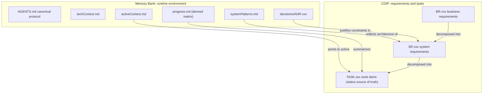
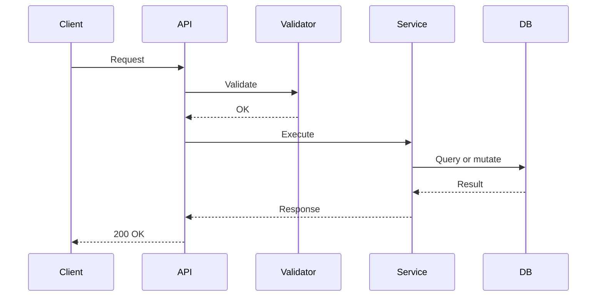

# Shared Memory Bank with CDIP: Extension Specification

> Extends the **Shared Memory Bank** protocol ([MemBankRules.md](MemBankRules.md)) with the **Context Dependency Inversion Principle (CDIP)** for requirements engineering and atomic task execution.
> Works with **Google Antigravity**, **Claude Code**, **Cline**, **Cursor**, and other AI coding agents.

**Specification version:** 3.2 (2026-10-07). **Extends:** MemBankRules.md v3.2.

> [!IMPORTANT]
> Everything in MemBankRules.md applies unless this document explicitly overrides it. This file defines only what CDIP **adds** or **changes**. Templates that are not changed (`techContext.md`, `systemPatterns.md`, `productContext.md`, ADR record) are not repeated here.

---

## Table of Contents

1. [Overview](#1-overview)
   - [1.1 What CDIP Adds](#11-what-cdip-adds)
   - [1.2 Relationship to MemBankRules.md](#12-relationship-to-membankrulesmd)
   - [1.3 Migrating from Memory Bank Only](#13-migrating-from-memory-bank-only)
   - [1.4 Unified Model](#14-unified-model)
   - [1.5 Task Context Rule](#15-task-context-rule)
   - [1.6 Traceability Conventions](#16-traceability-conventions)
2. [Repository Layout Additions](#2-repository-layout-additions)
   - [2.1 Directory Structure](#21-directory-structure)
   - [2.2 Scaffolding Additions](#22-scaffolding-additions)
   - [2.3 Single Source of Truth for Status](#23-single-source-of-truth-for-status)
3. [AGENTS.md CDIP Section](#3-agentsmd-cdip-section)
4. [CDIP Requirements Layer](#4-cdip-requirements-layer)
   - [4.1 Layer 1: Business Requirements](#41-layer-1-business-requirements)
   - [4.2 Layer 2: System Requirements](#42-layer-2-system-requirements)
   - [4.3 Layer 3: Implementation Tasks](#43-layer-3-implementation-tasks)
   - [4.4 Approval Gate](#44-approval-gate)
   - [4.5 Versioning and Change Propagation](#45-versioning-and-change-propagation)
   - [4.6 CDIP Templates](#46-cdip-templates)
5. [Memory Bank Changes Under CDIP](#5-memory-bank-changes-under-cdip)
   - [5.1 projectBrief.md as Project Charter](#51-projectbriefmd-as-project-charter)
   - [5.2 activeContext.md](#52-activecontextmd)
   - [5.3 progress.md](#53-progressmd)
   - [5.4 decisions.md](#54-decisionsmd)
6. [Workflow](#6-workflow)
   - [6.1 Phase 1: Discovery and Reverse-Engineering](#61-phase-1-discovery-and-reverse-engineering)
   - [6.2 Phase 2: Requirements Modeling and Approval](#62-phase-2-requirements-modeling-and-approval)
   - [6.3 Phase 3: Task Execution](#63-phase-3-task-execution)
   - [6.4 Blocker Protocol Additions](#64-blocker-protocol-additions)
   - [6.5 Execution Lifecycle](#65-execution-lifecycle)
7. [Session Lifecycle Additions](#7-session-lifecycle-additions)

---

## 1. Overview

### 1.1 What CDIP Adds

LLM-assisted development fails in two distinct ways:
1. **Context drift (runtime problem):** agents lose state between sessions and tools. The Memory Bank solves this.
2. **Ambiguous or bloated task context (payload problem):** giving an agent the whole codebase or a vague request causes hallucinations and missed constraints. CDIP solves this.

#### Target Audience and Recommended Usage

`MemBankRulesWithCDIP.md` is intended for **engineering teams and projects with medium-term to long-term lifecycles**, where **requirements traceability, auditability, and governance** are important. While individual developers may also use CDIP for high-assurance or mission-critical systems, it specifically addresses the scaling bottlenecks of multi-contributor collaboration and multi-agent coordination.

The CDIP approach establishes **end-to-end traceability** between top-level business goals, architectural system design, and granular implementation activities.

#### The CDIP Hierarchy: BR → SR → TASK

CDIP structures requirements into three bounded layers. Stable business intent sits at the top, and technical detail depends on it, never the reverse:

- **BR (Business Requirement):** Defines **why** the capability is needed, **who** benefits from it, and the applicable **business rules**.
  - *Boundary:* Business requirements must remain strictly **technology-agnostic**. They define real-world needs and constraints without prescribing programming languages, frameworks, endpoints, or database schemas.
- **SR (System Requirement):** Defines **how** the system fulfills a business requirement.
  - *Boundary:* Specifies concrete component responsibilities, API interfaces, data contracts, validation rules, data flows, security constraints, and architectural decisions.
- **TASK:** An atomic, self-contained implementation activity linked to one or more system requirements. Each task should include:
  - **A clear objective:** A concise statement of the precise technical deliverable.
  - **An implementation checklist:** Explicit, ordered steps for code and test modifications.
  - **Acceptance criteria:** Direct reciprocal references to parent SR acceptance criteria (`SR-xxx-AC-yy`).
  - **Verification or validation steps:** Unambiguous success criteria, preferably backed by executable verification commands (e.g. test suite invocations or linters).

#### Benefits of Explicit Traceability (BR → SR → TASK)

Maintaining explicit, enforceable links between `BR → SR → TASK` provides decisive engineering advantages:
- **Requirements traceability:** Provides a continuous audit trail from initial business justification down to specific lines of code, test assertions, and git commits.
- **Impact analysis:** When business priorities change or an architectural decision is updated, teams immediately identify which downstream SRs, tasks, and test suites must be re-evaluated.
- **Knowledge transfer:** Onboarding new team members or AI agents becomes instantaneous because the architectural rationale and business drivers behind every component are clearly documented on disk.
- **Collaboration across team members:** Establishes unambiguous contracts between product owners, system architects, and software engineers, eliminating misaligned assumptions.
- **AI-assisted development accuracy:** Feeding the model only the scoped TASK and its immediate parent SR eliminates token bloat and prevents hallucinations, leading to vastly higher first-pass code accuracy.
- **Long-term maintainability of the project:** Protects codebase integrity against architectural erosion, dead code accumulation, and undocumented legacy behaviors as the system evolves over months and years.

### 1.2 Relationship to MemBankRules.md

| Area | Under CDIP |
| :--- | :--- |
| `AGENTS.md` entry point, thin adapters, safety rules | **Inherited**; explicit versioned CDIP delegation is appended (section 3) |
| Operating modes, staleness detection, checkpoints, baseline, completion transaction | **Inherited**; CDIP adds task context, requirement approval guards, and derived-index closeout |
| Phase 1 discovery passes | **Inherited**, plus a reverse-engineering step (section 6.1) |
| Work items | **Changed:** CDIP `TASK` files replace tracked `memory-bank/plans/PLAN-xxx` records |
| Audit findings (`FIND-xxx`) | **Changed:** each finding chosen for work becomes one or more TASKs (linked to an SR) |
| `projectBrief.md` | **Changed:** becomes the project charter and indexes BRs (section 5.1) |
| `activeContext.md`, `progress.md` | **Changed:** reference TASKs; `progress.md` matrix is derived (section 2.3) |
| Requirements governance | **Added:** approval gate, versioning, change propagation |

### 1.3 Migrating from Memory Bank Only

| Memory Bank only | Memory Bank with CDIP |
| :--- | :--- |
| `projectBrief.md` requirements list | `projectBrief.md` charter + `requirements/BR/BR-xxx` files |
| `systemPatterns.md` component table | Unchanged; component contracts move into `requirements/SR/SR-xxx` |
| `FIND-xxx` in `progress.md` | Kept as the audit log; findings selected for work link to the TASKs that resolve them |
| Tracked `memory-bank/plans/PLAN-xxx` records | `requirements/tasks/TASK-xxx` files; `activeContext.md` points to the active TASK |
| Branch `fix/FIND-007-...`, commit `(FIND-007)` | Branch `task/TASK-007A-...`, commit prefix `TASK-007A:` |

Migrate in authorized Documentation Preparation: reserve IDs, preserve old approval/completion history and finding links, map each open plan to a TASK, and establish current BR/SR approvals and task-plan approvals before execution. Do not infer approvals from legacy statuses. Keep completed legacy records as historical evidence. Commit the reviewed migration before starting a new task.

### 1.4 Unified Model



### 1.5 Task Context Rule

This is the **only** definition of task context. All adapters and prompts use it:

| Load | Files |
| :--- | :--- |
| **Always** | The TASK, parent SR, `techContext.md`, `systemPatterns.md`; parent BR approval/version metadata and dependency/claim metadata needed for execution guards |
| **Only if needed** | Full parent BR body when business intent/acceptance is unclear; related acceptance, change-impact, or dependency evidence |
| **Do not preload** | Unrelated requirement bodies or unrelated implementation; graph/ID metadata may be inspected for validation |

Context minimization never excuses skipping approval-chain checks or inspecting the actual implementation/tests within scope. If the necessary context exceeds an atomic task, split or replan it.

### 1.6 Traceability Conventions

Traceability (code → TASK → SR → BR) is enforced by convention, not assumed:
* **Branch:** `task/TASK-xxx-<short-name>`
* **Commit prefix:** `TASK-xxx: <summary>`
* **TASK file:** links to its parent SR. **SR file:** links to its parent BR.
* **Approval binding:** SR records `Parent version`; TASK records its SR `Parent version`. BR/SR approval is bound to `Version`, task-plan approval to `Revision`.
* **Completion:** record a unique `Completion commit subject` with the TASK prefix, not the SHA of the commit being created. Git history resolves the subject after the completion transaction.
* **IDs and claims:** follow the base serialized reservation/ownership rules. Numeric IDs with an optional uppercase task suffix are supported (for example `TASK-001A`); filenames start with the record ID and a slug.

#### Concrete Decomposition Example: BR → SR → TASK

Below is an illustrative decomposition showing how a business requirement unfolds into system specifications and executable implementation tasks:

```text
BR-001: Transaction Data Export (Business intent: compliance & reporting)
  ├── SR-001: Streaming CSV Serialization Engine (src/export/)
  │     ├── TASK-001A: Streaming CSV Formatter and Batch Cursor
  │     └── TASK-001C: Route Integration & End-to-End Verification (joint)
  └── SR-002: Export Authorization & Rate Limiting (src/middleware/)
        ├── TASK-001B: RBAC Guard & Redis Rate Limiter
        └── TASK-001C: Route Integration & End-to-End Verification (joint)
```

1. **Business Requirement (`BR-001`):**
   - **Title:** Transaction Data Export to CSV
   - **Why & Who:** Compliance officers and financial auditors require exportable transaction history for tax and regulatory audits.
   - **Business Rules (technology-agnostic):**
     - Users may request transaction exports for custom date spans up to 365 calendar days.
     - Unmasked sensitive account identifiers may only be exported by users with verified compliance clearance.
     - Export operations must complete without system timeouts for datasets up to 100,000 records.

2. **System Requirements (`SR-001` & `SR-002`):**
   - **`SR-001`: Streaming CSV Serialization Engine**
     - **Component responsibility:** `src/export/csv_streamer.ts`
     - **Contract & Interface:** `POST /api/v1/transactions/export?format=csv` streaming HTTP response (`text/csv`) with header `Content-Disposition: attachment`.
     - **Validation & Data Flow:** Queries database in chunked cursor batches (1,000 records). Escapes formula injection characters (`=`, `+`, `-`, `@`). Memory RSS must remain under 128MB.
     - **Acceptance criteria:**
       - `SR-001-AC-01`: Streaming generator chunks records correctly and sanitizes formula injection vectors.
       - `SR-001-AC-02`: Streaming endpoint delivers a 50,000-record dataset within memory ceiling.
   - **`SR-002`: Export Authorization and Rate Limiting**
     - **Component responsibility:** `src/middleware/export_auth.ts`
     - **Contract & Interface:** Middleware enforcing role `compliance_auditor` and Redis sliding token bucket: max 5 exports per hour per user account.
     - **Acceptance criteria:**
       - `SR-002-AC-01`: Unauthorized users receive `403 Forbidden`; exceeding 5 requests returns `429 Too Many Requests`.
       - `SR-002-AC-02`: Every export attempt emits an immutable security audit event with user ID and timestamp.

3. **Executable Implementation Tasks (`TASK-001A`, `TASK-001B`, `TASK-001C`):**
   - **`TASK-001A`: Implement Streaming CSV Formatter and Batch Cursor**
     - **Objective:** Build `CsvStreamFormatter` class with batch database cursor handling and formula sanitization.
     - **Implementation checklist:**
       - [ ] Implement `CsvStreamFormatter` in `src/export/csv_streamer.ts`.
       - [ ] Add query cursor pagination helper for 1,000-row chunks.
       - [ ] Add unit test suite for CSV escaping and delimiter handling.
     - **Acceptance criteria:** `SR-001-AC-01`
     - **Verification command:** `npm test -- tests/export/csv_streamer.spec.ts`
   - **`TASK-001B`: Implement Export RBAC Guard and Redis Rate Limiter**
     - **Objective:** Implement Express/Fastify middleware validating `compliance_auditor` and enforcing Redis rate limit.
     - **Implementation checklist:**
       - [ ] Create `exportAuthGuard` middleware in `src/middleware/export_auth.ts`.
       - [ ] Integrate Redis rate limiter with 1-hour window.
       - [ ] Emit audit log entry to security stream on invocation.
     - **Acceptance criteria:** `SR-002-AC-01`, `SR-002-AC-02`
     - **Verification command:** `npm test -- tests/middleware/export_auth.spec.ts`
   - **`TASK-001C`: Wire Route and Execute End-to-End Verification**
     - **Objective:** Mount `/api/v1/transactions/export` route connecting middleware to CSV stream, verifying memory bounds.
     - **Implementation checklist:**
       - [ ] Wire route handler in `src/routes/export.ts`.
       - [ ] Add error interceptor for aborted client streams.
       - [ ] Implement end-to-end load test asserting streaming RSS stays < 128MB.
     - **Acceptance criteria:** `SR-001-AC-02`
     - **Verification command:** `npm run test:e2e -- tests/e2e/transaction_export.e2e.spec.ts`

---

## 2. Repository Layout Additions

### 2.1 Directory Structure

```text
project-root/
├── AGENTS.md                                    # Canonical protocol + CDIP section
├── MemBankRules.md                              # Installed base v3.2 specification
├── MemBankRulesWithCDIP.md                      # Installed compatible CDIP specification
├── GEMINI.md, CLAUDE.md                         # Thin adapters (see MemBankRules.md 3.2)
├── .clinerules/memory-bank.md                   # Thin adapter
├── .cursor/rules/memory-bank.mdc                # Thin adapter
├── .templates/                                  # CDIP templates
│   ├── BR-template.md
│   ├── SR-template.md
│   └── TASK-template.md
├── memory-bank/
│   ├── projectBrief.md                          # Project charter; indexes BRs
│   ├── productContext.md                        # Personas, journeys, glossary (shared by all BRs)
│   ├── systemPatterns.md
│   ├── techContext.md
│   ├── activeContext.template.md
│   ├── activeContext.md                         # Points to the active TASK
│   ├── progress.md                              # Derived requirements matrix + FIND-xxx log
│   ├── decisions.md
│   └── decisions/
│       └── ADR-001-memory-bank-cdip.md
└── requirements/
    ├── README.md                                # Derived traceability matrix
    ├── diagrams/                                # Mermaid or PlantUML flows
    ├── BR/
    │   └── BR-001-export-transactions-csv.md
    ├── SR/
    │   └── SR-001-csv-file-generation.md
    └── tasks/
        ├── TASK-001A-transaction-data-access.md
        └── TASK-001B-csv-formatter.md
```

### 2.2 Scaffolding Additions

Run during authorized Documentation Preparation after the Memory Bank scaffolding in MemBankRules.md section 2.2. Do not overwrite populated files:

```bash
mkdir -p .templates requirements/BR requirements/SR requirements/tasks requirements/diagrams
touch .templates/BR-template.md .templates/SR-template.md .templates/TASK-template.md \
      requirements/README.md
```

### 2.3 Single Source of Truth for Status

Task status is written in **one place only**: the `**Status:**` line of each TASK file.

The working-tree line is proposed state; only its committed version in the accepted baseline is published state. The listing below is inventory, not proof of dependency satisfaction or recovery completion.

| Location | Role |
| :--- | :--- |
| `requirements/tasks/TASK-xxx.md` `**Status:**` | **Authoritative** |
| SR "Derived Tasks" section | Links only, no checkboxes or statuses |
| `memory-bank/progress.md` matrix | Derived; refreshed at closeout |
| `requirements/README.md` matrix | Derived; refreshed at closeout |

Field-level authority: task execution/verification comes from TASK records; requirement version/approval comes from each BR/SR record; findings come from the findings log; claim authorization comes from the serialized coordinator decision recorded in the TASK. Derived indexes never override any of these. Read source records for decisions and refresh indexes in the same preparation/completion transaction, not later. To list task statuses:

```bash
grep -H '^\*\*Status:\*\*' requirements/tasks/TASK-*.md
```

---

## 3. AGENTS.md CDIP Section

Install this specification as `MemBankRulesWithCDIP.md` beside base v3.2 in the project root. Append this delegation section to `AGENTS.md` (MemBankRules.md section 3.1). Adapters need no changes. The full installed specifications are normative; this entry point deliberately does not restate a partial CDIP workflow.

```markdown
## 11. CDIP Extension
Before CDIP operations, read installed `MemBankRulesWithCDIP.md` specification
version 3.2 in full, in addition to base version 3.2. Missing or incompatible files
block CDIP writes until authorized preparation repairs the installation.
Its explicit overrides replace base tracked PLAN records with TASK files and add
task context, revision-bound approval chains, propagation, and derived-index rules.
Use its sections 1.5, 2.3, 4.4-4.6, 6, and 7 for those rules. Do not infer human
approval or rewrite intended requirements to match observed bugs.
All other base rules remain applicable, including host-mode limits, preparation,
ownership-safe rollback, verification states, and metadata-before-commit completion.
```

---

## 4. CDIP Requirements Layer

### 4.1 Layer 1: Business Requirements

* **Purpose:** business motivation, stakeholders, business rules, acceptance criteria, use cases.
* **Rule:** technology-agnostic. No frameworks, databases, or languages. A BR changes only when the business changes, never because of a technical choice.

### 4.2 Layer 2: System Requirements

* **Purpose:** turn a BR into component contracts: interfaces, schemas, validation rules, state changes, error behavior, and sequence diagrams.
* **Rule:** specify **what** the component guarantees, not **how** it is implemented internally.

### 4.3 Layer 3: Implementation Tasks

* **Purpose:** an atomic work item handed directly to an agent.
* **Size guideline:** one parent SR, about 5 or fewer files, independently testable, completable in one Act cycle. Split anything larger.
* **Dependencies:** declared by unique TASK IDs in `Depends on` (`none` when empty). Missing IDs, duplicates, self-dependencies, and cycles are invalid. `Cancelled` does not satisfy a dependency.
* **Readiness:** all guards in section 4.4 must hold; approved SRs do not automatically approve an agent's chosen task scope or verification strategy.

### 4.4 Approval Gate

| Artifact | Lifecycle | Approval authority |
| :--- | :--- | :--- |
| BR, SR | Draft → Approved; Approved → Draft on revision; Draft/Approved → Superseded or Deprecated with developer decision | **Developer only**; agent may transcribe an explicit decision with evidence |
| TASK | Base section 1.6 transition table: Backlog, Ready, In Progress, Blocked, Done, Cancelled | Agent applies transitions only after their guards pass; task-plan approval is a developer decision |

**Approval metadata:** BR/SR records require `Approved version`, `Approved by`, `Approved on`, and `Approval evidence`. `Approved version` must equal the current `Version`; evidence identifies a durable review/decision and its scope. Non-approved current revisions use `none` for current approval fields, preserving previous decisions in the changelog. SR approval additionally requires an approved parent BR at the exact `Parent version`. A missing parent is allowed only for a `Draft` SR with `Parent: unresolved`, `Parent version: none`, and an open question; no task may execute from it.

**TASK readiness/start/resume/completion guards:** its plan `Approved revision` equals `Revision`, all approval evidence is present, its SR is currently approved at its recorded `Parent version`, that SR's BR approval is current at the SR's recorded parent version, every dependency is satisfied under base section 1.6 (published Done, available implementation, compatibility evidence), no unresolved blocker remains, and ownership is valid. Check ancestor metadata even when the BR body is not loaded. At completion recheck the agreed coordinator/integration approval reference and bind verification to the final implementation and environment under base section 6.5. Task plan changes to objective, scope, dependencies, or acceptance/verification increment `Revision`, clear plan approval, and return non-running work to `Backlog`; running work first becomes `Blocked`. Administrative execution/status updates alone do not increment the plan revision. Preserve open blockers when returning to Backlog; replanning never resolves them implicitly.

**Acceptance mapping:** BR criteria have stable IDs (for example `BR-001-AC-01`). SR criteria have IDs and map to BR criteria. SR acceptance coverage maps each SR criterion to responsible TASKs and required integration checks. Each TASK lists its criterion IDs and concrete verification evidence. Approval requires complete coverage of in-scope criteria; task completion alone does not imply that cross-task integration or business acceptance passed. Record those results in follow-up integration/acceptance TASKs before declaring the capability delivered. Criterion IDs denote obligations, not checkbox completion states in approved requirements.

Agents may draft artifacts in authorized preparation but may not invent or self-grant human approval. A developer may approve a batch only if the exact artifact IDs and revisions are enumerated in the decision. Superseding or deprecating requirements needs a reason, a successor link when applicable, and the same downstream impact review as editing.

Use `Retirement reason` and `Retirement decision` for Superseded/Deprecated records; the decision identifies the developer, date, durable evidence and affected revision, independently of cleared implementation/requirement approval fields. `Superseded by` is an existing same-kind successor ID (with a navigational link in the retirement note); no self-reference or successor cycle. Deprecated requirements without replacement use `none`. TASK cancellation uses the base `Cancellation reason` and `Cancellation decision` fields, never `Approval evidence` as a substitute.

**Structured coverage:** define BR/SR obligations only as `- BR-001-AC-01: measurable obligation` or `- SR-001-AC-01: measurable obligation` in `## Acceptance Criteria`. IDs in comments, code fences, or unrelated prose are not definitions. Each current SR criterion has exactly one `Acceptance Coverage` row identifying its parent BR criterion, required TASK IDs, and concrete verification/integration obligations. Every executable TASK mapping must be reciprocal, at the same SR version, and name defined criteria. Draft SRs may leave decomposition `unassigned`; an Approved SR may do so temporarily before task-plan approval, but no mapped TASK may become Ready until coverage for the entire SR has assigned, existing, reciprocal tasks. Integration checks are explicit required TASKs, not implicit consequences of unit-test completion. Include required acceptance TASKs in the same mapping. Adding missing administrative links is not permission to weaken approved obligations; changing which work/evidence is required needs impact review and renewed affected task-plan approval.

### 4.5 Versioning and Change Propagation

Approval binds the contract content, not just a matching version label. The base section 8 comparison rejects changes to previously approved criteria, interfaces (including fenced examples), parent bindings, scope, dependencies, and verification obligations unless the version/revision increases. Reapproval requires fresh decision evidence for that revision; clearing approval is required until that decision exists. Administrative task allocation links and execution updates do not weaken the contract and are not substitutes for impact review. Recorded blocker history survives every propagation step and cannot be deleted to restore readiness. Use separate comparison and execution baselines: a prerequisite committed after the PR comparison base can satisfy a dependent if it is published in the accepted execution baseline and all base dependency guards pass.

Make requirement changes in authorized Documentation Preparation, never as implementation bookkeeping:
1. Record the proposed change and impact evidence. On adoption, increment `Version` (minor `1.0 → 1.1` for clarified intent, major `1.x → 2.0` for changed behavior), append a dated changelog, return to `Draft`, and clear current approval metadata. Preserve prior approved revisions in Git/history. Metadata-only index refreshes do not change requirement intent or require a version bump.
2. For a BR revision, invalidate approval of **all** linked SRs conservatively, even those thought unaffected. Mark them `Draft`, clear approvals, and record the BR revision review note. Review each SR, increment its version when rebinding its `Parent version` or changing its contract, and obtain fresh approval. Document no-behavior-change conclusions rather than silently retaining old approvals.
3. Traverse affected SR → TASK and task dependency edges. Unfinished non-running tasks return to `Backlog` with a review note and cleared plan approval. Running tasks immediately stop and become `Blocked`; preserve evidence and reconcile their diff under the base blocker protocol before replanning. Notify their owners through the coordinator. Existing `Blocked` tasks retain unresolved blocker evidence when returned to `Backlog`.
4. `Done` and `Cancelled` records remain historical, with their original bound versions. Never rewrite them to look approved against today's requirements. For affected completed behavior create follow-up tasks and review dependents that may rely on the old behavior; old `Done` alone does not demonstrate compatibility with new intent.
5. Reapprove BR, then affected SR revisions, then revised task plans. Rebind parent versions only after impact review; do not auto-copy version numbers. Only tasks whose entire current chain and dependencies are valid may return to `Ready`.
6. Refresh all derived indexes in the same authorized preparation transaction. Supersession/deprecation also invalidates downstream execution until records are rebound to approved replacements or explicitly cancelled.

### 4.6 CDIP Templates

The SR template contains code blocks, so it is wrapped in a four-backtick fence.

#### Template: BR-template.md

```markdown
# BR-XXX: <Business Requirement Title>

**Status:** Draft
**Version:** 1.0
**Approved version:** none
**Approved by:** none
**Approved on:** none
**Approval evidence:** none
**Origin:** Stakeholder input | Derived from code (unverified)
**Retirement reason:** none
**Retirement decision:** none
**Superseded by:** none

## Goal
<!-- The business or user outcome -->

## Context
<!-- Why this is needed; the problem it solves -->

## Stakeholders
- **Primary:** end users, customers, or operators
- **Secondary:** administrators, auditors, downstream systems

## Business Rules
1. Rule 1
2. Rule 2

## Triggers
- `trigger-name`: description

## Acceptance Criteria
- BR-XXX-AC-01: measurable business outcome (obligation, not an execution checkbox).

## Use Cases
### UC-001: <Primary flow>
- **Actor:** primary user
- **Preconditions:** ...
- **Main flow:** 1. ... 2. ... 3. ...
- **Failure flow:** ...

## Derived System Requirements
- [SR-XXX](../SR/SR-XXX-title.md)

## Changelog
- DD-MM-YYYY v1.0: created
```

#### Template: SR-template.md

````markdown
# SR-XXX: <System Requirement Title>

**Status:** Draft
**Version:** 1.0
**Approved version:** none
**Approved by:** none
**Approved on:** none
**Approval evidence:** none
**Retirement reason:** none
**Retirement decision:** none
**Superseded by:** none
**Origin:** Designed | Derived from code (unverified)
**Parent:** [BR-XXX](../BR/BR-XXX-title.md)
**Parent version:** 1.0
**Review note:** none

## Open Questions
- Resolve hypotheses before approval. If business intent is unknown, use Parent: unresolved and Parent version: none while Draft only.

## Goal
<!-- The technical capability this requirement guarantees -->

## Components and Boundaries
| Component | Path | Role |
| :--- | :--- | :--- |
| Core service | `src/services/...` | Business logic and validation |

## Logic and Rule Mapping
- **Validation:** exact conditions, formats, limits (map each to a BR rule).
- **State changes:** entities created, updated, deleted.
- **Errors:** error codes and fallback behavior.

## Interfaces
### `POST /api/v1/resource`
Input:
```json
{ "field": "string (ISO 8601-2, required)" }
```
Success (200):
```json
{ "status": "success", "id": "uuid" }
```
Errors: `400` validation failure, `401` unauthenticated.

## Sequence


## Derived Tasks
<!-- Links only. Status lives in each TASK file. -->
- [TASK-XXXA](../tasks/TASK-XXXA-title.md)
- [TASK-XXXB](../tasks/TASK-XXXB-title.md)

## Acceptance Criteria
- SR-XXX-AC-01: State the measurable technical obligation.

## Acceptance Coverage
| SR criterion | BR criterion | Required TASKs | Verification and integration evidence required |
| :--- | :--- | :--- | :--- |
| SR-XXX-AC-01 | BR-XXX-AC-01 | TASK-XXXA, TASK-XXXB | Component regression test plus end-to-end contract check |
<!-- Before task decomposition, required TASKs may be unassigned. Complete this
     mapping before task-plan approval. Adding links to existing obligations is
     administrative; changing an obligation requires a new requirement revision. -->

## Changelog
- DD-MM-YYYY v1.0: created
````

#### Template: TASK-template.md

```markdown
# TASK-XXX: <Task Name>

**Status:** Backlog
**Revision:** 1
**Approved revision:** none
**Approved by:** none
**Approved on:** none
**Approval evidence:** none
**Parent:** [SR-XXX](../SR/SR-XXX-title.md)
**Parent version:** 1.0
**Depends on:** none
**Resolves:** none
**Acceptance criteria:** SR-XXX-AC-01
**Verification result:** Not Run
**Verification evidence:** none
**Manual acceptance:** none
**Owner:** none
**Branch:** task/TASK-XXX-<short-name>
**Worktree:** none
**Checkpoint:** none
**Blocked reason:** none
**Review note:** none
**Cancellation reason:** none
**Cancellation decision:** none
**Verified implementation:** none
**Verification environment:** none
**Approval reference:** none
**Final checks:** none

## Blockers
| ID | State | Reason | Resolution evidence |
| :--- | :--- | :--- | :--- |

## Dependency Evidence
| Dependency | Published commit | Available at | Compatibility evidence |
| :--- | :--- | :--- | :--- |

## Objective
<!-- 1-2 sentences -->

## Scope (files)
- `src/...`
- `tests/...`

## Checklist
- [ ] 1. ...
- [ ] 2. Add or update tests for the behavior change.
- [ ] 3. Run tests and lint; no new failures compared with the baseline.

## Verification
- **Command:** `npm test -- path/to/test`
- **Success:** criterion SR-XXX-AC-01 is demonstrated; new/changed tests pass, no new failures against the baseline, and required integration checks pass.
- **Evidence:** none (record actual commands, exit codes, and criterion-level results).

## Rollback Plan
Follow base section 6.5; inspect ownership/index/commits before targeted recovery.

## Execution Record
- Claim/handoff authorization: none
- Baseline commands, exit codes, and known failures: not run
- Changed/created files and ownership: none
- Next steps and residual changes: none
- Rollback disposition: not needed

## Completion
**Completed on:** none
**Completion commit subject:** none
```

---

## 5. Memory Bank Changes Under CDIP

Descriptive Memory Bank files keep the header from base section 2.3; ADR and work-item records retain the stated exceptions. Requirement records use version/approval metadata, not descriptive-memory freshness headers.

### 5.1 projectBrief.md as Project Charter

`productContext.md` is unchanged: it holds personas, journeys, and the glossary shared by all BRs. `projectBrief.md` keeps the project-level mission, non-goals, and constraints, and replaces its requirements list with a BR index:

```markdown
> Last verified: DD-MM-YYYY @ <sha>
> Covers: README.md, requirements/BR/

# Project Brief

## Purpose
<!-- 1-2 sentences -->

## Scope and Non-Goals
- In scope: ...
- Out of scope: ...

## Constraints
- ...

## Business Requirements Index
| BR | Title | Status |
| :--- | :--- | :--- |
| [BR-001](../requirements/BR/BR-001-export-transactions-csv.md) | Export user transactions to CSV | Approved |
```

### 5.2 activeContext.md

The base active-plan pointer is replaced by a pointer to the active TASK. Its execution record remains tracked even if active context is ignored. Links are relative to `memory-bank/`:

```markdown
> Last verified: DD-MM-YYYY @ <sha>
> Covers: SESSION

# Active Context

**Last updated:** DD-MM-YYYY
**Current branch:** task/TASK-001A-transaction-data-access

## Active Task
- **Task:** [TASK-001A](../requirements/tasks/TASK-001A-transaction-data-access.md)
- **Parent SR:** [SR-001](../requirements/SR/SR-001-csv-file-generation.md)
- **Parent BR:** [BR-001](../requirements/BR/BR-001-export-transactions-csv.md) (always check approval metadata; full body as needed)

## Checkpoint and Baseline
- Owner/worktree: verify against the tracked TASK and actual Git state.
- Checkpoint: <SHA> (cache; TASK execution metadata is authoritative)
- Test baseline: <N> passing, <M> failing (<list>)
- Files modified or created in this task: (list)

## Next Steps
1. ...

## Open Questions
- ...

## Blockers and Risk Discoveries
- None.
```

### 5.3 progress.md

Matrices derive task counts from TASK records and BR/SR versions/statuses from their respective records. Both `progress.md` and `requirements/README.md` contain both exact blocks below (one row per SR, sorted by SR ID); use plain IDs in generated blocks and keep navigational links outside them. Count non-cancelled tasks in Total, and show Cancelled separately. A zero-task SR is not implemented. `Historical Done / Total` counts work across versions, never current capability acceptance. Refresh both blocks in both files together. Preserve the separate findings log and its evidence.

`CURRENT ACCEPTANCE` is a proposed metadata view: required TASK IDs are the sorted union of current coverage rows; Evidence lists the subset of those IDs pointing to Done, current-version records with Passed/Manual Accepted verification and evidence. `Evidence complete` requires all defined criteria covered and allocated, all required tasks complete with evidence, and current SR/BR approvals and parent-version binding; otherwise use `Pending`, or `Not approved` if the SR is not Approved. Structural validation must also pass. It is not a delivery/deployment certification: local proposals must be committed and integrated before consuming this view as published acceptance. Never carry old-version tasks into current coverage; preserve their historical mappings in their immutable records and Git. Reuse behavior only through current-version verification TASKs with explicit evidence. No separate manually editable acceptance flag is authoritative.

```markdown
> Last verified: DD-MM-YYYY @ <sha>
> Covers: requirements/

# Project Progress

**Status as of:** DD-MM-YYYY

## Requirements Matrix
<!-- BEGIN DERIVED REQUIREMENTS -->
| BR | BR Version | BR Status | SR | SR Version | SR Status | Historical Done / Total | Cancelled |
| :--- | :--- | :--- | :--- | :--- | :--- | :--- | :--- |
| BR-001 | 1.0 | Approved | SR-001 | 1.0 | Approved | 1 / 3 | 0 |
| BR-001 | 1.0 | Approved | SR-002 | 1.0 | Draft | 0 / 2 | 0 |
<!-- END DERIVED REQUIREMENTS -->

## Current-Version Acceptance (proposed metadata)
<!-- BEGIN CURRENT ACCEPTANCE -->
| SR | Version | Required TASKs | Evidence | Current-version result (proposed) |
| :--- | :--- | :--- | :--- | :--- |
| SR-001 | 1.0 | TASK-001A, TASK-001B, TASK-001C | TASK-001A | Pending |
| SR-002 | 1.0 | none | none | Not approved |
<!-- END CURRENT ACCEPTANCE -->

## Findings Log
| ID | Severity | Confidence | Evidence | Impact | Remediation | Regression risk | Status | Required items | Resolution evidence |
| :--- | :--- | :--- | :--- | :--- | :--- | :--- | :--- | :--- | :--- |
| FIND-003 | High | Verified | `src/db/query.ts:51` | Slow filtered reads | Add index | Write overhead | Planned | TASK-002B | none |
```

### 5.4 decisions.md

Format unchanged from MemBankRules.md. Filenames in the index must match the files in `decisions/`:

```markdown
> Last verified: DD-MM-YYYY @ <sha>
> Covers: memory-bank/decisions/

# Architectural Decision Records

| ADR | Date | Title | Status | Scope | File |
| :--- | :--- | :--- | :--- | :--- | :--- |
| ADR-001 | DD-MM-YYYY | Memory Bank with CDIP protocol | Accepted | System | [ADR-001](decisions/ADR-001-memory-bank-cdip.md) |
| ADR-002 | DD-MM-YYYY | Token-based download authentication | Proposed | Security | [ADR-002](decisions/ADR-002-token-download-auth.md) |
```

---

## 6. Workflow

### 6.1 Phase 1: Discovery and Reverse-Engineering

Run the three read-only discovery passes from base section 4. Draft text in Plan Mode; persist it only in authorized, write-enabled Documentation Preparation:

```text
Using the Pass 3 component map, draft System Requirements for the existing behavior.

- Create requirements/SR/SR-xxx-<title>.md files with Status: Draft and Origin: Derived from code (unverified).
- If no evidenced BR exists, use Parent: unresolved and Parent version: none, and record the missing-intent question. Resolve and approve the chain before task execution.
- Describe only behavior evidenced by code or tests, with path:line references.
- Draft a BR only where business intent is evidenced (README, docs, test names, UI text).
  Mark every inferred business rule as a hypothesis. Do not invent business rules.
- Do not create TASKs yet. Do not modify source code.
- List the open questions the developer must answer before approving.
```

The developer reviews draft intent; record explicit revision-specific decisions under section 4.4. Drafts are not approval, and superseded/deprecated history is retained rather than silently deleted.

### 6.2 Phase 2: Requirements Modeling and Approval

For new features, and for findings selected for work:

```text
1. BR: goals, stakeholders, business rules, acceptance criteria (Status: Draft).
2. SR: contracts, interfaces, validation, sequence diagram (Status: Draft).
3. Developer approves the BR revision, then the SR revision bound to it; record approval metadata/evidence.
4. TASKs: decompose the approved SR into atomic TASK files (size guideline, Depends on, Scope, Verification).
5. Complete acceptance coverage and obtain approval of each task plan revision (or an enumerated batch).
6. Validate graph/IDs/links, full approval chains and coverage; mark tasks Ready only with satisfied published dependencies and no open blockers.
7. Refresh indexes and commit authorized preparation. Claim tasks through the coordinator before implementation.
```

### 6.3 Phase 3: Task Execution

Act Mode, using section 1.5 context and section 4.4 approval guards. The base pre-act, scope, verification, rollback, and completion transaction apply, with TASK records replacing PLAN records:

```text
Execute requirements/tasks/TASK-001A-transaction-data-access.md (Ready to start or owned In Progress to resume).

Context: the TASK, its parent SR, memory-bank/techContext.md, memory-bank/systemPatterns.md.
Always verify parent BR approval metadata and dependency metadata; load the BR body when needed.

1. Check full approval chain, task-plan approval, dependencies, and claim; complete base pre-act or resume checks.
2. Record ownership/checkpoint/baseline durably and set In Progress if starting.
3. Implement the approved checklist within implementation scope plus bounded protocol metadata scope.
4. Run authorized tests/lint/integration checks; record criterion evidence and verification result against baseline.
5. Recheck final approval reference, ownership, satisfied dependencies and absence of open blockers.
   Bind verification evidence to the final scoped implementation fingerprint and environment.
   If Definition of Done passes and completion committing is authorized, prepare proposed Done, Completed on,
   and a unique Completion commit subject prefixed "TASK-001A:". Otherwise retain In Progress and hand off.
6. Closeout BEFORE committing: refresh both matrices, findings if fully resolved, active context, ADRs,
   and truthful memory headers. Review all changes.
7. Recheck final guards/index, then commit code and metadata together under that exact subject.
   Report actual SHA or pending transaction. A local Done proposal cannot release dependent work.
```

### 6.4 Blocker Protocol Additions

Follow base section 6.5 (stop, preserve evidence, check ownership, safe rollback or preserve diff, durable blocker, planning), plus:
- Set the TASK's `**Status:**` to `Blocked`, fill in `**Blocked reason:**`, and add an Open row to its Blockers table. Resolve rows only with evidence; retain them through replanning.
- If the blocker shows that the SR is wrong, propose an SR change and follow change propagation (section 4.5). Do not edit an `Approved` SR silently.

### 6.5 Execution Lifecycle

```text
Startup (AGENTS.md section 3; Tier 0 includes the active TASK)
   |
   v
Select Ready or resume owned In Progress (full current approval chain, approved plan, dependencies satisfied, no open blockers)
   |
   v
Load task context (including ancestor approval/dependency metadata; BR body as needed)
   |
   v
Pre-act checklist or reconciled resume -> tracked ownership/checkpoint/baseline -> In Progress
   |
   v
Implement within Scope -> verify against the baseline
   |---- blocked ----> Blocker Protocol (TASK Status: Blocked + reason)
   v
Definition of Done -> prepare Done + closeout/derived matrices -> review diff
   |
   v
Authorized completion commit "TASK-xxx: ..." (code + metadata) -> report SHA
```

---

## 7. Session Lifecycle Additions

**Startup** (in addition to MemBankRules.md section 7.1):
- Tier 0 includes the active TASK file referenced in `activeContext.md`.
- Recover tracked execution/handoff and verify branch/worktree/owner; reconcile interrupted completion under base section 6.5 before trusting Done. Recheck approval metadata, published dependency availability and open blockers at start/resume.
- The 1-2 sentence acknowledgment states the active TASK and its status.

**Closeout** (in addition to MemBankRules.md section 7.2):
1. Update the tracked TASK first (checklist, execution evidence, verification result, status, completion/handoff).
2. Refresh both derived matrix blocks from BR/SR/TASK source fields before the completion commit.
3. Resolve findings only after all required tasks and finding-level regression checks pass.
4. Requirement changes belong in separately authorized preparation with changelog/propagation, not incidental closeout edits.
5. Review the complete diff and complete the base transaction; on interruption, preserve a durable handoff.

**Update thresholds** (in addition to MemBankRules.md section 7.3). Always update when:
- A TASK changes status.
- A BR or SR is created, approved, or changed.

> [!TIP]
> The Memory Bank defines the workflow; CDIP defines approved intent and bounded tasks. `AGENTS.md` delegates explicitly to versioned specifications, authoritative artifacts own their fields, and indexes remain derived. Run the reference validator described in base section 8 before publishing preparation or completion.
