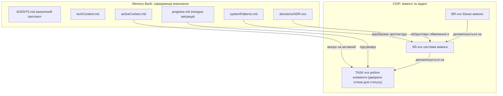
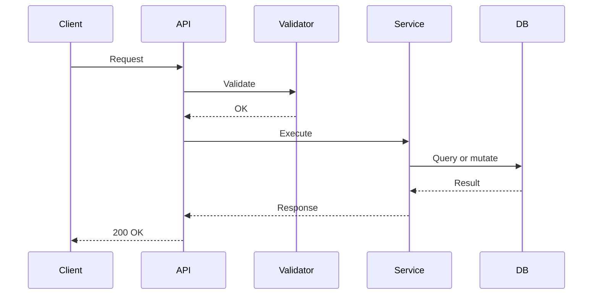

# Shared Memory Bank з CDIP: специфікація розширення

> Розширює протокол **Shared Memory Bank** ([MemBankRules.md](MemBankRules.md)) принципом **Context Dependency Inversion Principle (CDIP)** для інженерії вимог та виконання атомарних задач.
> Працює з **Google Antigravity**, **Claude Code**, **Cline**, **Cursor** та іншими AI-агентами для програмування.

**Версія специфікації:** 3.2 (07-10-2026). **Розширює:** MemBankRules.md v3.2.

> [!IMPORTANT]
> Усе в MemBankRules.md застосовується, якщо цей документ явно не перевизначає інше. Цей файл визначає лише те, що CDIP **додає** або **змінює**. Шаблони, які не зазнали змін (`techContext.md`, `systemPatterns.md`, `productContext.md`, запис ADR), тут не повторюються.

---

## Зміст

1. [Огляд](#1-огляд)
   - [1.1 Що додає CDIP](#11-що-додає-cdip)
   - [1.2 Відношення до MemBankRules.md](#12-відношення-до-membankrulesmd)
   - [1.3 Міграція з чистого Memory Bank](#13-міграція-з-чистого-memory-bank)
   - [1.4 Уніфікована модель](#14-уніфікована-модель)
   - [1.5 Правило контексту задачі](#15-правило-контексту-задачі)
   - [1.6 Конвенції простежуваності (Traceability)](#16-конвенції-простежуваності-traceability)
2. [Доповнення до структури репозиторію](#2-доповнення-до-структури-репозиторію)
   - [2.1 Структура каталогів](#21-структура-каталогів)
   - [2.2 Доповнення до створення каркаса](#22-доповнення-до-створення-каркаса)
   - [2.3 Єдине джерело істини для статусу](#23-єдине-джерело-істини-для-статусу)
3. [Розділ CDIP у AGENTS.md](#3-розділ-cdip-у-agentsmd)
4. [Рівень вимог CDIP](#4-рівень-вимог-cdip)
   - [4.1 Рівень 1: Бізнес-вимоги](#41-рівень-1-бізнес-вимоги)
   - [4.2 Рівень 2: Системні вимоги](#42-рівень-2-системні-вимоги)
   - [4.3 Рівень 3: Задачі реалізації](#43-рівень-3-задачі-реалізації)
   - [4.4 Шлюз затвердження](#44-шлюз-затвердження)
   - [4.5 Версіонування та поширення змін](#45-версіонування-та-поширення-змін)
   - [4.6 Шаблони CDIP](#46-шаблони-cdip)
5. [Зміни в Memory Bank за CDIP](#5-зміни-в-memory-bank-за-cdip)
   - [5.1 projectBrief.md як статут проєкту](#51-projectbriefmd-як-статут-проєкту)
   - [5.2 activeContext.md](#52-activecontextmd)
   - [5.3 progress.md](#53-progressmd)
   - [5.4 decisions.md](#54-decisionsmd)
6. [Робочий процес](#6-робочий-процес)
   - [6.1 Фаза 1: Дослідження та зворотне проєктування](#61-фаза-1-дослідження-та-зворотне-проєктування)
   - [6.2 Фаза 2: Моделювання вимог і затвердження](#62-фаза-2-моделювання-вимог-і-затвердження)
   - [6.3 Фаза 3: Виконання задач](#63-фаза-3-виконання-задач)
   - [6.4 Доповнення до Blocker Protocol](#64-доповнення-до-blocker-protocol)
   - [6.5 Життєвий цикл виконання](#65-життєвий-цикл-виконання)
7. [Доповнення до життєвого циклу сесії](#7-доповнення-до-життєвого-циклу-сесії)

---

## 1. Огляд

### 1.1 Що додає CDIP

Розробка за допомогою LLM стикається з двома основними проблемами:
1. **Зсув контексту (проблема часу виконання):** агенти втрачають стан між сесіями та інструментами. Memory Bank вирішує цю проблему.
2. **Неоднозначний або перевантажений контекст задачі (проблема обсягу даних):** передача агенту всієї кодової бази або нечіткого запиту призводить до галюцинацій та пропущених обмежень. CDIP вирішує цю проблему.

#### Цільова аудиторія та рекомендоване використання

`MemBankRulesWithCDIPUkr.md` призначений для **команд розробників та проєктів із середньостроковим і довгостроковим життєвим циклом**, де критично важливі **простежуваність вимог, аудит та управління змінами (governance)**. Хоча індивідуальні розробники також можуть застосовувати CDIP для систем із високими вимогами до надійності, цей підхід безпосередньо розв'язує проблеми масштабування командної взаємодії та координації багатьох AI-агентів.

Підхід CDIP забезпечує **наскрізну простежуваність (end-to-end traceability)** між високорівневими бізнес-цілями, архітектурним проєктуванням системи та конкретними завданнями реалізації.

#### Ієрархія CDIP: BR → SR → TASK

CDIP структурує вимоги на три чітко розмежовані рівні. Стабільний бізнес-намір знаходиться нагорі, а технічні деталі залежать від нього, і ніколи навпаки:

- **BR (Business Requirement — бізнес-вимога):** Визначає, **навіщо** потрібна можливість, **хто** отримує від неї користь, та відповідні **бізнес-правила**.
  - *Межа:* Бізнес-вимоги мають залишатися суворо **незалежними від технологій (technology-agnostic)**. Вони описують реальні потреби без прив'язки до мов програмування, фреймворків, ендпоінтів чи схем баз даних.
- **SR (System Requirement — системна вимога):** Визначає, **як** система задовольняє бізнес-вимогу.
  - *Межа:* Описує конкретні обов'язки компонентів, контракти API, валідаційні правила, потоки даних, обмеження безпеки та архітектурні рішення.
- **TASK (задача):** Атомарний, самодостатній робочий елемент реалізації, прив'язаний до однієї чи кількох системних вимог. Кожна задача повинна містити:
  - **Чітку мету (objective):** Лаконічне формулювання точного технічного результату.
  - **Чекліст реалізації (implementation checklist):** Послідовні практичні кроки для внесення змін у код і тести.
  - **Критерії приймання (acceptance criteria):** Прямі двосторонні посилання на критерії приймання батьківської SR (`SR-xxx-AC-yy`).
  - **Кроки перевірки чи валідації:** Однозначні критерії успіху, бажано підкріплені виконуваними командами верифікації (наприклад, запуск тестів або лінтерів).

#### Переваги явної простежуваності (BR → SR → TASK)

Підтримка явних зв'язків між `BR → SR → TASK` забезпечує вагомі інженерні переваги:
- **Простежуваність вимог:** Надає повний аудиторський слід від початкового бізнес-обґрунтування до конкретних рядків коду, тверджень у тестах та комітів git.
- **Аналіз впливу змін (impact analysis):** У разі зміни бізнес-пріоритетів або оновлення архітектури команда негайно бачить, які похідні SR, задачі та тестові набори потребують перегляду.
- **Передача знань (knowledge transfer):** Введення в курс справи нових розробників або нових AI-агентів відбувається миттєво, оскільки архітектурне підґрунтя та бізнес-причини кожного компонента чітко зафіксовані на диску.
- **Співпраця всередині команди:** Формує однозначні домовленості між власниками продукту, системними архітекторами та розробниками, усуваючи розбіжності в очікуваннях.
- **Точність розробки за допомогою AI:** Передача моделі лише контексту конкретної задачі TASK та її безпосередньої батьківської SR усуває перевантаження контексту і запобігає галюцинаціям, забезпечуючи значно вищу точність коду з першої спроби.
- **Довгострокова підтримуваність проєкту:** Захищає кодову базу від архітектурної деградації, накопичення "мертвого" коду та недокументованої технічної заборгованості протягом тривалого життєвого циклу проєкту.

### 1.2 Відношення до MemBankRules.md

| Сфера | За CDIP |
| :--- | :--- |
| Точка входу `AGENTS.md`, тонкі адаптери, правила безпеки | **Успадковано**; явне версіоване делегування CDIP додається в кінець (розділ 3) |
| Режими роботи, виявлення застарілості, checkpoint, baseline, транзакція завершення | **Успадковано**; CDIP додає контекст задачі, перевірки схвалення вимог та згортання похідних індексів |
| Проходи дослідження Фази 1 | **Успадковано**, плюс крок зворотного проєктування (розділ 6.1) |
| Робочі елементи | **Змінено:** файли `TASK` у CDIP замінюють відстежувані записи `memory-bank/plans/PLAN-xxx` |
| Знахідки аудиту (`FIND-xxx`) | **Змінено:** кожна обрана для роботи знахідка стає однією або кількома задачами TASK (пов'язаними з SR) |
| `projectBrief.md` | **Змінено:** стає статутом проєкту та містить індекс BR (розділ 5.1) |
| `activeContext.md`, `progress.md` | **Змінено:** посилаються на TASK; матриця в `progress.md` є похідною (розділ 2.3) |
| Управління вимогами | **Додано:** шлюз затвердження, версіонування, поширення змін |

### 1.3 Міграція з чистого Memory Bank

| Лише Memory Bank | Memory Bank з CDIP |
| :--- | :--- |
| Список вимог у `projectBrief.md` | Статут у `projectBrief.md` + файли `requirements/BR/BR-xxx` |
| Таблиця компонентів у `systemPatterns.md` | Без змін; контракти компонентів переходять у `requirements/SR/SR-xxx` |
| `FIND-xxx` у `progress.md` | Зберігається як журнал аудиту; знахідки для роботи посилаються на TASK, які їх закривають |
| Відстежувані записи `memory-bank/plans/PLAN-xxx` | Файли `requirements/tasks/TASK-xxx`; `activeContext.md` вказує на активний TASK |
| Гілка `fix/FIND-007-...`, коміт `(FIND-007)` | Гілка `task/TASK-007A-...`, префікс коміту `TASK-007A:` |

Міграція виконується в авторизованій підготовці документації: зарезервуйте ID, збережіть історію попередніх схвалень/завершень та посилання на знахідки, зіставте кожен відкритий план із TASK, та встановіть актуальні схвалення BR/SR і планів задач перед виконанням. Не виводьте схвалення зі старих статусів неявно. Зберігайте завершені старі записи як історичні докази. Зафіксуйте комітом переглянуту міграцію перед початком нової задачі.

### 1.4 Уніфікована модель



### 1.5 Правило контексту задачі

Це **єдине** визначення контексту задачі. Усі адаптери та промпти використовують його:

| Завантаження | Файли |
| :--- | :--- |
| **Завжди** | TASK, батьківський SR, `techContext.md`, `systemPatterns.md`; метадані схвалення/версії батьківського BR та метадані залежностей/прав, необхідні для перевірок виконання |
| **Лише за потреби** | Повний текст батьківського BR, якщо бізнес-намір чи умови приймання незрозумілі; пов'язані докази приймання, оцінки впливу або залежностей |
| **Не завантажувати заздалегідь** | Тексти непов'язаних вимог або непов'язану реалізацію; метадані графа/ID можна переглядати для валідації |

Мінімізація контексту ніколи не є виправданням для пропуску перевірок ланцюжка схвалень або аналізу фактичної реалізації та тестів у межах scope. Якщо необхідний контекст перевищує межі однієї атомарної задачі, розділіть або переплануйте її.

### 1.6 Конвенції простежуваності (Traceability)

Простежуваність (код → TASK → SR → BR) забезпечується конвенціями, а не припущеннями:
* **Гілка:** `task/TASK-xxx-<short-name>`
* **Префікс коміту:** `TASK-xxx: <summary>`
* **Файл TASK:** містить посилання на батьківський SR. **Файл SR:** містить посилання на батьківський BR.
* **Прив'язка схвалення:** SR фіксує `Parent version`; TASK фіксує `Parent version` свого SR. Схвалення BR/SR прив'язане до `Version`, схвалення плану задачі — до `Revision`.
* **Завершення:** записуйте унікальну тему `Completion commit subject` із префіксом TASK, а не SHA коміту, який тільки створюється. Історія Git зіставляє тему з SHA після завершення транзакції.
* **ID та закріплення:** дотримуйтеся базових правил послідовного резервування та власності. Підтримуються числові ID з необов'язковим літерним суфіксом верхнього регістру (наприклад, `TASK-001A`); назви файлів починаються з ID запису та короткої назви.

#### Конкретний приклад декомпозиції: BR → SR → TASK

Нижче наведено показовий приклад того, як бізнес-вимога розгортається у системні специфікації та виконувані задачі реалізації:

```text
BR-001: Експорт даних транзакцій (Бізнес-намір: аудит та звітність)
  ├── SR-001: Рушій потокової серіалізації CSV (src/export/)
  │     ├── TASK-001A: Потоковий форматер CSV та пакетний курсор
  │     └── TASK-001C: Інтеграція маршруту та наскрізна верифікація (спільна)
  └── SR-002: Авторизація експорту та обмеження частоти запитів (src/middleware/)
        ├── TASK-001B: RBAC-перевірка та Redis-лімітер запитів
        └── TASK-001C: Інтеграція маршруту та наскрізна верифікація (спільна)
```

1. **Бізнес-вимога (`BR-001`):**
   - **Назва:** Експорт історії транзакцій у формат CSV
   - **Навіщо та для кого:** Офіцерам з комплаєнсу та аудиторам потрібен експорт повної історії транзакцій для податкових перевірок і регуляторного аудиту.
   - **Бізнес-правила (незалежні від технологій):**
     - Користувачі можуть експортувати історію транзакцій за довільний період до 365 календарних днів.
     - Немасковані конфіденційні номери рахунків дозволено експортувати виключно користувачам із підтвердженою роллю аудитора комплаєнсу.
     - Операція експорту повинна успішно виконуватися без таймаутів для обсягів до 100 000 записів.

2. **Системні вимоги (`SR-001` та `SR-002`):**
   - **`SR-001`: Рушій потокової серіалізації CSV**
     - **Відповідальність компонента:** `src/export/csv_streamer.ts`
     - **Контракт та інтерфейс:** `POST /api/v1/transactions/export?format=csv`, що повертає потокову HTTP-відповідь (`text/csv`) із заголовком `Content-Disposition: attachment`.
     - **Валідація та потік даних:** Читання з БД пакетами по 1 000 записів через курсор. Екранування символів ін'єкції формул (`=`, `+`, `-`, `@`). Споживання пам'яті RSS має залишатися до 128 МБ.
     - **Критерії приймання:**
       - `SR-001-AC-01`: Потоковий генератор коректно розбиває дані на пакети та знешкоджує вектори ін'єкції формул.
       - `SR-001-AC-02`: Кінцева точка віддає набір даних на 50 000 записів у межах бюджету пам'яті.
   - **`SR-002`: Авторизація експорту та обмеження частоти запитів**
     - **Відповідальність компонента:** `src/middleware/export_auth.ts`
     - **Контракт та інтерфейс:** Проміжне програмне забезпечення (middleware) для перевірки ролі `compliance_auditor` та лімітер Redis (token bucket): не більше 5 запитів на експорт на годину для облікового запису.
     - **Критерії приймання:**
       - `SR-002-AC-01`: Неавторизовані користувачі отримують `403 Forbidden`; перевищення 5 запитів повертає `429 Too Many Requests`.
       - `SR-002-AC-02`: Кожна спроба експорту створює незмінний запис у журналі безпеки з ID користувача та часовою міткою.

3. **Виконувані задачі реалізації (`TASK-001A`, `TASK-001B`, `TASK-001C`):**
   - **`TASK-001A`: Реалізація потокового форматера CSV та пакетного курсора**
     - **Мета (objective):** Створити клас `CsvStreamFormatter` із пакетною обробкою курсора бази даних та захистом від CSV-ін'єкцій.
     - **Чекліст реалізації:**
       - [ ] Реалізувати `CsvStreamFormatter` у `src/export/csv_streamer.ts`.
       - [ ] Додати пагінацію курсора БД для читання пакетами по 1 000 рядків.
       - [ ] Написати набір модульних тестів для перевірки екранування CSV та роздільників.
     - **Критерії приймання:** `SR-001-AC-01`
     - **Команда верифікації:** `npm test -- tests/export/csv_streamer.spec.ts`
   - **`TASK-001B`: Реалізація RBAC-перевірки та Redis-лімітера для експорту**
     - **Мета (objective):** Реалізувати middleware Express/Fastify з перевіркою ролі `compliance_auditor` та лімітом частоти через Redis.
     - **Чекліст реалізації:**
       - [ ] Створити `exportAuthGuard` middleware у `src/middleware/export_auth.ts`.
       - [ ] Інтегрувати лімітер Redis з ковзним вікном в 1 годину.
       - [ ] Реалізувати запис події в аудит-лог безпеки під час виклику.
     - **Критерії приймання:** `SR-002-AC-01`, `SR-002-AC-02`
     - **Команда верифікації:** `npm test -- tests/middleware/export_auth.spec.ts`
   - **`TASK-001C`: Підключення маршруту та наскрізна верифікація**
     - **Мета (objective):** Підключити маршрут `/api/v1/transactions/export`, об'єднавши middleware з потоковим форматом, та верифікувати ліміти пам'яті.
     - **Чекліст реалізації:**
       - [ ] Підключити обробник маршруту в `src/routes/export.ts`.
       - [ ] Додати обробку обриву потоку з боку клієнта.
       - [ ] Написати e2e-тест, що перевіряє передачу 50 000 транзакцій із RSS < 128 МБ.
     - **Критерії приймання:** `SR-001-AC-02`
     - **Команда верифікації:** `npm run test:e2e -- tests/e2e/transaction_export.e2e.spec.ts`

---

## 2. Доповнення до структури репозиторію

### 2.1 Структура каталогів

```text
project-root/
├── AGENTS.md                                    # Канонічний протокол + розділ CDIP
├── MemBankRules.md                              # Встановлена базова специфікація v3.2
├── MemBankRulesWithCDIP.md                      # Встановлена сумісна специфікація CDIP
├── GEMINI.md, CLAUDE.md                         # Тонкі адаптери (див. MemBankRules.md 3.2)
├── .clinerules/memory-bank.md                   # Тонкий адаптер
├── .cursor/rules/memory-bank.mdc                # Тонкий адаптер
├── .templates/                                  # Шаблони CDIP
│   ├── BR-template.md
│   ├── SR-template.md
│   └── TASK-template.md
├── memory-bank/
│   ├── projectBrief.md                          # Статут проєкту; індексує BR
│   ├── productContext.md                        # Персони, сценарії, глосарій (спільні для всіх BR)
│   ├── systemPatterns.md
│   ├── techContext.md
│   ├── activeContext.template.md
│   ├── activeContext.md                         # Вказує на активний TASK
│   ├── progress.md                              # Похідна матриця вимог + журнал FIND-xxx
│   ├── decisions.md
│   └── decisions/
│       └── ADR-001-memory-bank-cdip.md
└── requirements/
    ├── README.md                                # Похідна матриця простежуваності
    ├── diagrams/                                # Діаграми процесів Mermaid або PlantUML
    ├── BR/
    │   └── BR-001-export-transactions-csv.md
    ├── SR/
    │   └── SR-001-csv-file-generation.md
    └── tasks/
        ├── TASK-001A-transaction-data-access.md
        └── TASK-001B-csv-formatter.md
```

### 2.2 Доповнення до створення каркаса

Виконуйте під час авторизованої підготовки документації після створення структури Memory Bank за MemBankRules.md, розділ 2.2. Не перезаписуйте наповнені файли:

```bash
mkdir -p .templates requirements/BR requirements/SR requirements/tasks requirements/diagrams
touch .templates/BR-template.md .templates/SR-template.md .templates/TASK-template.md \
      requirements/README.md
```

### 2.3 Єдине джерело істини для статусу

Статус задачі записується **лише в одному місці**: у рядку `**Status:**` відповідного файлу TASK.

Рядок у робочому дереві є пропозицією стану; лише його зафіксована версія у прийнятій базовій лінії є опублікованим станом. Перелік нижче є інвентаризацією, а не підтвердженням задоволення залежностей чи відновлення.

| Розташування | Роль |
| :--- | :--- |
| `requirements/tasks/TASK-xxx.md` `**Status:**` | **Авторитетний** |
| Розділ "Derived Tasks" у SR | Лише посилання, без чекбоксів чи статусів |
| Матриця в `memory-bank/progress.md` | Похідна; оновлюється під час згортання (closeout) |
| Матриця в `requirements/README.md` | Похідна; оновлюється під час згортання (closeout) |

Авторитетність на рівні полів: виконання та верифікація задачі беруться із записів TASK; версія та схвалення вимог беруться з кожного запису BR/SR; знахідки беруться з журналу знахідок; авторизація закріплення береться з послідовного рішення координатора, записаного в TASK. Похідні індекси ніколи не переважають першоджерела. Читайте вихідні записи для прийняття рішень та оновлюйте індекси в тій самій транзакції підготовки/завершення, а не пізніше. Щоб переглянути статуси задач:

```bash
grep -H '^\*\*Status:\*\*' requirements/tasks/TASK-*.md
```

---

## 3. Розділ CDIP у AGENTS.md

Встановіть цю специфікацію як `MemBankRulesWithCDIP.md` поруч із базовою v3.2 у корені проєкту. Додайте цей розділ делегування до кінця `AGENTS.md` (MemBankRules.md, розділ 3.1). Адаптери не потребують змін. Повні встановлені специфікації є нормативними; ця точка входу свідомо не повторює фрагментарний робочий процес CDIP.

```markdown
## 11. CDIP Extension
Before CDIP operations, read installed `MemBankRulesWithCDIP.md` specification
version 3.2 in full, in addition to base version 3.2. Missing or incompatible files
block CDIP writes until authorized preparation repairs the installation.
Its explicit overrides replace base tracked PLAN records with TASK files and add
task context, revision-bound approval chains, propagation, and derived-index rules.
Use its sections 1.5, 2.3, 4.4-4.6, 6, and 7 for those rules. Do not infer human
approval or rewrite intended requirements to match observed bugs.
All other base rules remain applicable, including host-mode limits, preparation,
ownership-safe rollback, verification states, and metadata-before-commit completion.
```

---

## 4. Рівень вимог CDIP

### 4.1 Рівень 1: Бізнес-вимоги

* **Призначення:** бізнес-мотивація, стейкхолдери, бізнес-правила, критерії приймання, користувацькі сценарії (use cases).
* **Правило:** технологічно нейтральні. Без фреймворків, баз даних чи мов програмування. BR змінюється лише тоді, коли змінюється бізнес, і ніколи через технічний вибір.

### 4.2 Рівень 2: Системні вимоги

* **Призначення:** перетворення BR на контракти компонентів: інтерфейси, схеми, правила валідації, зміни стану, обробку помилок та діаграми послідовностей.
* **Правило:** описувати, **що** гарантує компонент, а не **як** він реалізований внутрішньо.

### 4.3 Рівень 3: Задачі реалізації

* **Призначення:** атомарний робочий елемент, що безпосередньо передається агенту.
* **Орієнтир розміру:** один батьківський SR, приблизно до 5 файлів, незалежно тестується, виконується за один цикл Act Mode. Будь-що більше слід розділяти.
* **Залежності:** оголошуються унікальними ID задач у полі `Depends on` (`none`, якщо порожньо). Відсутні ID, дублікати, самопосилання та цикли є недійсними. Статус `Cancelled` не задовольняє залежність.
* **Готовність:** усі захисні перевірки розділу 4.4 мають бути виконані; схвалені SR не схвалюють автоматично обраний агентом обсяг задачі чи стратегію верифікації.

### 4.4 Шлюз затвердження

| Артефакт | Життєвий цикл | Орган схвалення |
| :--- | :--- | :--- |
| BR, SR | Draft → Approved; Approved → Draft під час перегляду; Draft/Approved → Superseded або Deprecated за рішенням розробника | **Лише розробник**; агент може зафіксувати явне рішення з доказами |
| TASK | Базова таблиця переходів розділу 1.6: Backlog, Ready, In Progress, Blocked, Done, Cancelled | Агент застосовує переходи лише після проходження захисних перевірок; схвалення плану задачі є рішенням розробника |

**Метадані схвалення:** записи BR/SR вимагають `Approved version`, `Approved by`, `Approved on` та `Approval evidence`. Поле `Approved version` має дорівнювати поточній `Version`; доказ визначає надійний огляд/рішення та його межі. Несхвалені поточні ревізії використовують `none` для полів поточного схвалення, зберігаючи попередні рішення в журналі змін. Схвалення SR додатково вимагає схваленого батьківського BR із точною відповідністю `Parent version`. Відсутність батьківського елемента дозволена лише для SR зі статусом `Draft`, де зазначено `Parent: unresolved`, `Parent version: none` та є відкрите питання; жодна задача не може виконуватися на такій основі.

**Захисні перевірки готовності/старту/відновлення/завершення TASK:** поле плану `Approved revision` дорівнює `Revision`, усі докази схвалення наявні, відповідний SR наразі схвалений із зафіксованою версією `Parent version`, схвалення BR для цього SR є чинним для вказаної батьківської версії, кожна залежність задоволена згідно з базовим розділом 1.6 (опублікована Done, доступна реалізація, докази сумісності), відсутні відкриті блокери, а авторство/володіння дійсне. Перевіряйте метадані предків, навіть якщо тіло BR не завантажене. Під час завершення повторно перевірте посилання на схвалення координатора/інтеграції та прив'яжіть верифікацію до фінальної реалізації й оточення за базовим розділом 6.5. Зміни в плані задачі щодо мети, scope, залежностей або приймання/верифікації підвищують `Revision`, очищають схвалення плану та повертають невиконувану роботу в `Backlog`; активна робота спочатку переходить у `Blocked`. Суто адміністративні оновлення виконання/статусу не збільшують ревізію плану. Зберігайте відкриті блокери під час повернення в Backlog; перепланування ніколи не усуває їх автоматично.

**Відображення критеріїв приймання (Acceptance mapping):** критерії BR мають стабільні ID (наприклад, `BR-001-AC-01`). Критерії SR мають ID і відображаються на критерії BR. Покриття приймання SR зв'язує кожен критерій SR із відповідальними TASK та обов'язковими інтеграційними перевірками. Кожен TASK містить перелік ID своїх критеріїв та конкретні докази верифікації. Схвалення вимагає повного покриття критеріїв у межах scope; завершення задачі саме по собі не означає проходження міжзадачної інтеграції чи бізнес-приймання. Фіксуйте ці результати в наступних інтеграційних/приймальних TASK перед тим, як оголосити функціональність реалізованою. ID критеріїв позначають зобов'язання, а не позначки виконання в схвалених вимогах.

Агенти можуть готувати чернетки артефактів в авторизованій підготовці, але не мають права вигадувати чи самостійно надавати погодження людини. Розробник може схвалити пакет вимог лише за умови перерахування точних ID артефактів та їхніх ревізій у рішенні. Заміна (superseding) чи списання (deprecating) вимог потребує причини, посилання на наступника (де застосовно) та такого самого аналізу впливу, як і редагування.

Використовуйте `Retirement reason` та `Retirement decision` для записів Superseded/Deprecated; рішення визначає розробника, дату, надійні докази та зачеплену ревізію незалежно від очищених полів схвалення реалізації/вимоги. Поле `Superseded by` вказує на наявний ID наступника того самого типу (з навігаційним посиланням у примітці); самопосилання чи цикли заборонені. Списані вимоги без заміни використовують `none`. Скасування TASK використовує базові поля `Cancellation reason` та `Cancellation decision`, і ніколи не підміняє їх полем `Approval evidence`.

**Структуроване покриття:** визначайте зобов'язання BR/SR виключно як `- BR-001-AC-01: вимірюване зобов'язання` або `- SR-001-AC-01: вимірюване зобов'язання` у розділі `## Acceptance Criteria`. ID у коментарях, блоках коду чи непов'язаному тексті не вважаються визначеннями. Кожен актуальний критерій SR має рівно один рядок у таблиці `Acceptance Coverage`, де зазначено батьківський критерій BR, обов'язкові ID задач TASK та конкретні зобов'язання щодо верифікації/інтеграції. Кожне виконуване відображення TASK має бути взаємним, посилатися на ту саму версію SR і називати визначені критерії. Чернетки SR можуть залишати декомпозицію як `unassigned`; схвалений SR може тимчасово містити такий стан до схвалення плану задач, але жоден призначений TASK не може перейти в Ready, доки для всього SR не буде призначено наявні взаємні задачі. Інтеграційні перевірки є явними обов'язковими TASK, а не автоматичним наслідком проходження юніт-тестів. Включайте необхідні приймальні TASK до того самого покриття. Додавання відсутніх службових посилань не є дозволом на послаблення схвалених зобов'язань; зміна обсягу робіт/доказів потребує аналізу впливу та оновлення схвалення планів зачеплених задач.

### 4.5 Версіонування та поширення змін

Схвалення закріплює зміст контракту, а не просто відповідний номер версії. Базове порівняння за розділом 8 відхиляє зміни раніше схвалених критеріїв, інтерфейсів (включно з прикладами у блоках коду), батьківських прив'язок, scope, залежностей та зобов'язань щодо верифікації, якщо версія/ревізія не була збільшена. Повторне схвалення потребує нових доказів рішення для цієї ревізії; очищення схвалення є обов'язковим, доки рішення не прийнято. Службові посилання розподілу задач та оновлення виконання не послаблюють контракт і не замінюють аналіз впливу. Зафіксована історія блокерів зберігається на кожному кроці поширення змін і не може бути видалена задля відновлення готовності. Використовуйте окремі базові лінії для порівняння та виконання: попередня умова, зафіксована комітом після бази порівняння PR, може задовольнити залежність, якщо вона опублікована у прийнятій базовій лінії виконання та всі базові перевірки залежностей пройдено.

Вносьте зміни до вимог в авторизованій підготовці документації, ніколи не робіть цього як побічний запис під час реалізації:
1. Зафіксуйте запропоновану зміну та докази впливу. Після погодження збільшіть `Version` (мінорна `1.0 → 1.1` для уточнення наміру, мажорна `1.x → 2.0` для зміни поведінки), додайте датований рядок до changelog, поверніть у статус `Draft` та очистіть поточні метадані схвалення. Зберігайте попередні схвалені версії в Git/історії. Оновлення виключно службових індексів не змінює змісту вимог і не вимагає підвищення версії.
2. У разі перегляду BR консервативно анулюйте схвалення **всіх** пов'язаних SR, навіть тих, які вважаються незачепленими. Позначте їх як `Draft`, очистіть схвалення та внесіть примітку про перегляд BR. Проаналізуйте кожен SR, збільшіть його версію у разі переприв'язки `Parent version` чи зміни контракту та отримайте нове схвалення. Фіксуйте висновки про відсутність змін у поведінці документально замість мовчазного збереження старих схвалень.
3. Пройдіть зв'язки SR → TASK та ребра залежностей задач. Незавершені неактивні задачі повертаються в `Backlog` із приміткою та очищеним схваленням плану. Активні задачі негайно зупиняються і переходять у `Blocked`; збережіть докази та узгодьте їхній diff за базовим протоколом блокерів перед переплануванням. Повідомте їхніх власників через координатора. Наявні заблоковані задачі зберігають нерозв'язані докази блокерів під час повернення в `Backlog`.
4. Записи зі статусом `Done` та `Cancelled` залишаються історичними з початковими версіями прив'язки. Ніколи не переписуйте їх задля створення видимості відповідності сьогоднішнім вимогам. Для зачепленої реалізованої поведінки створюйте нові задачі та переглядайте залежні елементи; старий статус `Done` сам по собі не підтверджує сумісність із новим наміром.
5. Повторно затвердіть BR, потім зачеплені ревізії SR, а потім переглянуті плани задач. Переприв'язуйте версії батьківських елементів лише після аналізу впливу; не копіюйте версії автоматично. Лише задачі, чий повний ланцюжок і залежності є дійсними, можуть повернутися в `Ready`.
6. Оновіть усі похідні індекси в тій самій транзакції підготовки. Заміна чи списання вимог також блокує подальше виконання, доки записи не будуть прив'язані до схвалених замінників або явно скасовані.

### 4.6 Шаблони CDIP

Шаблон SR містить блоки коду, тому оформлений чотирма зворотними лапками.

#### Шаблон: BR-template.md

```markdown
# BR-XXX: <Business Requirement Title>

**Status:** Draft
**Version:** 1.0
**Approved version:** none
**Approved by:** none
**Approved on:** none
**Approval evidence:** none
**Origin:** Stakeholder input | Derived from code (unverified)
**Retirement reason:** none
**Retirement decision:** none
**Superseded by:** none

## Goal
<!-- Бізнес-результат або результат для користувача -->

## Context
<!-- Навіщо це потрібно; проблема, яку вирішує вимога -->

## Stakeholders
- **Primary:** кінцеві користувачі, клієнти або оператори
- **Secondary:** адміністратори, аудитори, інтегровані системи

## Business Rules
1. Rule 1
2. Rule 2

## Triggers
- `trigger-name`: опис

## Acceptance Criteria
- BR-XXX-AC-01: вимірюваний бізнес-результат (зобов'язання, а не чекбокс виконання).

## Use Cases
### UC-001: <Primary flow>
- **Actor:** основний користувач
- **Preconditions:** ...
- **Main flow:** 1. ... 2. ... 3. ...
- **Failure flow:** ...

## Derived System Requirements
- [SR-XXX](../SR/SR-XXX-title.md)

## Changelog
- DD-MM-YYYY v1.0: created
```

#### Шаблон: SR-template.md

````markdown
# SR-XXX: <System Requirement Title>

**Status:** Draft
**Version:** 1.0
**Approved version:** none
**Approved by:** none
**Approved on:** none
**Approval evidence:** none
**Retirement reason:** none
**Retirement decision:** none
**Superseded by:** none
**Origin:** Designed | Derived from code (unverified)
**Parent:** [BR-XXX](../BR/BR-XXX-title.md)
**Parent version:** 1.0
**Review note:** none

## Open Questions
- Вирішіть гіпотези перед схваленням. Якщо бізнес-намір невідомий, вказуйте Parent: unresolved та Parent version: none лише у статусі Draft.

## Goal
<!-- Технічна можливість, яку гарантує ця вимога -->

## Components and Boundaries
| Component | Path | Role |
| :--- | :--- | :--- |
| Core service | `src/services/...` | Бізнес-логіка та валідація |

## Logic and Rule Mapping
- **Validation:** точні умови, формати, обмеження (відображені на правила BR).
- **State changes:** сутності, що створюються, змінюються, видаляються.
- **Errors:** коди помилок та логіка відновлення.

## Interfaces
### `POST /api/v1/resource`
Input:
```json
{ "field": "string (ISO 8601-2, required)" }
```
Success (200):
```json
{ "status": "success", "id": "uuid" }
```
Errors: `400` validation failure, `401` unauthenticated.

## Sequence


## Derived Tasks
<!-- Лише посилання. Статус зберігається в кожному файлі TASK. -->
- [TASK-XXXA](../tasks/TASK-XXXA-title.md)
- [TASK-XXXB](../tasks/TASK-XXXB-title.md)

## Acceptance Criteria
- SR-XXX-AC-01: Визначте вимірюване технічне зобов'язання.

## Acceptance Coverage
| SR criterion | BR criterion | Required TASKs | Verification and integration evidence required |
| :--- | :--- | :--- | :--- |
| SR-XXX-AC-01 | BR-XXX-AC-01 | TASK-XXXA, TASK-XXXB | Регресійний тест компонента плюс наскрізна перевірка контракту |
<!-- До декомпозиції задач required TASKs можуть бути unassigned. Заповніть це
     відображення перед схваленням плану задач. Додавання посилань до наявних
     зобов'язань є адміністративним; зміна зобов'язання потребує нової ревізії. -->

## Changelog
- DD-MM-YYYY v1.0: created
````

#### Шаблон: TASK-template.md

```markdown
# TASK-XXX: <Task Name>

**Status:** Backlog
**Revision:** 1
**Approved revision:** none
**Approved by:** none
**Approved on:** none
**Approval evidence:** none
**Parent:** [SR-XXX](../SR/SR-XXX-title.md)
**Parent version:** 1.0
**Depends on:** none
**Resolves:** none
**Acceptance criteria:** SR-XXX-AC-01
**Verification result:** Not Run
**Verification evidence:** none
**Manual acceptance:** none
**Owner:** none
**Branch:** task/TASK-XXX-<short-name>
**Worktree:** none
**Checkpoint:** none
**Blocked reason:** none
**Review note:** none
**Cancellation reason:** none
**Cancellation decision:** none
**Verified implementation:** none
**Verification environment:** none
**Approval reference:** none
**Final checks:** none

## Blockers
| ID | State | Reason | Resolution evidence |
| :--- | :--- | :--- | :--- |

## Dependency Evidence
| Dependency | Published commit | Available at | Compatibility evidence |
| :--- | :--- | :--- | :--- |

## Objective
<!-- 1-2 речення -->

## Scope (files)
- `src/...`
- `tests/...`

## Checklist
- [ ] 1. ...
- [ ] 2. Add or update tests for the behavior change.
- [ ] 3. Run tests and lint; no new failures compared with the baseline.

## Verification
- **Command:** `npm test -- path/to/test`
- **Success:** критерій SR-XXX-AC-01 підтверджено; нові/змінені тести проходять, нові збої відносно baseline відсутні, обов'язкові інтеграційні перевірки пройдено.
- **Evidence:** none (фіксуйте фактичні команди, коди виходу та результати за критеріями).

## Rollback Plan
Дотримуйтеся базового розділу 6.5; перевірте авторство/індекс/коміти перед точковим відновленням.

## Execution Record
- Claim/handoff authorization: none
- Baseline commands, exit codes, and known failures: not run
- Changed/created files and ownership: none
- Next steps and residual changes: none
- Rollback disposition: not needed

## Completion
**Completed on:** none
**Completion commit subject:** none
```

---

## 5. Зміни в Memory Bank за CDIP

Описові файли Memory Bank зберігають заголовок із базового розділу 2.3; записи ADR та робочих елементів зберігають зазначені винятки. Записи вимог використовують метадані версії/схвалення замість заголовків свіжості описової пам'яті.

### 5.1 projectBrief.md як статут проєкту

`productContext.md` залишається без змін: він містить персони, користувацькі шляхи та глосарій, спільні для всіх BR. `projectBrief.md` зберігає місію проєкту, не-цілі та обмеження, а список вимог замінює індексом BR:

```markdown
> Last verified: DD-MM-YYYY @ <sha>
> Covers: README.md, requirements/BR/

# Project Brief

## Purpose
<!-- 1-2 речення -->

## Scope and Non-Goals
- In scope: ...
- Out of scope: ...

## Constraints
- ...

## Business Requirements Index
| BR | Title | Status |
| :--- | :--- | :--- |
| [BR-001](../requirements/BR/BR-001-export-transactions-csv.md) | Export user transactions to CSV | Approved |
```

### 5.2 activeContext.md

Базовий покажчик на активний план замінюється покажчиком на активний TASK. Запис його виконання відстежується, навіть якщо активний контекст ігнорується. Посилання наводяться відносно `memory-bank/`:

```markdown
> Last verified: DD-MM-YYYY @ <sha>
> Covers: SESSION

# Active Context

**Last updated:** DD-MM-YYYY
**Current branch:** task/TASK-001A-transaction-data-access

## Active Task
- **Task:** [TASK-001A](../requirements/tasks/TASK-001A-transaction-data-access.md)
- **Parent SR:** [SR-001](../requirements/SR/SR-001-csv-file-generation.md)
- **Parent BR:** [BR-001](../requirements/BR/BR-001-export-transactions-csv.md) (завжди перевіряйте метадані схвалення; повний текст за потреби)

## Checkpoint and Baseline
- Owner/worktree: перевірте за відстежуваним TASK та реальним станом Git.
- Checkpoint: <SHA> (кеш; метадані виконання TASK є авторитетними)
- Test baseline: <N> passing, <M> failing (<list>)
- Files modified or created in this task: (list)

## Next Steps
1. ...

## Open Questions
- ...

## Blockers and Risk Discoveries
- None.
```

### 5.3 progress.md

Матриці беруть кількість задач із записів TASK, а версії/статуси BR/SR — з їхніх відповідних записів. Як `progress.md`, так і `requirements/README.md` містять обидва точні блоки, наведені нижче (по одному рядку на SR, відсортовані за ID SR); використовуйте прості ID у згенерованих блоках та виносьте навігаційні посилання за їхні межі. Враховуйте нескасовані задачі в Total, а Cancelled показуйте окремо. SR без задач вважається нереалізованим. Підрахунок `Historical Done / Total` працює між версіями і ніколи не замінює поточне прийняття можливостей. Оновлюйте обидва блоки в обох файлах разом. Зберігайте окремий журнал знахідок та його докази.

`CURRENT ACCEPTANCE` — це запропоноване представлення метаданих: ID обов'язкових задач є відсортованим об'єднанням поточних рядків покриття; поле Evidence містить підмножину цих ID, що вказують на записи поточної версії зі статусом Done та верифікацією Passed/Manual Accepted з доказами. Стан `Evidence complete` вимагає покриття та розподілу всіх визначених критеріїв, завершення всіх обов'язкових задач із доказами, а також чинних схвалень SR/BR і прив'язки батьківської версії; інакше використовуйте `Pending` або `Not approved`, якщо SR не схвалено. Структурна валідація також повинна пройти успішно. Це не є сертифікацією розгортання чи здачі: локальні пропозиції мають бути закомічені та інтегровані перед використанням цього представлення як опублікованого приймання. Ніколи не переносьте задачі старих версій у поточне покриття; зберігайте їхні історичні відображення в незмінних записах і Git. Повторно використовуйте поведінку лише через задачі верифікації поточної версії з явними доказами. Жоден окремий прапорець ручного редагування не є авторитетним.

```markdown
> Last verified: DD-MM-YYYY @ <sha>
> Covers: requirements/

# Project Progress

**Status as of:** DD-MM-YYYY

## Requirements Matrix
<!-- BEGIN DERIVED REQUIREMENTS -->
| BR | BR Version | BR Status | SR | SR Version | SR Status | Historical Done / Total | Cancelled |
| :--- | :--- | :--- | :--- | :--- | :--- | :--- | :--- | :--- |
| BR-001 | 1.0 | Approved | SR-001 | 1.0 | Approved | 1 / 3 | 0 |
| BR-001 | 1.0 | Approved | SR-002 | 1.0 | Draft | 0 / 2 | 0 |
<!-- END DERIVED REQUIREMENTS -->

## Current-Version Acceptance (proposed metadata)
<!-- BEGIN CURRENT ACCEPTANCE -->
| SR | Version | Required TASKs | Evidence | Current-version result (proposed) |
| :--- | :--- | :--- | :--- | :--- |
| SR-001 | 1.0 | TASK-001A, TASK-001B, TASK-001C | TASK-001A | Pending |
| SR-002 | 1.0 | none | none | Not approved |
<!-- END CURRENT ACCEPTANCE -->

## Findings Log
| ID | Severity | Confidence | Evidence | Impact | Remediation | Regression risk | Status | Required items | Resolution evidence |
| :--- | :--- | :--- | :--- | :--- | :--- | :--- | :--- | :--- | :--- | :--- |
| FIND-003 | High | Verified | `src/db/query.ts:51` | Slow filtered reads | Add index | Write overhead | Planned | TASK-002B | none |
```

### 5.4 decisions.md

Формат без змін із MemBankRules.md. Назви файлів в індексі повинні точно відповідати файлам у `decisions/`:

```markdown
> Last verified: DD-MM-YYYY @ <sha>
> Covers: memory-bank/decisions/

# Architectural Decision Records

| ADR | Date | Title | Status | Scope | File |
| :--- | :--- | :--- | :--- | :--- | :--- |
| ADR-001 | DD-MM-YYYY | Memory Bank with CDIP protocol | Accepted | System | [ADR-001](decisions/ADR-001-memory-bank-cdip.md) |
| ADR-002 | DD-MM-YYYY | Token-based download authentication | Proposed | Security | [ADR-002](decisions/ADR-002-token-download-auth.md) |
```

---

## 6. Робочий процес

### 6.1 Фаза 1: Дослідження та зворотне проєктування

Виконайте три проходи дослідження в режимі читання з базового розділу 4. Створюйте чернетки в Plan Mode; фіксуйте їх лише в авторизованій підготовці документації з дозволом на запис:

```text
Використовуючи карту компонентів із Проходу 3, створіть чернетки System Requirements для наявної поведінки.

- Створіть файли requirements/SR/SR-xxx-<title>.md зі Status: Draft та Origin: Derived from code (unverified).
- Якщо підтвердженого BR не існує, вкажіть Parent: unresolved та Parent version: none і зафіксуйте питання про відсутній намір. Узгодьте та схваліть ланцюжок перед виконанням задач.
- Описуйте лише поведінку, підтверджену кодом або тестами, з посиланнями path:line.
- Створюйте чернетку BR лише тоді, коли бізнес-намір підтверджений (README, документація, назви тестів, тексти UI).
  Позначайте кожне виведене бізнес-правило як гіпотезу. Не вигадуйте бізнес-правила.
- Поки не створюйте TASK. Не змінюйте вихідний код.
- Перелічіть відкриті питання, на які розробник повинен відповісти перед схваленням.
```

Розробник переглядає чернетку наміру; фіксуйте явні рішення для конкретних ревізій згідно з розділом 4.4. Чернетки не є схваленням, а історія замінених/списаних вимог зберігається замість мовчазного видалення.

### 6.2 Фаза 2: Моделювання вимог і затвердження

Для нових функцій та знахідок, обраних для роботи:

```text
1. BR: цілі, стейкхолдери, бізнес-правила, критерії приймання (Status: Draft).
2. SR: контракти, інтерфейси, валідація, діаграма послідовності (Status: Draft).
3. Розробник схвалює ревізію BR, потім прив'язану до неї ревізію SR; зафіксуйте метадані/докази схвалення.
4. TASKs: декомпонуйте схвалений SR на атомарні файли TASK (орієнтир розміру, Depends on, Scope, Verification).
5. Заповніть покриття приймання та отримайте схвалення кожної ревізії плану задач (або переліченого пакета).
6. Перевірте граф/ID/посилання, повні ланцюжки схвалення та покриття; позначайте задачі Ready лише за наявності задоволених опублікованих залежностей та відсутності відкритих блокерів.
7. Оновіть індекси та зафіксуйте комітом авторизовану підготовку. Закріплюйте задачі через координатора перед реалізацією.
```

### 6.3 Фаза 3: Виконання задач

Act Mode з використанням контексту розділу 1.5 та захисних перевірок схвалення розділу 4.4. Застосовуються базові перевірки перед стартом, scope, верифікація, відкат та транзакція завершення, де записи TASK замінюють записи PLAN:

```text
Виконайте requirements/tasks/TASK-001A-transaction-data-access.md (Ready для старту або власний In Progress для продовження).

Контекст: TASK, його батьківський SR, memory-bank/techContext.md, memory-bank/systemPatterns.md.
Завжди перевіряйте метадані схвалення батьківського BR та метадані залежностей; завантажуйте текст BR лише за потреби.

1. Перевірте повний ланцюжок схвалення, схвалення плану задачі, залежності та закріплення; пройдіть базові перевірки перед стартом або відновленням.
2. Зафіксуйте надійно авторство/checkpoint/baseline та встановіть In Progress під час старту.
3. Реалізуйте схвалений чекліст у межах scope реалізації та обмежених метаданих протоколу.
4. Запустіть дозволені тести/лінтер/інтеграційні перевірки; зафіксуйте докази за критеріями та результат верифікації щодо baseline.
5. Повторно перевірте фінальне посилання на схвалення, власника, задоволені залежності та відсутність відкритих блокерів.
   Прив'яжіть докази верифікації до фінального fingerprint реалізації у межах scope та середовища.
   Якщо Definition of Done пройдено і створення завершального коміту дозволено, підготуйте запропонований стан Done, Completed on,
   та унікальну тему Completion commit subject з префіксом "TASK-001A:". В іншому разі збережіть In Progress і передайте роботу.
6. Згортання (Closeout) ДО коміту: оновіть обидві матриці, знахідки (якщо повністю закриті), активний контекст, ADR,
   та достовірні заголовки пам'яті. Перегляньте всі зміни.
7. Повторно перевірте фінальні захисти/індекс, після чого зробіть спільний коміт коду та метаданих із цією точною темою.
   Повідомте фактичний SHA або незавершену транзакцію. Локальна пропозиція Done не може розблокувати залежну роботу.
```

### 6.4 Доповнення до Blocker Protocol

Дотримуйтеся базового розділу 6.5 (зупинитися, зберегти докази, перевірити авторство, безпечний відкат або збереження diff, надійний запис блокера, планування), а також:
- Встановіть у TASK `**Status:**` значення `Blocked`, заповніть `**Blocked reason:**` та додайте рядок зі станом Open до таблиці Blockers. Закривайте рядки лише з доказами; зберігайте їх під час перепланування.
- Якщо блокер свідчить про помилковість SR, запропонуйте зміну SR та дотримуйтеся поширення змін (розділ 4.5). Не редагуйте схвалений `Approved` SR мовчки.

### 6.5 Життєвий цикл виконання

```text
Старт (AGENTS.md, розділ 3; Tier 0 включає активний TASK)
   |
   v
Вибір Ready або відновлення власного In Progress (повний актуальний ланцюжок схвалення, схвалений план, залежності задоволені, немає відкритих блокерів)
   |
   v
Завантаження контексту задачі (включно з метаданими схвалення/залежностей предків; тіло BR лише за потреби)
   |
   v
Чекліст перед Act Mode або узгоджене відновлення -> зафіксовані авторство/checkpoint/baseline -> In Progress
   |
   v
Реалізація в межах Scope -> верифікація щодо baseline
   |---- заблоковано ----> Blocker Protocol (TASK Status: Blocked + причина)
   v
Definition of Done -> підготовка Done + згортання/похідні матриці -> огляд diff
   |
   v
Авторизований коміт завершення "TASK-xxx: ..." (код + метадані) -> звіт із SHA
```

---

## 7. Доповнення до життєвого циклу сесії

**Старт** (на додачу до MemBankRules.md, розділ 7.1):
- Tier 0 включає активний файл TASK, на який посилається `activeContext.md`.
- Відновіть відстежуване виконання/передачу та перевірте гілку/worktree/власника; узгодьте перерване завершення за базовим розділом 6.5 перед тим, як довіряти статусу Done. Повторно перевірте метадані схвалення, доступність опублікованих залежностей та відкриті блокери на старті/відновленні.
- Підтвердження в 1-2 реченнях називає активний TASK та його статус.

**Завершення сесії** (на додачу до MemBankRules.md, розділ 7.2):
1. Спочатку оновіть відстежуваний TASK (чекліст, докази виконання, результат верифікації, статус, завершення/передача).
2. Оновіть обидва блоки похідних матриць із вихідних полів BR/SR/TASK перед завершальним комітом.
3. Закривайте знахідки лише після проходження всіх обов'язкових задач та перевірок регресії на рівні знахідки.
4. Зміни вимог належать до окремої авторизованої підготовки з changelog/поширенням змін, а не до випадкових правок під час згортання.
5. Перегляньте повний diff та завершіть базову транзакцію; у разі переривання збережіть надійні дані для передачі.

**Пороги оновлення** (на додачу до MemBankRules.md, розділ 7.3). Завжди оновлюйте, коли:
- TASK змінює статус.
- BR або SR створюється, схвалюється або змінюється.

> [!TIP]
> Memory Bank визначає робочий процес; CDIP визначає схвалений намір та обмежені задачі. `AGENTS.md` явно делегує повноваження версіованим специфікаціям, авторитетні артефакти володіють своїми полями, а індекси залишаються похідними. Запускайте еталонний валідатор, описаний у базовому розділі 8, перед публікацією підготовки чи завершення робіт.
