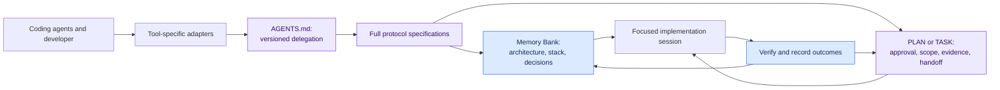
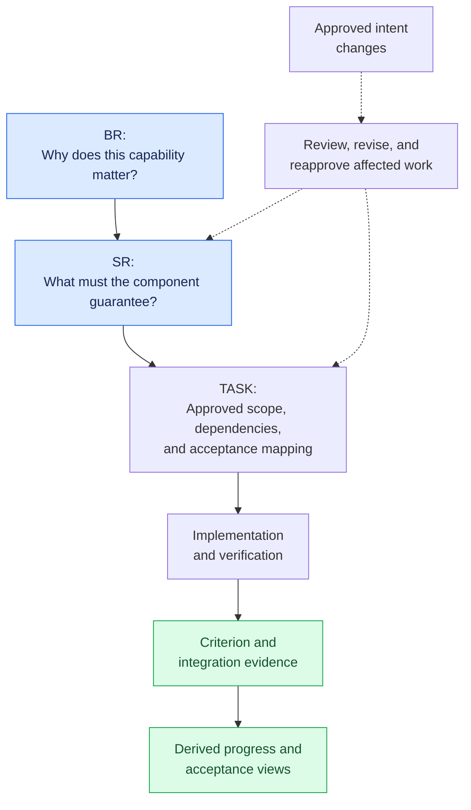
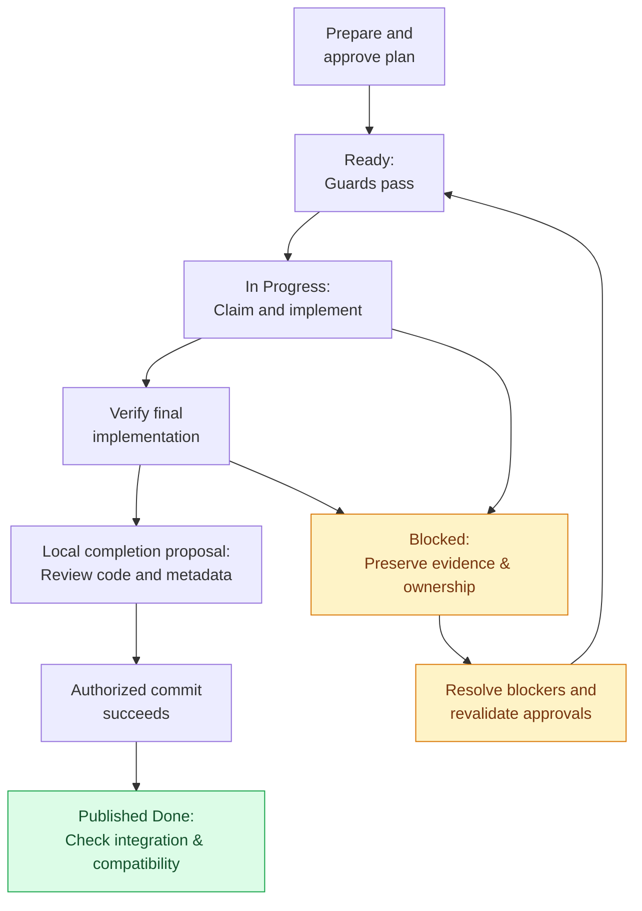
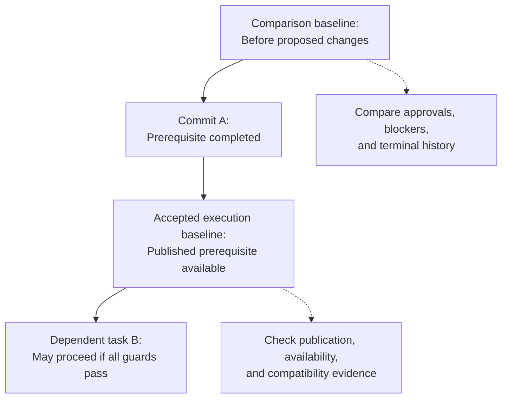

<div align="center">

🇬🇧 **[ English ]** · 🇺🇦 [Українська](README.uk.md)

# Shared AI Memory Bank

### Shared context. Explicit approvals. Traceable implementation.

A Markdown-first protocol for carrying project knowledge across AI coding agents and sessions—without losing the decisions behind the code.

[](MemBankRules.md)
[](MemBankRules.md)
[](MemBankRulesUkr.md)
[](tools/validate_protocol.py)
[](tools/validate_protocol.py)

[Quick start](#quick-start) · [Variants](#choosing-your-memory-bank-variant) · [How it works](#how-it-works) · [Languages](#versions-and-translations) · [Validation](#validate-this-repository)

</div>

---

## Why this exists

Changing agents or starting a session should not mean rediscovering the architecture, repeating the audit, or forgetting why a requirement exists. Keep that knowledge in **versioned, reviewable files beside your code**.

| Need | Protocol mechanism |
| :--- | :--- |
| Preserve context across sessions | Shared Memory Bank and durable work-item handoffs |
| Work across coding assistants | One `AGENTS.md` entry point with thin tool-specific adapters |
| Know what is approved | Revision-bound plans and requirement approvals |
| Keep implementation focused | Explicit scope, dependencies, and acceptance criteria |
| Recover safely | Persistent blockers, ownership checks, and completion recovery |
| Audit progress | Traceable requirements, verification evidence, and derived summaries |

**This is a protocol and reference validator—not an agent runtime, database, or automatic approval system.** The specifications describe adapters for Cline, Claude Code, Cursor, and Gemini CLI. Follow each tool's actual permissions and discovery rules.

## Start here

- **Base protocol:** `MemBankRules.md` — context, tracked plans, approval, execution, verification, and recovery.
- **Optional CDIP extension:** `MemBankRulesWithCDIP.md` — business requirements (BR), system requirements (SR), and implementation TASKs. Read the base first; the extension is not standalone.
- **Reference validator:** `tools/validate_protocol.py` — read-only structural and baseline checks.

Paths above are relative to this repository root. Install the complete English specifications and the documented `AGENTS.md` delegation, not just copied templates or an isolated instruction snippet. Host permissions still take precedence over repository instructions.

## Choosing your Memory Bank variant

This protocol offers two standardized tiers. Choose the variant matching your workflow, team size, and governance needs:

| Feature / Dimension | Base Memory Bank (`MemBankRules.md`) | CDIP Extension (`MemBankRulesWithCDIP.md`) |
| :--- | :--- | :--- |
| **Primary Audience** | Individual developers & small/medium projects | Multi-developer teams & multi-agent systems |
| **Project Lifecycle** | Short-term to medium-term horizons | Medium-term to long-term lifecycles |
| **Context Overhead** | Minimal (lightweight markdown context store) | Structured 3-layer requirement hierarchy |
| **Requirements Model** | Informal / plan-based (`projectBrief.md`, `plans/`) | Formal, technology-agnostic `BR → SR → TASK` hierarchy |
| **Traceability & Governance** | Lightweight change history & ADRs | Strict end-to-end traceability & revision binding |
| **Verification & Acceptance** | Plan checklists & audit log (`FIND-xxx`) | Executable verification commands & reciprocal acceptance matrices |

---

### 1. Base Memory Bank (`MemBankRules.md` / `MemBankRulesUkr.md`)

**Target Audience:** Individual developers and small to medium projects with short- to medium-term horizons.

Base Memory Bank provides a lightweight yet robust persistence layer that overcomes the primary friction in AI-assisted development: **statelessness and context loss across sessions**.

#### Key Benefits
- **Preserves project context between AI sessions:** Eliminates model amnesia. Architectural decisions, technology conventions, and active work items live durably in repository files rather than volatile prompt histories.
- **Reduces repetitive explanations to different models:** Stops you from having to re-explain project background, coding conventions, or constraints every time a new chat or session starts.
- **Enables seamless switching across AI tools and providers:** Work interchangeably with Google Antigravity, Claude Code, Cline, Cursor, or Gemini CLI. All agents reference the exact same repository-native context files through thin adapters.
- **Minimizes productivity loss caused by model limits and quotas:** When hitting model rate limits, token exhaustion, context window saturation, or AI subscription restrictions (e.g. 5-hour usage cooling intervals), developers can instantly switch to another agent, model, or session without losing progress or context.
- **Saves substantial time and token costs:** Drastically cuts redundant token expenditures on repetitive codebase exploration, maximizing productive output per AI interaction.

---

### 2. CDIP Extension (`MemBankRulesWithCDIP.md` / `MemBankRulesWithCDIPUkr.md`)

**Target Audience:** Engineering teams and projects with medium-term to long-term lifecycles where requirements traceability, auditability, and governance are important.

The **Context Dependency Inversion Principle (CDIP)** adds an **end-to-end traceability layer** connecting business intent, system architecture, and atomic code tasks.

#### The 3-Tier Hierarchy: BR → SR → TASK

1. **BR (Business Requirement):**
   - **Purpose:** Defines **why** the capability is needed, **who** benefits from it, and the applicable **business rules**.
   - **Boundary:** Strictly **technology-agnostic**. Captures real-world user needs and operational constraints without specifying programming languages, frameworks, endpoints, or database tables.
2. **SR (System Requirement):**
   - **Purpose:** Defines **how** the system fulfills a business requirement.
   - **Boundary:** Specifies component responsibilities, API interfaces, data contracts, validation rules, state flows, security constraints, and architectural decisions.
3. **TASK:**
   - **Purpose:** An atomic, self-contained implementation activity linked to one or more system requirements.
   - **Required contents:**
     - **A clear objective:** Concise statement of the technical deliverable.
     - **An implementation checklist:** Step-by-step checklist of concrete code and test edits.
     - **Acceptance criteria:** Direct reciprocal references to parent SR acceptance criteria (`SR-xxx-AC-yy`).
     - **Verification / validation steps:** Unambiguous success criteria, preferably backed by executable verification commands (e.g., test suite invocations or linters).

#### Why Maintain Explicit Links (BR → SR → TASK)?

Maintaining explicit, enforceable links between `BR → SR → TASK` provides decisive engineering advantages:
- **Requirements traceability:** Provides a complete audit trail from initial business justification down to specific lines of code, test assertions, and git commits.
- **Impact analysis:** When business priorities change or an architectural decision is updated, teams immediately identify which downstream SRs, tasks, and test suites must be re-evaluated.
- **Knowledge transfer:** Onboarding new team members or AI agents becomes instantaneous because the architectural rationale and business drivers behind every component are clearly documented on disk.
- **Collaboration across team members:** Establishes unambiguous contracts between product owners (BR), system architects (SR), and software engineers (TASK), eliminating misaligned assumptions.
- **AI-assisted development accuracy:** Feeding the model only the scoped TASK and its immediate parent SR eliminates token bloat and prevents hallucinations, leading to vastly higher first-pass code accuracy.
- **Long-term maintainability of the project:** Protects codebase integrity against architectural erosion, dead code accumulation, and undocumented legacy behaviors over multi-year lifecycles.

#### End-to-End Decomposition Example

```text
BR-001: Transaction Data Export (Business intent: compliance & reporting)
  ├── SR-001: Streaming CSV Serialization Engine (src/export/)
  │     ├── TASK-001A: Streaming CSV Formatter and Batch Cursor
  │     └── TASK-001C: Route Integration & End-to-End Verification (joint)
  └── SR-002: Export Authorization & Rate Limiting (src/middleware/)
        ├── TASK-001B: RBAC Guard & Redis Rate Limiter
        └── TASK-001C: Route Integration & End-to-End Verification (joint)
```

- **Business Requirement (`BR-001`):** Compliance officers require exportable transaction history to CSV for custom date ranges up to 365 days. Technology-agnostic rules: unmasked account numbers require compliance clearance; exports must complete within 30 seconds for up to 100,000 records.
- **System Requirements:**
  - **`SR-001` (Serialization Engine):** `POST /api/v1/transactions/export?format=csv` streaming HTTP response (`text/csv`); DB batch cursor chunking (1,000 rows); formula injection escaping (`=`, `+`, `-`, `@`); RSS memory ceiling 128MB.
  - **`SR-002` (Auth & Rate Limit):** Enforces role `compliance_auditor`; token bucket rate limiter allowing max 5 exports/hour/user; emits security audit event.
- **Implementation Tasks:**
  - **`TASK-001A`:** Implement `CsvStreamFormatter` class with batch DB cursor and formula escaping.
    - *Verification:* `npm test -- tests/export/csv_streamer.spec.ts`
  - **`TASK-001B`:** Implement middleware checking `compliance_auditor` and Redis rate limiter (5/hr).
    - *Verification:* `npm test -- tests/middleware/export_auth.spec.ts`
  - **`TASK-001C`:** Wire endpoint `/api/v1/transactions/export` and perform E2E memory and latency benchmark.
    - *Verification:* `npm run test:e2e -- tests/e2e/transaction_export.e2e.spec.ts`

## Versions and translations

| Language | Base protocol | CDIP extension | Status |
| :--- | :--- | :--- | :--- |
| 🇬🇧 English | [Read the base](MemBankRules.md) | [Read CDIP](MemBankRulesWithCDIP.md) | **3.2 · authoritative** |
| 🇺🇦 Українська | [Базова специфікація](MemBankRulesUkr.md) | [Розширення CDIP](MemBankRulesWithCDIPUkr.md) | **3.2 · повний переклад** |

Both the English and Ukrainian specifications implement **version 3.2 (07-10-2026)** with ISO 8601-2 dates (`DD-MM-YYYY`). Always use matching specification versions together. The English specification remains the authoritative canonical reference.

The 3.2 publication checks separate historical comparison from dependency publication, compare approved content across revisions, and preserve recorded blocker history. These are targeted checks, not a guarantee that every possible workflow is correct.

The badges above are static version/language labels, not live CI results or a compatibility certification.

## How it works

### 1. Share knowledge, not just chat history



The Memory Bank describes the project. Tracked work items preserve authorization and execution history. Session context points to those records; it is not the only copy of an approved plan.

### 2. Add requirements traceability when you need it

The optional **Context Dependency Inversion Principle (CDIP)** extension adds a requirement hierarchy. Read the base first; CDIP is not standalone.



Approvals bind to specific revisions. Historical completion stays historical: implementing an older SR does not automatically establish acceptance of the current version.

### 3. Make completion a reviewed transaction



This is the main execution path, not the complete state machine. Base section 1.6 also defines replanning, resumption, and cancellation. If committing is not authorized, retain `In Progress` and hand off the proposed transaction. Uncommitted `Done` cannot unlock another task.

## Quick start

| Start with | Best fit | Read |
| :--- | :--- | :--- |
| **Base Memory Bank** | Persistent context, audits, tracked plans, and handoffs | `MemBankRules.md` |
| **Base + CDIP** | Explicit BR → SR → TASK traceability and acceptance mapping | Both English specifications |

1. **Read the full base specification.** Add the matching CDIP specification if needed.
2. **Install the specifications in your project root.** Create the documented `AGENTS.md` delegation and adapters for your tools. Do not install only an isolated excerpt.
3. **Prepare the Memory Bank.** Record the architecture, stack, decisions, and current work. Review existing files before changing them.
4. **Create a tracked PLAN or TASK.** Record scope, verification strategy, dependencies, and actual developer approval.
5. **Execute only when guards pass.** Verify the final implementation, preserve evidence, and publish an authorized completion transaction.

Host permissions always take precedence. Repository instructions cannot grant access, switch an agent's mode, or authorize a human decision.

<details>
<summary><strong>Example installed project layout</strong></summary>

```text
your-project/
├── AGENTS.md
├── MemBankRules.md
├── MemBankRulesWithCDIP.md       # Optional CDIP extension
├── CLAUDE.md                    # Optional tool adapter
├── GEMINI.md                    # Optional tool adapter
├── .clinerules/                 # Optional Cline adapter
├── .cursor/rules/               # Optional Cursor adapter
├── memory-bank/
│   ├── projectBrief.md
│   ├── productContext.md
│   ├── systemPatterns.md
│   ├── techContext.md
│   ├── activeContext.md
│   ├── plans/
│   ├── progress.md
│   ├── decisions.md
│   └── decisions/
└── requirements/                # With CDIP
    ├── README.md
    ├── BR/
    ├── SR/
    └── tasks/
```

This is an installation example, not a list of pre-created files in this repository. Populate templates before validating project artifacts.

</details>

## Validate this repository

Prerequisites: **Python 3.10+** and **Git** on PATH. No third-party Python packages are required. Run from the repository root:

```bash
python3 -B tools/validate_protocol.py --specs .
python3 -B -m unittest discover -s tests -v
git diff --check
git diff --cached --check
```

The tests write only to temporary directories. Specification validation checks the two English specifications, not deployed project artifacts. This repository contains protocol templates, so artifact validation against it is not the publication check; an empty artifact set intentionally fails.

## Validate an installed project's artifacts

Pass the actual project root to `--artifacts`. Replace `/absolute/path/to/project` and `BASE_REF` below with your project path and an agreed existing commit/ref; they are command examples, not literal values to use:

```bash
python3 -B tools/validate_protocol.py --artifacts /absolute/path/to/project
python3 -B tools/validate_protocol.py --artifacts /absolute/path/to/project --baseline BASE_REF --execution-baseline HEAD
python3 -B tools/validate_protocol.py --artifacts /absolute/path/to/project --fingerprint requirements/tasks/TASK-001A-title.md
```

- `--baseline` compares the working tree to a trusted pre-change commit for immutable terminal records, approval-sensitive changes, and blocker history. For a committed PR, use its agreed pre-change base, not its final state.
- `--execution-baseline` identifies the accepted published state available to dependency checks. It defaults to HEAD when `--baseline` is supplied. It can include prerequisite completions committed after the comparison base. Confirm that it is accepted; the tool cannot grant acceptance.
- `--fingerprint` prints the scoped implementation digest only; it does **not** run artifact validation or tests. Use the actual TASK/PLAN filename. Do not combine it with baseline options.
- Exit status 0 means the requested checks passed; nonzero means errors. Read warnings: omitted baselines leave specific history/publication checks unperformed. Validate each preparation and completion boundary, not only the final PR.

### Why two baselines?



For a committed PR, compare against its agreed pre-change base—not the PR's final state. A prerequisite can be completed after that comparison base and still be available in the execution baseline. The validator checks ancestry and records; it cannot decide which commit your team has accepted.

## Guarantees and limits

| Checked by the validator | Still requires review or execution |
| :--- | :--- |
| IDs, links, schemas, and dependency cycles | Scope completeness and architectural correctness |
| Revision-bound approvals and baseline content changes | Authentic human approval and current remote decisions |
| Blocker preservation and evidenced resolution | Whether the problem was actually resolved |
| Publication records and dependency ancestry | Behavior after reverts, merges, or superseding changes |
| Criterion mappings and derived summaries | Real test execution and business acceptance |
| Scoped implementation fingerprints | Ownership and staged-vs-tested implementation equality |

Checks include record syntax, links, IDs, approval chains, revision/content consistency against a baseline, blocker preservation, dependency publication/ancestry, criteria/coverage relationships, completion fingerprints, and derived summaries. See base section 8 for exact schemas and administrative exceptions.

Validation does **not** authenticate a human decision, run the documented test commands, prove compatibility or ownership, check all intervening commits, verify remote approval freshness, or prove that the staged implementation matches the tested working tree. Newly introduced records and intermediate history still require review. Do not put normative obligations in comments or operational sections excluded from approval comparison.

## Contributing and publishing

Keep specifications, templates, validator behavior, and regression tests aligned. Add regression cases for invalid transitions **and** legitimate workflows. Preserve historical terminal records, use follow-up records for corrections, and label translations with their actual protocol version.

1. Review the full diff, including staged changes, for correctness and sensitive information.
2. Run specification validation and the regression suite.
3. Stage only the reviewed files and confirm the staged versions match the tested files; do not assume a clean working-tree diff means the index was tested.
4. Run both whitespace checks above. Commit and push only when authorized.

## License

No redistribution license is included. Repository owners should choose and add a license before describing this as an open-source release or granting reuse permissions; this README does not grant them.
