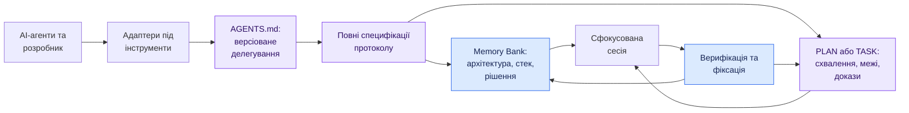
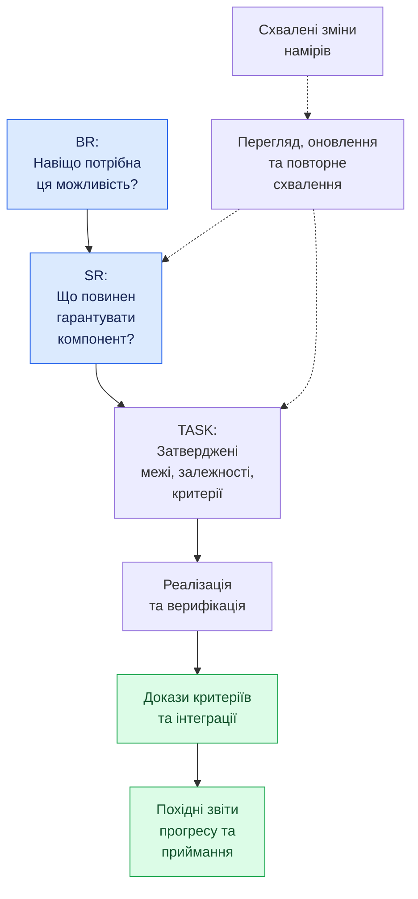
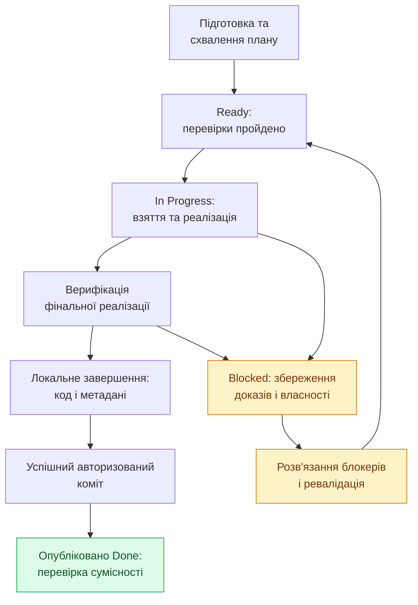
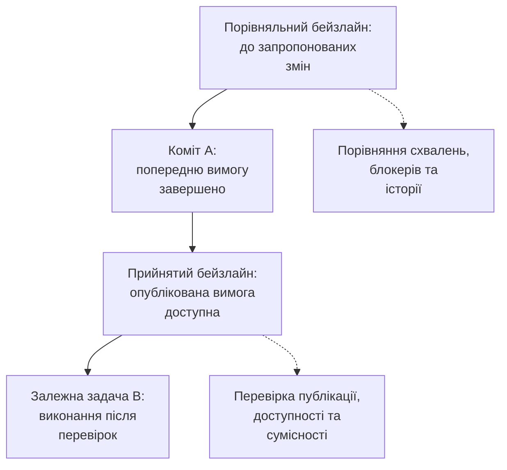

<div align="center">

<a href="README.md"></a> [English](README.md) · <a href="README.uk.md"></a> **[ Українська ]**

# Спільний AI Memory Bank

### Спільний контекст. Явні схвалення. Простежувана реалізація.

Протокол на основі файлів Markdown для збереження та передачі знань про проєкт між AI-агентами та робочими сесіями без втрати рішень, що стоять за кодом.

[](MemBankRulesUkr.md)
[](MemBankRulesUkr.md)
[](MemBankRules.md)
[](tools/validate_protocol.py)
[](tools/validate_protocol.py)

[Швидкий старт](#швидкий-старт) · [Варіанти](#вибір-варіанта-memory-bank) · [Як це працює](#як-це-працює) · [Мови](#версії-та-переклади) · [Валідація](#валідація-цього-репозиторію)

</div>

---

## Чому це існує

Зміна AI-агента або початок нової робочої сесії не повинні означати повторне дослідження архітектури, проходження того самого аудиту чи втрату розуміння того, навіщо існує та чи інша вимога. Зберігайте ці знання у **версіонованих файлах, придатних для перегляду (code review), безпосередньо поруч із кодом**.

| Потреба | Механізм протоколу |
| :--- | :--- |
| Збереження контексту між сесіями | Спільний Memory Bank і надійна передача робочих завдань |
| Робота з різними AI-асистентами | Єдина точка входу `AGENTS.md` із тонкими адаптерами під конкретні інструменти |
| Чітке розуміння схвалених дій | Плани з прив'язкою до ревізій та обов'язкове схвалення вимог |
| Сфокусована реалізація | Явно визначені межі (scope), залежності та критерії приймання |
| Безпечне відновлення після збоїв | Стійкі блокери, перевірки власності та відновлення незавершених транзакцій |
| Аудит прогресу | Простежувані вимоги, докази верифікації та автоматично похідні звіти |

**Це протокол та еталонний валідатор, а не середовище виконання агентів, база даних чи система автоматичного схвалення.** Специфікація містить опис адаптерів для Cline, Claude Code, Cursor та Gemini CLI. Завжди дотримуйтеся фактичних дозволів та правил виявлення файлів кожного конкретного інструмента.

## З чого почати

- **Базовий протокол:** `MemBankRulesUkr.md` (англійська версія: `MemBankRules.md`) — контекст, відстежувані плани, схвалення, виконання, верифікація та відновлення.
- **Опціональне розширення CDIP:** `MemBankRulesWithCDIPUkr.md` (англійська версія: `MemBankRulesWithCDIP.md`) — бізнес-вимоги (BR), системні вимоги (SR) та задачі реалізації (TASK). Спочатку ознайомтеся з базовою версією; розширення не є автономним.
- **Еталонний валідатор:** `tools/validate_protocol.py` — структурні та базові перевірки в режимі лише для читання.

Усі шляхи вище наведено відносно кореня цього репозиторію. Встановлюйте повні файли специфікації та задокументоване делегування в `AGENTS.md`, а не просто скопійовані шаблони чи фрагменти інструкцій. Дозволи хост-системи завжди мають вищий пріоритет за правила в репозиторії.

## Вибір варіанта Memory Bank

Протокол пропонує два стандартизовані рівні. Оберіть той, що найкраще відповідає структурі вашої роботи, розміру команди та вимогам до контролю якості:

| Характеристика | Базовий Memory Bank (`MemBankRulesUkr.md`) | Розширення CDIP (`MemBankRulesWithCDIPUkr.md`) |
| :--- | :--- | :--- |
| **Основна аудиторія** | Індивідуальні розробники та малі/середні проєкти | Команди інженерів та багатоагентні системи |
| **Життєвий цикл проєкту** | Короткостроковий та середньостроковий горизонт | Середньостроковий та довгостроковий життєвий цикл |
| **Накладні витрати на контекст** | Мінімальні (легке Markdown-сховище контексту) | Структурована 3-рівнева ієрархія вимог |
| **Модель вимог** | Гнучка / списки завдань у `projectBrief.md` та `plans/` | Формальна, незалежна від технологій ієрархія `BR → SR → TASK` |
| **Простежуваність і контроль** | Легка історія змін та архітектурні рішення (ADR) | Сувора наскрізна простежуваність і прив'язка до версій |
| **Верифікація та приймання** | Чеклісти плану та журнал знахідок аудиту (`FIND-xxx`) | Виконувані команди верифікації та матриці критеріїв приймання |

---

### 1. Базовий Memory Bank (`MemBankRulesUkr.md` / `MemBankRules.md`)

**Цільова аудиторія:** Індивідуальні розробники та малі й середні проєкти з короткостроковим і середньостроковим горизонтом планування.

Базовий Memory Bank надає легкий, але надійний рівень збереження стану, що усуває головну проблему AI-асистентів: **відсутність пам'яті та втрату контексту між сесіями**.

#### Ключові переваги
- **Зберігає контекст проєкту між сесіями AI:** Усуває "амнезію" моделей. Архітектурні рішення, конвенції технологічного стека та активні робочі завдання зберігаються у файлах репозиторію, а не в тимчасових діалогах чату.
- **Зменшує потребу багаторазово пояснювати деталі проєкту:** Більше не потрібно щоразу заново розповідати про цілі, стандарти коду чи обмеження під час запуску нової сесії чи нової моделі.
- **Забезпечує безшовне перемикання між AI-інструментами та провайдерами:** Ви можете вільно чергувати Google Antigravity, Claude Code, Cline, Cursor або Gemini CLI. Усі агенти використовують однакові стандартизовані файли через тонкі адаптери.
- **Мінімізує втрати продуктивності через ліміти, квоти та розмір контексту:** Коли ви вичерпуєте годинні ліміти токенів, упираєтеся в межі контекстного вікна або стикаєтеся з тимчасовими сервісними блокуваннями підписки (наприклад, 5-годинними інтервалами використання моделей), ви можете миттєво переключитися на інший інструмент, модель чи сесію без втрати прогресу.
- **Заощаджує час та витрати на токени:** Суттєво знижує непродуктивні витрати токенів на постійне повторне сканування кодової бази, забезпечуючи максимальну віддачу від кожної взаємодії з моделлю.

---

### 2. Розширення CDIP (`MemBankRulesWithCDIPUkr.md` / `MemBankRulesWithCDIP.md`)

**Цільова аудиторія:** Інженерні команди та проєкти із середньостроковим і довгостроковим життєвим циклом, де критично важливі простежуваність вимог, аудит та управління змінами.

Принцип інверсії залежностей контексту (**Context Dependency Inversion Principle, CDIP**) створює рівень **наскрізної простежуваності (end-to-end traceability)**, що надійно пов'язує бізнес-намір, системну архітектуру та атомарні завдання розробки.

#### Трирівнева ієрархія: BR → SR → TASK

1. **BR (Business Requirement — бізнес-вимога):**
   - **Призначення:** Визначає, **навіщо** потрібна можливість, **хто** отримує від неї користь, та які **бізнес-правила** діють.
   - **Межа:** Суворо **незалежна від технологій (technology-agnostic)**. Фіксує реальні потреби користувачів та операційні рамки без згадок про мови програмування, бібліотеки, ендпоінти чи таблиці баз даних.
2. **SR (System Requirement — системна вимога):**
   - **Призначення:** Визначає, **як** система задовольняє бізнес-вимогу.
   - **Межа:** Фіксує обов'язки компонентів, контракти API, формати даних, валідаційні правила, поведінку станів, вимоги безпеки та архітектурні рішення.
3. **TASK (задача реалізації):**
   - **Призначення:** Атомарний, самодостатній робочий елемент, пов'язаний з однією чи кількома системними вимогами.
   - **Обов'язковий вміст:**
     - **Чітка мета (objective):** Лаконічне формулювання технічного результату.
     - **Чекліст реалізації (implementation checklist):** Послідовні кроки для внесення змін у код і тести.
     - **Критерії приймання (acceptance criteria):** Двосторонні посилання на критерії приймання батьківської SR (`SR-xxx-AC-yy`).
     - **Кроки верифікації та валідації:** Однозначні критерії успіху, бажано підкріплені виконуваними командами (запуск тестів, лінтерів).

#### Чому важливо підтримувати явні зв'язки (BR → SR → TASK)?

Підтримка послідовних зв'язків `BR → SR → TASK` забезпечує відчутні інженерні переваги:
- **Простежуваність вимог:** Повний аудиторський слід від початкового бізнес-обґрунтування до рядків коду, тверджень у тестах та комітів Git.
- **Аналіз впливу змін (impact analysis):** У разі зміни бізнес-вимог чи архітектурних рішень команда відразу бачить усі залежні SR, задачі та тестові набори, що потребують оновлення.
- **Передача знань (knowledge transfer):** Нові інженери або змінені AI-агенти входять у проєкт миттєво, оскільки призначення кожного модуля зафіксоване в репозиторії.
- **Співпраця в команді:** Прозорі домовленості між власниками продукту (BR), архітекторами (SR) та розробниками (TASK).
- **Точність генерації коду AI:** Надання моделі лише конкретної TASK та її батьківської SR запобігає переповненню контексту, економить токени й усуває галюцинації.
- **Довгострокова підтримуваність проєкту:** Захист від архітектурної ерозії, накопичення мертвого коду та прихованого технічного боргу протягом багатьох років розвитку системи.

#### Приклад наскрізної декомпозиції

```text
BR-001: Експорт даних транзакцій (Бізнес-намір: податковий облік та аудит)
  ├── SR-001: Рушій потокової серіалізації CSV (src/export/)
  │     ├── TASK-001A: Потоковий форматер CSV та пакетний курсор
  │     └── TASK-001C: Інтеграція маршруту та наскрізна верифікація (спільна)
  └── SR-002: Авторизація експорту та обмеження частоти запитів (src/middleware/)
        ├── TASK-001B: RBAC-перевірка та Redis-лімітер запитів
        └── TASK-001C: Інтеграція маршруту та наскрізна верифікація (спільна)
```

- **Бізнес-вимога (`BR-001`):** Фінансові аудитори потребують експорту історії транзакцій у CSV за період до 365 днів. Незалежні від технологій правила: повні номери рахунків доступні лише користувачам із правом комплаєнс-аудиту; експорт до 100 000 записів має завершуватися без таймаутів.
- **Системні вимоги:**
  - **`SR-001` (Рушій серіалізації):** Потокова відповідь `POST /api/v1/transactions/export?format=csv` (`text/csv`); читання з БД порціями по 1 000 рядків; захист від CSV-ін'єкцій (`=`, `+`, `-`, `@`); обмеження пам'яті RSS до 128 МБ.
  - **`SR-002` (Авторизація та ліміти):** Перевірка ролі `compliance_auditor`; лімітер Redis на 5 запитів на годину для акаунта; запис події в аудит-лог безпеки.
- **Задачі реалізації:**
  - **`TASK-001A`:** Реалізація класу `CsvStreamFormatter` із курсором БД та екрануванням формул.
    - *Верифікація:* `npm test -- tests/export/csv_streamer.spec.ts`
  - **`TASK-001B`:** Реалізація middleware перевірки ролі `compliance_auditor` та лімітера Redis (5/год).
    - *Верифікація:* `npm test -- tests/middleware/export_auth.spec.ts`
  - **`TASK-001C`:** Підключення ендпоінта `/api/v1/transactions/export` та проведення наскрізного навантажувального тесту пам'яті.
    - *Верифікація:* `npm run test:e2e -- tests/e2e/transaction_export.e2e.spec.ts`

## Версії та переклади

| Мова | Базовий протокол | Розширення CDIP | Статус |
| :--- | :--- | :--- | :--- |
|  English | [Read the base](MemBankRules.md) | [Read CDIP](MemBankRulesWithCDIP.md) | **3.2 · authoritative** |
|  Українська | [Базова специфікація](MemBankRulesUkr.md) | [Розширення CDIP](MemBankRulesWithCDIPUkr.md) | **3.2 · повний переклад** |

Обидві мовні версії специфікації реалізують **версію 3.2 (07-10-2026)** з форматом дат ISO 8601-2 (`DD-MM-YYYY`). Завжди використовуйте узгоджені версії специфікацій. Англійський варіант залишається авторитетним канонічним першоджерелом.

Перевірки публікації версії 3.2 розділяють історичне порівняння та публікацію залежностей, порівнюють затверджений вміст між ревізіями та зберігають історію блокерів. Це цільові перевірки валідатора, а не абсолютна гарантія безпомилковості будь-якого довільного робочого процесу.

Значки (badges) вгорі — це статичні мітки версій і мов, а не інтерактивні результати CI чи сертифікати сумісності.

## Як це працює

### 1. Обмін знаннями, а не просто історією чату



Memory Bank описує проєкт. Відстежувані робочі елементи зберігають історію авторизацій та виконання. Контекст поточної сесії посилається на ці записи; він не є єдиною копією схваленого плану.

### 2. Додавання простежуваності вимог за потреби

Опціональне розширення **Context Dependency Inversion Principle (CDIP)** додає ієрархію вимог. Спочатку ознайомтеся з базовою специфікацією; CDIP не є автономним документом.



Схвалення прив'язуються до конкретних ревізій. Історичне виконання залишається історичним: виконання попередньої версії SR не означає автоматичного приймання її поточної версії.

### 3. Завершення як транзакція з обов'язковим переглядом



Це основний шлях виконання, а не повна діаграма станів. Базовий розділ 1.6 також визначає перепланування, відновлення та скасування. Якщо коміт не дозволено користувачем, зберігайте статус `In Progress` і передайте підготовлену транзакцію. Нескоммічений статус `Done` не може розблокувати залежну задачу.

## Швидкий старт

| З чого почати | Найкраще підходить для | Що читати |
| :--- | :--- | :--- |
| **Базовий Memory Bank** | Стійкий контекст, аудити, плани та передача задач | `MemBankRulesUkr.md` |
| **Базовий + CDIP** | Явна простежуваність `BR → SR → TASK` та матриці приймання | Обидві українські (або англійські) специфікації |

1. **Прочитайте базову специфікацію повністю.** За потреби додайте сумісну специфікацію CDIP.
2. **Встановіть специфікації в корінь вашого проєкту.** Створіть файл делегування `AGENTS.md` та адаптери під ваші інструменти. Не встановлюйте вирвані з контексту фрагменти.
3. **Підготуйте Memory Bank.** Зафіксуйте архітектуру, технологічний стек, рішення та поточні завдання. Ознайомтеся з наявними файлами перед їх зміною.
4. **Створіть відстежуваний PLAN або TASK.** Зафіксуйте межі роботи (scope), стратегію верифікації, залежності та фактичне схвалення розробника.
5. **Виконуйте роботу лише після проходження перевірок.** Верифікуйте фінальний код, збережіть докази та опублікуйте авторизовану транзакцію завершення.

Дозволи середовища розробника завжди мають перевагу. Інструкції репозиторію не можуть самостійно надавати права доступу, перемикати режими агента чи імітувати рішення людини.

<details>
<summary><strong>Приклад структури каталогу у встановленому проєкті</strong></summary>

```text
your-project/
├── AGENTS.md
├── MemBankRules.md               # або MemBankRulesUkr.md
├── MemBankRulesWithCDIP.md       # Опціональне розширення CDIP
├── CLAUDE.md                    # Опціональний адаптер інструмента
├── GEMINI.md                    # Опціональний адаптер інструмента
├── .clinerules/                 # Опціональний адаптер Cline
├── .cursor/rules/               # Опціональний адаптер Cursor
├── memory-bank/
│   ├── projectBrief.md
│   ├── productContext.md
│   ├── systemPatterns.md
│   ├── techContext.md
│   ├── activeContext.md
│   ├── plans/
│   ├── progress.md
│   ├── decisions.md
│   └── decisions/
└── requirements/                # У разі використання CDIP
    ├── README.md
    ├── BR/
    ├── SR/
    └── tasks/
```

Це приклад структури в цільовому проєкті, а не список файлів у цьому репозиторії. Заповнюйте шаблони перед валідацією артефактів проєкту.

</details>

## Валідація цього репозиторію

Вимоги: **Python 3.10+** та **Git** у змінній PATH. Жодних сторонніх пакетів Python не потрібно. Виконайте в корені репозиторію:

```bash
python3 -B tools/validate_protocol.py --specs .
python3 -B -m unittest discover -s tests -v
git diff --check
git diff --cached --check
```

Тести здійснюють запис лише в тимчасові ізольовані каталоги. Валідація специфікацій перевіряє файли специфікації, а не розгорнуті артефакти проєкту. Цей репозиторій містить шаблони протоколу, тому перевірка артефактів на ньому за замовчуванням сигналізує про відсутність користувацьких даних.

## Валідація артефактів встановленого проєкту

Вказуйте фактичний корінь проєкту в аргументі `--artifacts`. Замініть `/absolute/path/to/project` та `BASE_REF` нижче на дійсний шлях до вашого проєкту та узгоджений існуючий коміт/ref:

```bash
python3 -B tools/validate_protocol.py --artifacts /absolute/path/to/project
python3 -B tools/validate_protocol.py --artifacts /absolute/path/to/project --baseline BASE_REF --execution-baseline HEAD
python3 -B tools/validate_protocol.py --artifacts /absolute/path/to/project --fingerprint requirements/tasks/TASK-001A-title.md
```

- `--baseline` порівнює робоче дерево з перевіреним станом до внесення змін для незмінних фінальних записів, змін підтвердженого контенту та історії блокерів. Для PR використовуйте узгоджений базовий коміт до початку робіт, а не кінцевий стан PR.
- `--execution-baseline` визначає прийнятий опублікований стан для перевірки залежностей. За замовчуванням це HEAD, якщо вказано `--baseline`.
- `--fingerprint` виводить лише контрольний хеш (дайджест) реалізації в межах scope; ця опція **не** запускає валідацію артефактів.
- Код завершення 0 означає успішне проходження перевірок; ненульовий — наявність помилок.

### Чому два бейзлайни?



## Гарантії та обмеження

| Перевіряється валідатором | Потребує експертного перегляду або виконання |
| :--- | :--- |
| Ідентифікатори (ID), посилання, схеми та цикли залежностей | Повнота охоплення задачі та архітектурна коректність |
| Схвалення з прив'язкою до ревізій та зміни контенту відносно baseline | Справжнє схвалення людиною та актуальність рішень |
| Збереження блокерів та наявність доказів їх розв'язання | Чи дійсно проблему було фактично усунуто в коді |
| Записи про публікацію та дерево предків залежностей | Поведінка після відкатів (revert), злиття чи заміни змін |
| Зіставлення критеріїв приймання та похідні зведення | Реальний запуск тестів та бізнес-приймання |
| Контрольні відбитки (fingerprints) реалізації в межах scope | Відповідність підготовлених до коміту змін протестованому коду |

Валідація **не** замінює рішення людини, не запускає команди тестів автоматично та не гарантує сумісність за межами задокументованих структур.

## Внесок та публікація

Підтримуйте узгодженість специфікацій, шаблонів, поведінки валідатора та регресійних тестів. Зберігайте історію фінальних записів і маркуйте переклади фактичною версією протоколу.

1. Перегляньте повний diff, включаючи індексовані зміни, на коректність та відсутність конфіденційних даних.
2. Запустіть перевірку специфікацій та регресійний набір тестів.
3. Додавайте в індекс Git лише перевірені файли.
4. Виконайте перевірку пробілів і форматування. Комітьте та відправляйте зміни лише після авторизації.

## Ліцензія

Ліцензія на повторне розповсюдження не додається. Власники репозиторіїв повинні обрати та додати власну ліцензію перед відкритим поширенням проєкту.
